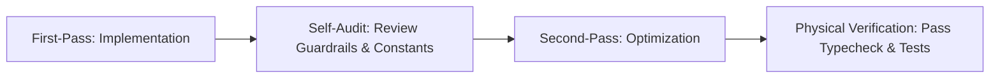

# Docuvia2 Developer Guardrails & Self-Optimization Workflow

This guide establishes the highest standards for all development, refactoring, and daily maintenance in `Docuvia2`. Rather than imposing rigid restrictions, we use a **Two-Pass Self-Audit Loop** and **Positive Reference Patterns** derived from production code to guide both AI Agents and human developers in crafting highly elegant, strongly-typed, and contract-compliant code.

---

## 🔄 Part 1: The Two-Pass Self-Audit Loop

Whenever implementing a feature, developers and AI agents must follow this two-pass cycle:



### 1. First-Pass: Implementation

- **Core Objective**: Rapidly construct the primary functionality matching the business logic.
- **Execution**: Establish API flows, connections, directory operations, or algorithmic cores. Temporary constants are permissible during this draft stage.

### 2. Second-Pass: Optimization (Refactoring)

- **Core Objective**: Before declaring a task "completed" or "ready," **the Agent must proactively review these guardrails** and self-audit the code.
- **Execution**:
  - Scan all newly written or modified files to identify hardcoded string literals, timeouts, encoding names, or file paths.
  - Refactor all of them into strongly-typed constants exported from `@workspace/contracts` or corresponding core constant modules.
  - Run `pnpm run typecheck` and `pnpm test` for physical validation to ensure types and logic are fully correct.

---

## 🔍 Part 2: Positive Reference Patterns

When writing code, refer to the following positive patterns from Docuvia2's production codebase:

### 1. Constantizing Relationships and Node Types (`L2NodeTypes` & `LinkTypes`)

When persisting AST-parsed files, symbols, or establishing relationship links, use strongly-typed constants exported from the contracts layer:

```typescript
import { L2NodeTypes, LinkTypes } from "@workspace/contracts";

// Positive Example A: Insert L2 Module Node
const fileId = store.graph.insertNode({
  projectId,
  name: result.file,
  type: L2NodeTypes.MODULE, // Using strongly-typed node type
  nodeKey: result.file,
  contentHash: result.hash,
});

// Positive Example B: Establish a "Contains" Link
store.graph.insertLink({
  sourceNodeId: fileId,
  targetNodeId: fnId,
  linkType: LinkTypes.CONTAINS, // Using strongly-typed link type
});

// Positive Example C: Establish Calls, Inheritance, and Implementation Relationships between Symbols
for (const call of result.data.calls) {
  processLink(call.sourceFunction, call.targetFunction, LinkTypes.CALLS);
}
```

### 2. Single Source of Truth for Snapshots and Hydration (`GitConstants`)

When dealing with snapshot serialization and database hydration using the hidden knowledge branch (`docuvia-knowledge`), use domain-specific semantic constants for path and filename joining:

```typescript
import { GitConstants } from "./git-constants.js";

// Positive Example A: Create and Write Snapshot Output Directory
const graphDir = path.join(outDir, GitConstants.GRAPH_DIR_NAME);
const knowledgeDir = path.join(outDir, GitConstants.KNOWLEDGE_DIR_NAME);

// Positive Example B: Dynamically Generate Nodes & Edges jsonl Filenames
await fs.writeFile(
  path.join(graphDir, GitConstants.NODES_JSONL_NAME),
  nodesData,
  UTF8_ENCODING
);

// Positive Example C: Use Posix-Standard Path Joining for Reading Ref Files during Hydration
const [nodesJsonl, edgesJsonl] = await Promise.all([
  this.git.readFileAtRef(
    cwd,
    knowledgeSha,
    path.posix.join(GitConstants.GRAPH_DIR_NAME, GitConstants.NODES_JSONL_NAME)
  ),
  ...
]);
```

### 3. Encoding, Hash, and Algorithm Standardization (`UTF8_ENCODING`)

For any file read/write (`fs`), stream processing, or hash computation, utilize high-level constants defined in the contracts:

```typescript
import { UTF8_ENCODING } from "@workspace/contracts";

// Positive Example A: Specify Uniform Encoding for File Operations
const content = await fs.readFile(targetPath, UTF8_ENCODING);

// Positive Example B: Constantize Encoding when Writing Markdown Files
await fs.writeFile(mdPath, frontmatter + body, UTF8_ENCODING);
```

### 4. Database Connection Pragmas Configuration (`SQLiteConstants`)

When initializing the database, executing PRAGMA settings, or optimizing connections, introduce database-specific constants to ensure connection strategies remain consistent across processes:

```typescript
import { SQLiteConstants } from "./constants.js";

// Positive Example A: Configure Database Busy Timeout
db.pragma(`busy_timeout = ${SQLiteConstants.BUSY_TIMEOUT_MS}`);

// Positive Example B: Enable and Configure WAL Mode
if (!opts.readonly) {
  db.pragma(`journal_mode = ${SQLiteConstants.JOURNAL_MODE}`);
  db.pragma(`synchronous = ${SQLiteConstants.SYNCHRONOUS}`);
}
```

---

## 🚨 Part 3: Verification Gate

To guarantee development quality, run the following commands before code delivery:

1. **Compilation Check**: Ensure zero type issues.
   ```bash
   pnpm run typecheck
   ```
2. **Tests & Coverage Check**: Maintain Statement coverage ≥ 80%.
   ```bash
   pnpm test
   ```
