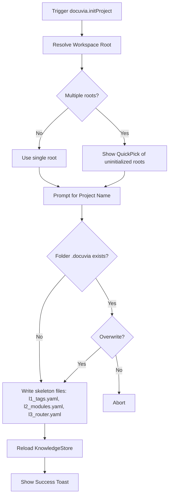

# Command: Docuvia Init Project

## Command Details

- **Command ID**: `docuvia.initProject`
- **Title**: `Docuvia: Init Project`
- **Activation Context**: Available globally via Command Palette, or triggered via inline tree view actions/welcome views (registered in [`extension.ts`](file:///d:/GitHub/Docuvia/artifacts/vscode-client/src/extension.ts)).

## Functional Flow



1. **Workspace Resolution**:
   - Check if an explicit node was passed (e.g., from an inline tree action). If so, use `node.workspaceRoot`.
   - If no node was passed, check how many workspace folders are currently open.
   - If exactly 1, use it.
   - If multiple:
     - Filter out folders that are already initialized (have a `.docuvia` directory loaded in the store).
     - If all are initialized, show an information message and exit.
     - Display a `QuickPick` menu allowing the user to select one of the remaining uninitialized workspace folders.

2. **Project Naming**:
   - Prompt the user to enter a project name using `vscode.window.showInputBox`.
   - Prefills the input box with the directory's basename.

3. **Scaffolding (`.docuvia/`)**:
   - **Polyfill Strategy**: The command checks if target files already exist to prevent accidental deletion.
   - Create the `.docuvia` directory in the resolved workspace root.
   - Create the `.docuvia/l3_decisions` directory.
   - Generate default skeleton files **only if they do not already exist**:
     - `l1_tags.yaml` (includes the `project_name` key).
     - `l2_modules.yaml`.
     - `l3_router.yaml`.
   - **Force Overwrite**: If the target workspace is already fully initialized but the user invokes this command directly from the palette targeting that workspace, display a warning prompt: `".docuvia already exists. Do you want to overwrite existing files? This action cannot be undone."` before proceeding with destructive generation.

   > ⚠️ **CONFLICT – Force-Overwrite Prompt Not Implemented**: The current `initProject` implementation uses `writeIfAbsent()` for all skeleton files, which silently skips files that already exist. There is no force-overwrite dialog. Additionally, in multi-root scenarios, the folder picker explicitly filters out already-initialized folders, so a fully initialized project can never be selected from the palette at all – there is no code path that would trigger the overwrite prompt. Data is never accidentally destroyed (files are skipped, not overwritten), but a user who wants to intentionally re-initialize a project cannot do so. The overwrite dialog is scheduled for Round 2.

4. **Post-Initialization**:
   - Request the [`KnowledgeStore`](file:///d:/GitHub/Docuvia/artifacts/vscode-client/src/KnowledgeStore.ts) to reload (reading the newly created files).
   - This reload triggers the `FileSystemWatcher`, which in turn fires the UI update event.
   - Display a success message: `Docuvia: Project "<name>" initialized. Populate the YAML files to build your knowledge graph.`

## Edge Cases Handled

- User cancels project name input (silently aborts).
- User attempts to initialize when no workspace folders are open (shows error).

---

## Known Issues

> ⚠️ **CONFLICT – `parseTags` YAML Format Bug (Critical)**: The skeleton `l1_tags.yaml` generated by `initProject` uses the object format:
>
> ```yaml
> project_name: "MyProject"
> tags:
>   # - id: <uuid>
>   #   slug: ...
> ```
>
> However, [`parser.ts::parseTags`](file:///d:/GitHub/Docuvia/artifacts/vscode-client/src/parser.ts) calls `parseYaml(content) as unknown[]` and immediately invokes `.map()` on the result. When the file has a top-level object (not an array), `parseYaml` returns a plain object, and `.map()` throws `TypeError: raw.map is not a function`. The `tryParse` wrapper in `KnowledgeStore` catches this silently and returns an empty array. **Any user who populates the `tags:` list in the skeleton file will see zero L1 tags in the Knowledge Graph tree view.** A fix is scheduled for Round 2 (`parseTags` must check if the parsed result is an object with a `tags` property and use that array instead of treating the whole document as a flat list).
