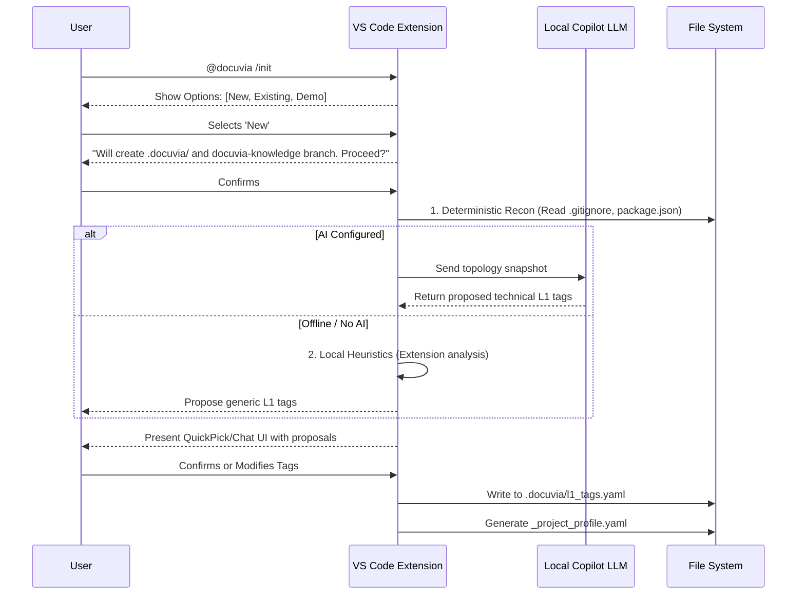

# Implementation Plan: Docuvia VS Code Client Onboarding (`/init`)

## 1. Implementation Goals
- **Goal 1:** Update `ADR-001-vscode-client-onboarding.md` to incorporate Tolaria-inspired "First Launch" principles: Clear Choices, Transparent Artifact Creation, and Graceful Degradation.
- **Goal 2:** Define the new `/init` command UX flow to provide a 3-way choice menu (New, Connect, Demo) rather than forcefully initializing a workspace.
- **Goal 3:** Establish an explicit "No-AI" fallback path in the onboarding state machine, ensuring users without LLM configuration can still initialize and utilize local-first capabilities.

## 2. Approach / Methodology
We will rewrite `docs/design/adrs/ADR-001-vscode-client-onboarding.md` to insert a new "Decision/Consent" layer at the start of the workflow. The updated ADR will:
- Require the UI to present options (Initialize Local, Connect Remote, Explore Demo Sandbox) before any filesystem scanning occurs.
- Add a transparency confirmation step explicitly stating that a `docuvia-knowledge` orphan branch and a `.docuvia/` config folder will be created.
- Modify the Mermaid sequence diagram to include an `alt AI Configured vs Offline/No-AI` branch. When AI is unavailable, the extension will rely entirely on local heuristic analysis (extension ratios, directory conventions) to propose tags, skipping the LLM call entirely.

## 3. Detailed Implementation Steps
1. **Modify Core Objectives in ADR-001**:
   - Add explicit goals for "User Autonomy" (giving clear choices) and "Graceful Degradation" (working without AI).

2. **Revise the Zero-Trust Workflow Diagram**:
   - Update the mermaid diagram to show the initial 3-way choice.
   - Add an explicit consent step for creating local artifacts.
   - Add a split path for `Local Heuristics Only` when the LLM is not configured.

3. **Define the `/init` Command UX (Clear Choices)**:
   - When the user clicks `[Initialize Docuvia Knowledge Base]` or runs `@docuvia /init`, show a VS Code QuickPick:
     - `✨ Initialize Knowledge Graph here` (New)
     - `🔗 Connect to Remote Graph` (Existing)
     - `📚 Clone & Explore Demo Sandbox` (Getting Started/Template)

4. **Define Transparent Artifact Creation**:
   - Before writing any files, show a confirmation prompt/chat card:
     *“This will create a `.docuvia/` folder for settings and a hidden `docuvia-knowledge` orphan branch for your graph. No source code will be modified. Proceed?”*

5. **Define Optional AI / Graceful Degradation**:
   - Explain that if the `integrations-openai-ai-server` endpoint is unconfigured, unreachable, or the user opts out, the system skips the "Intelligent Proposal" step.
   - Instead, the system uses deterministic regex (the "Unknown Framework Defense" logic) to present generic L1 tags (e.g., `CoreLogic`, `UI`, `API`) and allows the user to manually refine them without breaking the flow.

## 4. Implementation Details
- **File to Modify:** `docs/design/adrs/ADR-001-vscode-client-onboarding.md`
- **Affected Packages:** None (Documentation-only task)

## 5. Architecture Diagram Updates
The updated `mermaid` diagram in the ADR will look roughly like:
