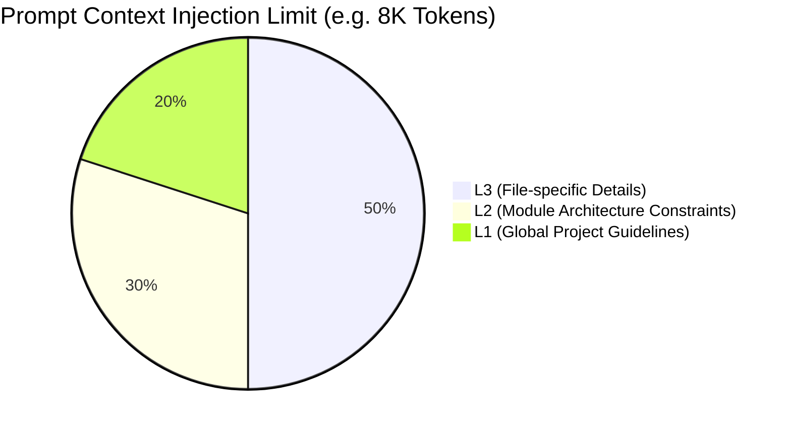

# Token Management & Extraction Efficiency

## Core Philosophy
1. **"Solidify known boundaries and strictly adhere to them" (Local Deterministic Constraints)**
2. **"Let the LLM explore unknown boundaries and continuously convert the unknown into the known" (Evolutionary Solidification)**

## Context Weight Allocation (Agentic RAG)

## 1. Consumption Phase: Interception and Allocation
*   **Local Pre-processing**: Active Editor anchoring identifies L3 rules related to the file, traces upstream to L2 and L1, and truncates irrelevant noise on the Local side before LLM execution.
*   **O(1) Map Key Lookups**: Relies on cached definitions to prevent wasting tokens on intent arbitration.

## 2. Evolution Phase: Local Solidification (1900 -> 300 Tokens)
*   **Unknown to Known**: The system initially uses 1900 Tokens to ask the LLM to find hotspots in 100 git commit paths.
*   **Solidification**: The system evolves by implementing a Trie (Prefix Tree) algorithm locally.
*   **Efficiency Breakthrough**: On the next run, the Local side compresses the paths, shrinking the payload to under 300 Tokens, freeing up LLM compute for higher-level semantic tasks.

## 3. Batching & Chunking
*   Configurations like `docuvia.extraction.maxFileSizeKBWarning` must be exposed. Massive `/analyze_l2` tasks are sliced into chunks to prevent context overflow.