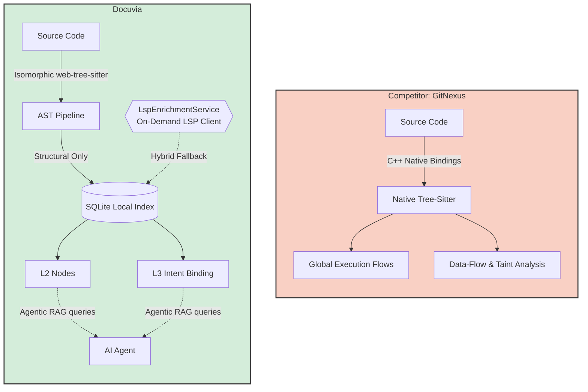

# AST & Semantic Graph Competitor Analysis

## Current State

Docuvia utilizes a multi-language Web-tree-sitter worker pool and a local-first SQLite schema. It features a "Ring 3" cross-file Scope Resolver that accurately maps `CALLS` edges by traversing import statements, and it anchors L1/L3 Architectural Intent directly to these L2 structural nodes.

## Competitors

GitNexus, Sourcegraph (Cody / sg)

## What Competitors Have That We Don't

- **Global Execution Flows (`processes`)**: While Docuvia accurately maps cross-file `CALLS` edges (Ring 3), we do not currently stitch these individual edges together into high-level, end-to-end "execution flows" or business processes like GitNexus does.
- **Data Dependency & Taint Analysis**: GitNexus and Sourcegraph can track variable assignments and data-flow (Reachability), not just function calls.
- **WASM Independence**: GitNexus compiles Node-API (C++) native bindings for tree-sitter, avoiding the memory limits and module-resolution quirks of Web-tree-sitter in CLI environments.

## What We Have That They Don't

- **Isomorphic Engine**: By strictly adhering to `web-tree-sitter`, Docuvia's AST engine can run in the Node.js CLI _and_ inside the VS Code Web Extension (browser). GitNexus completely fails in a pure browser/Web IDE environment because it relies on C++ binaries.
- **Intent Binding (L2/L3)**: We don't just extract structural syntax. Our graph schema is purpose-built to attach Human/AI Architectural Intent (`l3_nodes`) directly to the AST nodes, creating an Agentic RAG graph.

## Fatal Flaws

- **No Control Flow Graph (CFG)**: We have zero understanding of loops, conditionals, or statement-level blocks. Our AST extraction is strictly structural (Functions, Classes, Imports, Calls).
- **Hardcoded Path Aliases**: Our `ScopeResolver` currently hardcodes the `@workspace/` alias logic. It does not dynamically read the `tsconfig.json` paths or `package.json` exports, meaning it will silently fail to resolve cross-file calls in projects with complex monorepo layouts (unlike GitNexus which natively uses the TypeScript compiler API).

## Immediate Next Steps

- Keep the AST `ScopeResolver` "fast and dumb". Avoid bloating the AST pipeline with deep compiler logic (CFG, full execution flow stitching, or parsing `tsconfig.json` paths). The indexer should focus on maintaining fast, O(1) SQLite lookups.
- Achieve true parity with GitNexus via a **Hybrid Approach**: lazy-load an on-demand background LSP client (`LspEnrichmentService`). MCP tool calls like `docuvia_impact` will query the fast AST SQLite index first, and then conditionally escalate to the LSP for exact execution flows and taint analysis ONLY when required by an AI agent.

