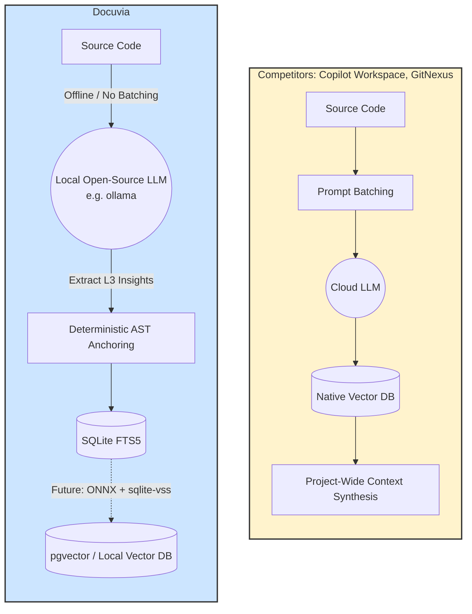

> **Note:** This document contains competitor analysis and references that have not been fully integrated into the current implementation yet.

# Agentic RAG & Background Intent Extraction Competitor Analysis

## Current State

Docuvia handles L3 intent extraction asynchronously using a local model (`ollama/llama3-8b`) or cloud provider mapped via `docuvia.json`. Extracted insights are directly linked to AST L2 nodes in SQLite.

## Competitors

GitHub Copilot Workspace, GitNexus

## What Competitors Have That We Don't

- **Native Vector Search**: Copilot Workspace uses deeply integrated embeddings for fuzzy intention mapping. Docuvia completely lacks a local Vector Database; we only use FTS5 (Full-Text Search) in SQLite.
- **Prompt Batching**: GitNexus batches multiple small extractions into a single LLM call to save tokens. Docuvia fires a separate API request for every single file.
- **Project-Wide Synthesis**: Copilot Workspace synthesizes context across the entire repository to draft multi-file plans. Docuvia's L3 nodes are strictly file-isolated.

## What We Have That They Don't

- **Offline Background Processing**: We can run RAG asynchronously (`--deep`) in the background on local open-source models, completely bypassing the massive cloud costs associated with Copilot.
- **Deterministic AST Anchoring**: Our L3 insights are permanently anchored to exact AST node IDs. If the file is renamed, the insights follow the node.

## Fatal Flaws

- **Zero Vector Capabilities**: FTS5 string matching is fundamentally incapable of true Agentic RAG. If a user asks for "authentication", and the L3 node says "login management", FTS5 will return 0 results.
- **LLM Rate Limiting**: Sending 1000 files to an LLM provider simultaneously via `ExtractService` will immediately trigger a 429 Too Many Requests error.

## Immediate Next Steps

- Integrate a local vector embedding generator (e.g., `all-MiniLM-L6-v2` via ONNX) and store vectors directly in a `pgvector` or `sqlite-vss` compatible format.
- Implement a task queue to throttle and batch `ExtractService` requests.

