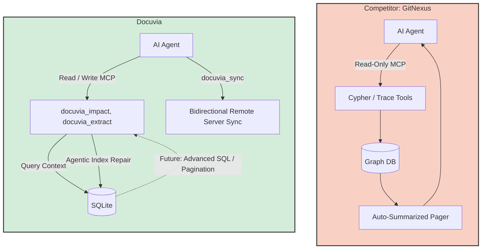

> **Note:** This document contains competitor analysis and references that have not been fully integrated into the current implementation yet.

# MCP AI Interfaces & Tooling Competitor Analysis

## Current State

Docuvia exposes 8 core MCP tools via `server.ts`, granting AI agents access to graph queries (`docuvia_context`), blast radius impact analysis (`docuvia_impact`), and index maintenance commands.

## Competitors

GitNexus

## What Competitors Have That We Don't

- **Cypher Query Language**: GitNexus allows advanced agents to send raw Cypher queries directly to the graph database (e.g., `MATCH (a)-[:CALLS]->(b) RETURN a`).
- **Semantic Path Tracing**: GitNexus provides a `gitnexus_trace` tool to find the shortest directed path between any two symbols.
- **Auto-Summarized Pager**: GitNexus MCP automatically truncates outputs that are too large, summarizing the omission to prevent flooding the AI context window.

## What We Have That They Don't

- **Write Capabilities**: Docuvia exposes `docuvia_init`, `docuvia_analyze`, and `docuvia_extract` over MCP. GitNexus MCP is strictly read-only. We allow AI agents to actively repair or upgrade the knowledge index themselves.
- **Bidirectional Sync**: `docuvia_sync` allows an AI agent to push its local context updates to a remote orchestration server directly through the MCP protocol.

## Fatal Flaws

- **Hardcoded Tool Limits**: `docuvia_impact` hardcodes a depth of 3 and a limit of 5 nodes per branch. Advanced AI agents have no way to request a deeper scan.
- **Missing Token Budgeting**: Returning massive `docuvia_context` JSON blobs for God-Objects (like a utility file with 500 exports) will instantly blow up Claude's token limit.

## Immediate Next Steps

- Add pagination and depth parameters to `docuvia_impact` and `docuvia_context`.
- Introduce a `docuvia_query_advanced` tool that accepts raw SQLite SQL for sophisticated AI orchestration.

