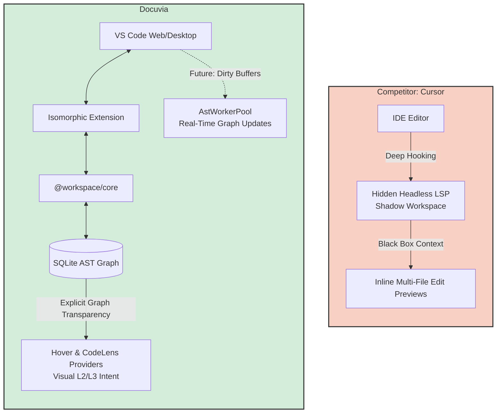

# IDE & VS Code Client Competitor Analysis

## Current State

Docuvia provides a VS Code extension with standard command palette integration and in-editor visual anchors via `HoverProvider` and `CodeLensProvider` that reveal "Blast Radius" data powered by the local SQLite AST graph.

## Competitors

Cursor (Shadow Workspace)

## What Competitors Have That We Don't

- **Shadow Workspace**: Cursor runs a hidden, headless language server in the background to simulate code edits and compile-test them before showing the results to the user.
- **Inline Multi-File Edit Previews**: Cursor provides a rich diff UI spanning multiple files concurrently based on its internal graph.
- **Deep Language Server Protocol (LSP) Hooking**: Cursor intercepts the IDE's native "Go to Definition" and "Find All References".

## What We Have That They Don't

- **Universal Graph Transparency**: Cursor's context engine is a black box. Docuvia explicitly renders the exact `L3 Intent` and AST Call Graph edges via CodeLens, meaning the developer can visually audit exactly what context the AI is going to see _before_ making a prompt.
- **Isomorphic Extension Architecture**: Our VS Code Client directly links to `@workspace/core`, meaning the exact same graph traversal logic running in the CLI runs seamlessly inside the IDE.

## Fatal Flaws

- **Reactive UI**: Our Hover and CodeLens providers are entirely reactive. They only display context if the user explicitly triggers them or scrolls over a symbol.
- **No Predictive Pre-warming**: The client does not proactively analyze unsaved (dirty) buffers to update the graph in real-time, leading to stale CodeLens data while the user is actively typing.

## Immediate Next Steps

- Implement an `onDidChangeTextDocument` event listener that feeds dirty buffer contents directly to the `AstWorkerPool` for real-time, in-memory graph updates.
- Develop a Webview-based "Topology Map" to provide a D3.js visual representation of the L2/L3 Node connections.

