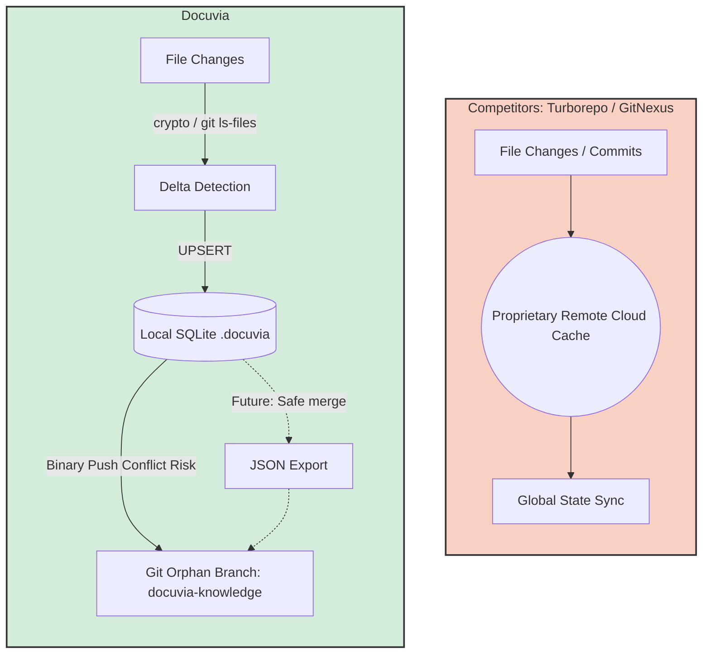

> **Note:** This document contains competitor analysis and references that have not been fully integrated into the current implementation yet.

# Data Pipeline & Sync Competitor Analysis

## Current State

Docuvia utilizes a Git-native blob hashing approach (`git ls-files -s`) combined with SQLite `UPSERT` transactions to achieve near-instant incremental AST scanning. Syncing is handled non-intrusively via an orphan Git branch (`docuvia-knowledge`).

## Competitors

Turborepo, GitNexus

## What Competitors Have That We Don't

- **Global Remote Caching**: Turborepo can fetch artifact hashes from a centralized cloud cache (Vercel) to share build states across teams.
- **Deep Git Integration**: GitNexus analyzes commits to find "affected execution flows" mapping git diff hunks to their exact AST symbols dynamically.

## What We Have That They Don't

- **Zero-Pollution Local State**: Turborepo and GitNexus often leave heavy cache folders (`.turbo`, `.gitnexus`). Docuvia strictly bounds its database inside `.docuvia` but relies on the actual Git internal tree for distribution. By storing the graph in an orphan branch, developers can `git push` the graph directly to their origin without needing a proprietary remote caching server.
- **Graceful Degradation**: If Git is unavailable, Docuvia's data pipeline seamlessly falls back to `fast-glob` and manual Node.js `crypto` hashing.

## Fatal Flaws

- **Git Branch Conflicts**: While the orphan branch strategy is clever, concurrent pushes from multiple developers to `docuvia-knowledge` will result in severe merge conflicts, as SQLite binary files cannot be easily merged by git.
- **Lack of Garbage Collection**: We do not currently prune deleted files from the `project_files` table efficiently; we only skip what hasn't changed. Over time, the SQLite DB will bloat with dead nodes.

## Immediate Next Steps

- Implement a robust JSON-based export for the SQLite DB before committing to the orphan branch, allowing Git to handle line-by-line diff merging safely.
- Write a `CleanService.prune()` function to garbage collect orphaned L2/L3 nodes whose `source_paths` no longer exist in the working directory.

