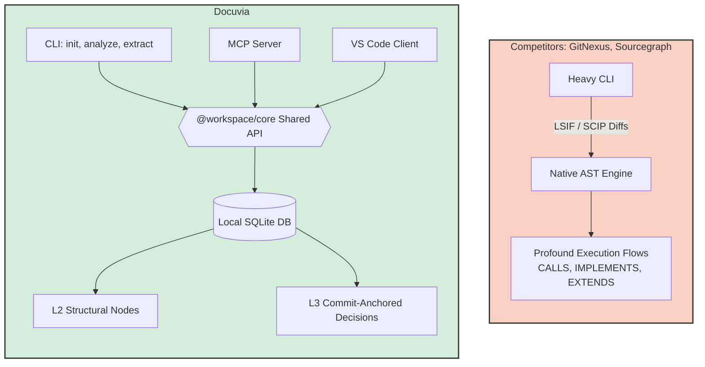

# CLI & Core API Parity Competitor Analysis

## Current State

This document tracks the implementation status of CLI commands (init, analyze, extract, query, clean, status, detect-changes, sync), their alignment with the Shared Core API (`@workspace/core`), and parity across other presentation layers (MCP, VS Code). Implementation is largely complete and well-aligned, with recent architectural updates providing Core API encapsulation (ADR-021), multi-root workspace isolation, feature parity across MCP tools, and localized CLI fixes.

## Competitors

GitNexus, Sourcegraph (Cody / sg), Cursor (Shadow Workspace), GitHub Copilot (Workspace)

## What Competitors Have That We Don't

- Git-integrated dirty-tracking (GitNexus) and LSIF/SCIP diffs (Sourcegraph) or fast LSP-based invalidation (Cursor).
- Direct compilation of tree-sitter parsers, explicit `.wasm` bundling via loaders, or native bindings (Node-API).
- Profound execution flows out of the box (`CALLS`, `IMPLEMENTS`, `EXTENDS`, `ACCESSES`).
- Automatic linking of high-level architectural intent (embeddings) to underlying symbols without a separate extraction pass.

## What We Have That They Don't

- Unified local-first Core API connecting CLI commands with MCP tools in a single SQLite DB.
- Integrated L3 decision extraction that anchors directly to commits.

## Fatal Flaws

- Historically fragile WASM loading strategies that broke based on package manager hoisting.
- High overhead if delta tracking (file hashing) fails to match fast LSP-based invalidation on large codebases.
- Limited semantic edge depth (recently added `CALLS`, but missing broader type-aware dependencies).

## Immediate Next Steps

- Scale incremental sync (`AnalyzeService`) for large monorepos.
- Expand semantic graph to include cross-module `IMPLEMENTS` and `EXTENDS`.
- Refine background L3 Extraction (`--deep` flag) for better LLM context building.

