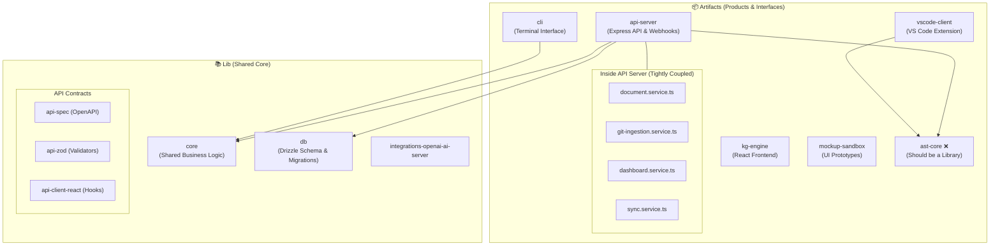
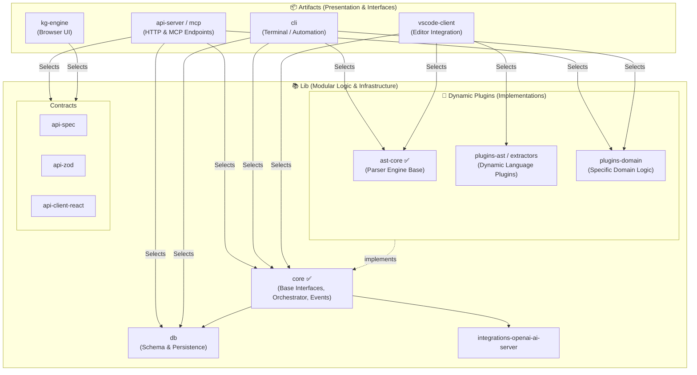

# System Architecture Refactoring Plan

## 1. Current System Architecture (Issue Identified)

The current workspace violates the **"Core-Driven Development"** principle. Some core libraries and shared domain services are tightly coupled inside specific product artifacts instead of being generalized in the `lib/` directory.

## 2. Issues & Violations

1. **`artifacts/ast-core` Misplacement**: AST parsing and bridging is a generic foundational capability (Isomorphic AST Microkernel). Placing it inside `artifacts/` suggests it is an end-product. It must be moved to `lib/ast-core`.
2. **Fat `api-server` (Domain Logic Coupling)**: Many core domain services (e.g., `git-ingestion.service.ts`, `dashboard.service.ts`, `document.service.ts`) are currently located in `artifacts/api-server/src/services/`. According to `shared_core_api_architecture.md`, the CLI, MCP, and VS Code extensions must consume the same core logic. Keeping these in `api-server` forces other artifacts to either duplicate logic or make unnecessary network calls.

## 3. Proposed Reasonable System Architecture (Selective Composition)

We need to relocate the misplaced packages and extract business logic from the API server into the `lib/` directory.
Crucially, to prevent `lib/core` from becoming a monolithic "God Package", we must split it into foundational core interfaces and dynamic plugins/extensions.

The presentation layers (`cli`, `mcp`, `vscode-client`, `api-server`, `kg-engine`) sit at the top level. They act as "Ports/Adapters" and **selectively compose** the core architecture and plugins based on their specific use cases and runtime environments.

## 4. Refactoring Action Plan

### Phase 1: Relocate & Split `ast-core` [COMPLETED]

- [x] Move `artifacts/ast-core` -> `lib/ast-core` (This becomes the base parser engine).
- [x] Extract specific language detection and dynamic parsing capabilities into a separate dynamic plugin folder (e.g., `lib/plugins-ast` or `lib/extractors`).
- [x] Update `package.json` references and `tsconfig.json` paths accordingly.

### Phase 2: Prevent `core` from becoming a God Package

- Identify domain services currently in `artifacts/api-server/src/services/` that are not strictly HTTP-bound.
- **Do not** dump everything into `lib/core`.
- Define foundational interfaces, dependency injection tokens, and orchestrators (like `intent-router`) in `lib/core`.
- Move specific business implementations (e.g., specific language ingestion, specific webhook handlers) into modular plugin packages like `lib/plugins-domain` or domain-specific packages.
- Ensure `api-server`, `cli`, and `vscode-client` compose these plugins into the `core` orchestrator without duplicating logic.
