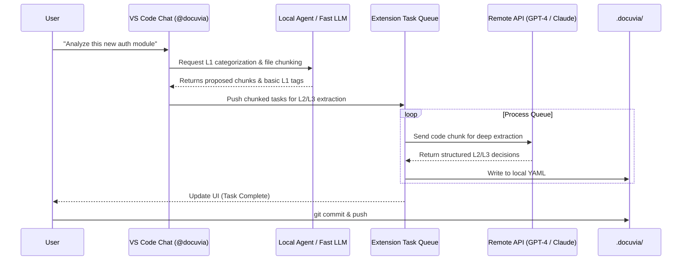
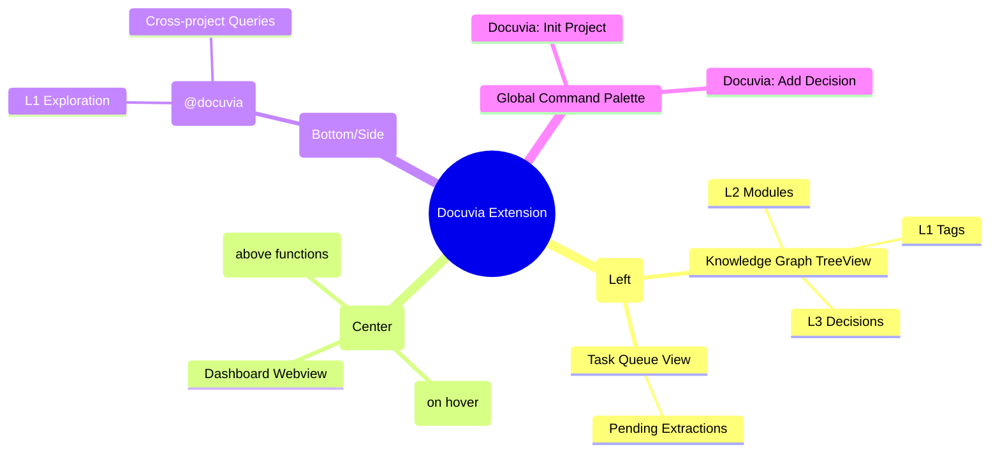

# VS Code Extension Implementation Roadmap (Git-Backed Architecture)

## Architecture Paradigm Shift

Based on architectural discussions, the VS Code Extension will adopt a **Git-backed, Local-first** architecture with a **Hybrid Execution Engine**.

### Core Principles

1. **Source of Truth**: The local `.docuvia/` folder inside each Git repository is the absolute source of truth for deep project knowledge.
2. **Conflict Resolution**: Handled entirely by Git (merges, rebases).
3. **Central Server Role**: The PostgreSQL Docuvia Server transitions to a **Global Search Index** for cross-project "breadth" knowledge, updated via CI/CD pipelines.
4. **Hybrid Execution**: Light tasks (file reading, simple routing, L1 exploration) run locally (via local LLMs like Qwen 0.5B or fast API). Heavy tasks (L2/L3 extraction) are queued and processed asynchronously.

---

## Roadmap

### Phase 1: Local Knowledge Schema & Foundations

- **Goal**: Define how knowledge is stored locally and create the basic extension skeleton.
- **Tasks**:
  - [x] Initialize VS Code Extension project structure (`artifacts/vscode-client`).
  - [x] Define the `.docuvia` local file schema (e.g., `l1_tags.yaml`, `l2_modules.yaml`, `l3_decisions/`).
    - _Decision_: Use UUIDs/CUIDs for strict entity linking, paired with human-readable fields (`slug` or `name`) for Git diff readability.
    - _Decision_: Structure L3 decisions as Markdown files with YAML frontmatter.
    - _Decision_: Implement an L3 Router/Index (`l3_index.yaml`) to map UUIDs to their corresponding markdown files, preventing costly full-directory scans.
  - [x] Implement local file system watchers and parsers to load `.docuvia` data into VS Code memory.
  - [x] Create the `~/.docuvia/config.yaml` schema for global settings (API keys, Central Server URL).
  - [ ] **Critical Gap (acceptL1Tags — Directory Creation)**: `acceptL1Tags` must call `vscode.workspace.fs.createDirectory` for `.docuvia/` before writing `l1_tags.yaml`. Currently fails silently with `FileNotFound` if the folder does not exist (BUG A-1).
  - [ ] **Critical Gap (acceptL1Tags — Skeleton Polyfill)**: After writing `l1_tags.yaml`, `acceptL1Tags` must also create `l2_modules.yaml` and `l3_decisions/` directory if they do not exist. The skeleton is currently incomplete after an `/explore` + Accept flow — previous documentation incorrectly claimed the full skeleton was created (BUG A-2).
  - [ ] **Critical Gap (acceptL1Tags — Multi-Root)**: `acceptL1Tags` must resolve the target workspace root from the chat participant's context rather than hardcoding `workspaceFolders?.[0]`. In multi-root workspaces, the wrong project's YAML is overwritten (BUG A-3, M-2).

### Phase 2: UI/UX Shell & TreeViews

- **Goal**: Build the native VS Code interfaces to display local knowledge.
- **Tasks**:
  - [x] Register Docuvia Activity Bar Icon.
  - [x] Implement `Knowledge Graph` TreeView (L1 -> L2 -> L3 hierarchy) reading from local `.docuvia`.
  - [x] Add `viewsWelcome` contribution to guide users to initialize the project when `.docuvia` is missing.
    - _Decision_: Use the welcome view to route users to `/explore` (via `docuvia.startExplore`) rather than silent initialization, ensuring AI analysis happens by default.
  - [x] Prompt for project name during `Docuvia: Init Project` and auto-refresh the TreeView state.
  - [x] Implement `Task Queue` TreeView for tracking background extraction tasks.
  - [x] Create the Webview-based Dashboard skeleton (to replace the web app).
    - _Decision_: The Dashboard serves as a **"Project Knowledge Hub"**.
    - _Decision_: **Layout**: Split layout.
      - **Left Pane (Actionable & High-Value Knowledge)**: Quick Start guides, most frequently accessed decisions, highly-tagged modules, and an overview of "What is this repo?".
      - **Right Pane (Stats & Background Tasks, smaller UI)**: Knowledge coverage statistics, background extraction queues, recent architectural changes.
      - **Bottom**: A unified search/Agent bar for natural language queries (both deep local context and broad central search).
    - [x] Improve Dashboard bottom-bar contrast to prevent blending with the VS Code status bar.
    - [x] Wire Dashboard bottom-bar search button to open `@docuvia` Chat participant.

### Phase 3: Interactive Exploration & Hybrid Execution (Chat)

- **Goal**: Implement the `@docuvia` chat participant and local/remote execution routing.
- **Tasks**:
  - [x] Register `@docuvia` Chat Participant.
  - [x] Implement "L1 Exploration Mode" using local/fast LLMs to analyze `README.md` and suggest initial architecture.
    - _Decision_: Use a **Multi-Template-Driven** approach for L1 initialization. Extension detects project type (e.g., hybrid, frontend, backend) and offers multiple predefined templates (Standard Ontology).
    - _Decision_: **Dynamic AI Fallback**: If templates fail to match, dynamically query the active Copilot model (`request.model`) with `dependencies` to zero-shot generate 10-25 architectural L1 tags.
    - [x] Enhance `/explore` to detect mixed/large project types (e.g., frontend + backend + library) and smartly combine their standard L1 tags using the LLM.
    - [x] Enhance `/explore` to render results as a clean Markdown table instead of raw YAML.
    - [x] Wire `/explore <type>` argument from `request.prompt` to apply matching L1 template without re-running workspace detection.
  - [x] Implement the Task Queue manager to chunk heavy L2/L3 extraction requests.
    - [x] Enhance `/extract` to support directory-level recursive extraction with `.gitignore` and `minimatch` filtering.

### Phase 4: Editor Integration (Deep Context)

- **Goal**: Bring knowledge directly into the code editing experience.
- **Tasks**:
  - [x] Implement CodeLens: Provide "View Context" or "Add Decision" buttons above key architectural boundaries.
    - _Decision_: Use **CodeLens as the primary knowledge signal** (e.g., `🧠 Docuvia: 2 Decisions`) to avoid cluttering native Hover tooltips.
    - _Decision_: Clicking the CodeLens shows the 1-2 most highly relevant decisions directly in a Peek View or Quick Pick. If there are more decisions or complex context, route the user to the Chat View for interactive analysis, modification, or explanation.
  - [x] Implement Hover Provider: Show L3 decisions when hovering over relevant functions/modules (restrict to explicit requests or Docuvia files to avoid noise).
  - [x] Implement context-menu action to quickly generate an L3 decision draft from selected code and save to `.docuvia/`.
  - [ ] **Critical Gap (Orphaned L3s)**: Implement an auto-categorization flow so newly extracted L3 decisions (from `/extract` or Code Selection) are automatically linked to an L2 module. Currently, all extracted decisions are saved with `l2_module_id: ""` (BUG B-1/H-1).
  - [ ] **Critical Gap (CodeLens Drift)**: Upgrade CodeLens anchoring. Relying solely on line numbers causes annotations to drift when code is modified above them. Implement AST-based or Snippet Hash anchoring. **Previous documentation incorrectly described drift protection as already implemented — it is not (BUG D-1/D-2).**
  - [ ] **Critical Gap (addDecision — l3_router.yaml)**: `addDecision` must append the new decision entry to `l3_router.yaml` immediately after writing the markdown file. Currently the decision is invisible to all router-based lookups (CodeLens, Hover, TreeView) until the file-system watcher triggers a full reload (BUG C-1, I-1).
  - [ ] **Critical Gap (Slug Collision Guard)**: `addDecision` must check whether a file with the same slug already exists and either append a numeric suffix or prompt the user, rather than silently overwriting the existing decision (BUG C-3, I-3).
  - [ ] **Critical Gap (l2_module_id Sentinel)**: Replace the `"unassigned"` sentinel with an empty string `""` or a proper UUID constant, and add a downstream convention so consumers handle the unlinked case consistently (BUG C-2, I-2).
  - [ ] **Critical Gap (source_paths Guidance)**: Add UI guidance (welcome message or inline hint) to prompt users to populate `source_paths` in `l2_modules.yaml`. Default skeleton writes `source_paths: []` making all CodeLens and Hover features silently inactive for new users (BUG D-3, J-3).

### Phase 5: Breadth Search Integration (Central Server)

- **Goal**: Connect the local extension to the central Docuvia server for cross-project queries.
- **Tasks**:
  - [x] Update Chat participant to route "breadth" queries (e.g., "How do other projects do auth?") to the central `/query` API.
  - [x] Display remote search results seamlessly within the Chat or a dedicated Webview search panel.
  - [x] Implement secure credential management.
    - _Decision_: Use a private key (or OS Keychain) to encrypt API tokens stored in `~/.docuvia/config.yaml`.
  - [x] Implement deferred Authorization (AuthZ) handling for the central server.
    - _Decision_: Default to global access for simple/internal deployments. Provide hooks for enterprise deployments to integrate with their own Identity Providers (OAuth / Active Directory) for project-level Role-Based Access Control (RBAC).
  - [ ] **Critical Gap (Local Search)**: Enhance local `/query` logic. Currently it uses naive `.includes()` string matching which fails if vocabulary differs. Implement semantic search or LLM-driven query expansion for the local `.docuvia` store (BUG E-2).
  - [ ] **Critical Gap (server_url UI)**: Add a VS Code setting (`docuvia.server.url`) so users can set the central server URL via Settings UI or `settings.json`, rather than requiring manual editing of `~/.docuvia/config.yaml` (BUG K-1).
  - [ ] **Critical Gap (SearchResultsPanel Local Fallback)**: When `search.defaultView` is `"panel"` and the central server is unavailable, fall back to local knowledge search rather than surfacing a generic error (BUG N-1).
  - [ ] **Critical Gap (searchFromSelection Length Limit)**: Cap the query length for `searchFromSelection` (e.g., 2000 chars) to prevent sending entire file contents to the central server and risking sensitive data exposure (BUG N-2).
  - [ ] **Critical Gap (SearchResultsPanel XSS)**: Sanitize all server-returned content (title, snippet, projectName fields) before rendering in the SearchResultsPanel Webview to prevent XSS from malicious server responses.

### Phase 6: Human-in-the-Loop & Quality Assurance

- **Goal**: Ensure the extracted knowledge is accurate and verifiable.
- **Tasks**:
  - [ ] AST-based Chunking: Implement `tree-sitter` for precise, syntax-aware chunking when extracting decisions from code (currently using a lightweight line-based fallback). Note: `GlobalConfig.chunking_strategy: 'line' | 'ast'` is defined but `TaskRunner` currently ignores it (BUG B-2).
  - [ ] Git State Verification: Integrate `vscode.git` API to warn users if they are querying or modifying decisions when there are uncommitted changes or detached HEAD states.
  - [ ] Review Queue UI: Build a dedicated view for approving/rejecting AI-extracted decisions.
  - [ ] **Critical Gap (Dashboard Live Refresh)**: Subscribe Dashboard webview to `KnowledgeStore.onDidLoad` events (or add a manual Refresh button) so that stats update without reopening the panel (BUG F-2).
  - [ ] **Critical Gap (Multi-Root Query Attribution)**: When returning results from the aggregated `snapshot` (multi-root), tag each result with its source workspace root so the user knows which project a decision came from (BUG M-1).
  - [ ] **Critical Gap (initProject Empty Name Guard)**: Add `validateInput` to the project name `showInputBox` in `initProject` to prevent empty project names from being saved (BUG G-1).
  - [ ] **Critical Gap (Binary File Guard)**: Add pre-extraction checks to reject binary or empty files in both `docuvia.runExtraction` and `@docuvia /extract` before queuing tasks (BUG H-3).

---

## Functional Component Mapping

The following Mermaid diagrams illustrate the system interactions.

### 1. Storage & Synchronization Flow

How data moves between Local Git, VS Code, and the Central Server.

```mermaid
flowchart TD
    subgraph VSCode_Extension["VS Code Extension"]
        Editor[Editor / Hover]
        Chat[Chat View]
        Tree[Sidebar TreeView]
        LocalLogic[Local Extension Logic]
    end

    subgraph Local_Workspace["Local Git Workspace"]
        Code[Source Code]
        DocuviaFolder[".docuvia/ (YAMLs)"]
    end

    subgraph Global_Settings["Global (Local Machine)"]
        UserConfig["~/.docuvia/config.yaml"]
    end

    subgraph Remote_Infrastructure["Remote Infrastructure"]
        GitRemote[GitHub / GitLab]
        CICD[CI/CD Pipeline]
        CentralDB[(PostgreSQL Central Index)]
        DocuviaAPI[Docuvia Server API]
    end

    Editor & Chat & Tree <--> LocalLogic
    LocalLogic <-->|Read/Write| DocuviaFolder
    LocalLogic -->|Read| UserConfig
    Code <--> DocuviaFolder : "Tied by Git Commits"

    DocuviaFolder -->|git push| GitRemote
    GitRemote -->|Trigger| CICD
    CICD -->|Index Updates| DocuviaAPI
    DocuviaAPI -->|Write| CentralDB

    LocalLogic <-->|Query Breadth Knowledge| DocuviaAPI
```

### 2. Hybrid Execution & Task Flow

How tasks are split between local lightweight models and heavy remote processing.



### 3. VS Code UI Layout

How the extension maps to VS Code native UI elements.


