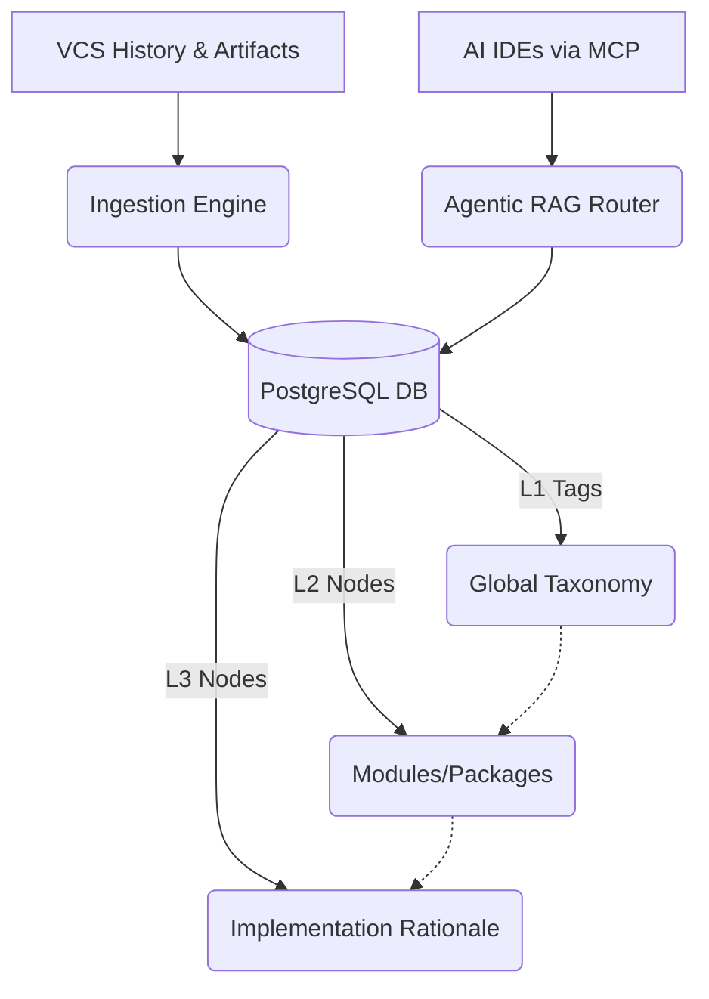

# 1. Introduction and Goals

## 1.1 Product Vision

**Docuvia** is a Universal VCS Knowledge Graph Engine. It ingests version control history (Git, SVN), documents, and build artifacts from any software project, and constructs a queryable [three-tier knowledge graph (L1 → L2 → L3)](adrs/ADR-005-knowledge-abstraction-strategy.md). The resulting knowledge graph is exposed via a REST API, a Model Context Protocol (MCP) interface for AI IDEs, a React web dashboard, and a [VS Code extension](adrs/ADR-001-vscode-client-onboarding.md) that integrates directly into the developer's editor.

The core insight: commit messages, PR descriptions, and code diffs encode architectural decisions, implementation rationale, and module relationships. Docuvia surfaces this latent knowledge in a structured, searchable, and agent-consumable form.

---

## 1.2 Core Requirements (Top 5 Drivers)

1. **[Universal VCS Ingestion](adrs/ADR-004-git-isomorphic-graph.md)** — Ingest any Git or SVN repository and produce a queryable knowledge graph from commit history, documents, and build artifacts.
2. **[Three-Tier Knowledge Structure](09-architectural-decisions.md#adr-003-three-tier-knowledge-graph-l1l2l3)** — L1 (global classification tags) → L2 (per-project modules/packages) → L3 (implementation decisions, rules, rationale per module).
3. **[Human-in-the-Loop Review](09-architectural-decisions.md#adr-006-human-in-the-loop-via-review-queue)** — All AI-generated nodes enter a review queue (`review_tasks`) where humans anchor, merge, or reject them before they are anchored to the graph.
4. **[Agentic RAG via MCP](adrs/ADR-007-agentic-rag-routing.md)** — Answer natural language queries about the codebase using 4-way intent routing (vector | graph | direct | hybrid), exposed as MCP-compatible tool calls for AI IDEs.
5. **[VS Code Integration](adrs/ADR-001-vscode-client-onboarding.md)** — Provide inline, editor-native access via a Knowledge Graph TreeView, Command Palette commands, CodeLens, Hover providers, and a Copilot Chat participant (`@docuvia`).

---

## 1.3 Quality Goals

| Quality Goal                        | Motivation                                                                                                                                                                          | Priority    |
| ----------------------------------- | ----------------------------------------------------------------------------------------------------------------------------------------------------------------------------------- | ----------- |
| **Accuracy of L3 Decision Records** | Developers must trust AI-generated decisions; inaccurate records erode confidence faster than no records                                                                            | 🔴 Critical |
| **MCP Query Latency**               | AI IDEs call `/mcp/query` synchronously during autocomplete; p95 must be under 2s excluding LLM calls                                                                               | 🔴 Critical |
| **Observability**                   | Structured logs and an activity feed are required for operators to diagnose pipeline failures and LLM drift                                                                         | 🟠 High     |
| **Extensibility — VCS Providers**   | New VCS adapters (GitLab, Bitbucket, Perforce) must be addable without modifying core services                                                                                      | 🟠 High     |
| **Extensibility — LLM Providers**   | The LLM integration must be swappable; [OpenAI-compatible interface is an abstraction boundary](09-architectural-decisions.md#adr-004-openai-compatible-llm-interface-only)         | 🟠 High     |
| **Maintainability via API-First**   | [All API types are generated from `openapi.yaml`](09-architectural-decisions.md#adr-001-openapi-as-single-source-of-truth); zero drift between spec and implementation is mandatory | 🟠 High     |
| **Testability**                     | All routes and services must be unit-testable in isolation; DB integration tests must be rollback-safe                                                                              | 🟡 Medium   |

---

## 1.4 Stakeholders

| Role                      | Concern                                                                          | Key Touch Points                                                |
| ------------------------- | -------------------------------------------------------------------------------- | --------------------------------------------------------------- |
| **Developer / Team Lead** | Understand codebase decisions and module ownership at file/module level          | VS Code extension (TreeView, CodeLens, Hover), `/mcp/query`     |
| **AI Agent / IDE**        | MCP-compatible tool calls for context augmentation during code generation        | `/mcp/*` endpoints, Copilot Chat `@docuvia` participant         |
| **Code Reviewer**         | Understand the historical rationale for architectural choices in a PR            | GitHub PR analysis webhook, review dashboard                    |
| **Project Manager**       | Dashboard statistics, review task queue health, pipeline status                  | kg-engine dashboard (port 18774)                                |
| **SaaS Operator**         | Deployment, multi-tenant configuration, LLM key management, subscription billing | `subscriptions` / `notifications` tables, environment variables |
| **New Team Member**       | Onboarding — understanding the codebase without reading all commits              | Knowledge graph query UI, `@docuvia /explore` chat              |

---

## References

- [Roadmap Checklist](../roadmap/roadmap_checklist.md) — Full completion checklist (42/42 items)
- [AGENTS.md](../../AGENTS.md) — AI developer guide and architectural conventions
