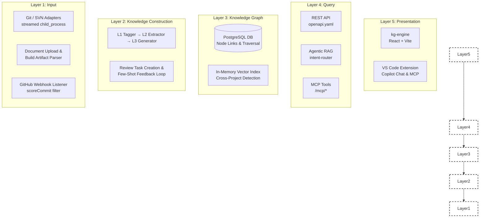

# 4. Solution Strategy

## 4.1 Technology Choices

| Decision              | Choice                                                            | Rationale                                                                                                                      |
| --------------------- | ----------------------------------------------------------------- | ------------------------------------------------------------------------------------------------------------------------------ |
| **Language**          | TypeScript (strict mode)                                          | Full-stack type safety; enables Orval codegen from OpenAPI spec; prevents entire classes of runtime errors                     |
| **Backend Framework** | Express 5 (ESM)                                                   | Minimal, well-understood; async-native in v5 (async error propagation); large ecosystem                                        |
| **ORM**               | Drizzle ORM                                                       | Type-safe SQL queries as TypeScript; schema-as-code; migration support; no magic                                               |
| **Database**          | PostgreSQL                                                        | JSONB column type for embedding storage; proven ACID guarantees; rich indexing; no external vector DB required in v1           |
| **Frontend**          | React 18 + Vite + shadcn/ui + Tailwind CSS                        | Fast HMR; composable design system; tree-shakeable components                                                                  |
| **API Contract**      | OpenAPI 3.x + Orval codegen                                       | Single source of truth eliminates type drift between frontend and backend; generates both Zod validators and React Query hooks |
| **Vector Search**     | Raw SQL cosine distance with Temporal Decay filter                                       | No external vector DB dependency in v1; embeddings stored as JSONB in PostgreSQL; sufficient for ≤100K nodes                   |
| **LLM Integration**   | OpenAI-compatible interface (`lib/integrations-openai-ai-server`) | Provider-agnostic; compatible with OpenRouter, Azure OpenAI, and any `/v1/chat/completions`-compatible endpoint                |
| **IDE Integration**   | VS Code Extension API                                             | Primary developer audience uses VS Code; enables Copilot Chat participant, CodeLens, TreeView                                  |
| **MCP Layer**         | Custom Express routes at `/mcp/*`                                 | Compatibility with AI agent toolchains (Cursor, GitHub Copilot, Claude, etc.) that implement Model Context Protocol            |
| **Package Manager**   | pnpm workspaces                                                   | Efficient monorepo dependency management; hoisting control; `preinstall` hook blocks accidental npm/yarn use                   |

---

## 4.2 Top-Level Decomposition

Docuvia is decomposed into **five conceptual layers**, each corresponding to one or more packages in the monorepo:



### Layer Breakdown

1. **Input Layer**: Handles raw data ingestion. Stream-based Git/SVN adapters, document parsing via isolated processes, and webhook listeners with signal/noise filtering (`scoreCommit`).
2. **Knowledge Construction Layer**: The LLM-powered engine. Translates raw inputs into structured abstractions (L1/L2/L3) and automatically queues them for human review to create a self-improving feedback loop.
3. **Knowledge Graph**: The storage boundary. PostgreSQL acts as the single source of truth, handling graph edge traversal and temporal vector similarity matching.
4. **Query Layer**: The API boundary. Exposes strictly typed REST endpoints (driven by Orval/Zod) and the 4-way Agentic RAG router via MCP.
5. **Presentation Layer**: The user interfaces. The Vite-powered dashboard for administration, and the editor-native VS Code extension delivering Knowledge Graph context directly to the developer's workspace.

See [05-building-blocks.md](05-building-blocks.md) for the package-level view.

---

## 4.3 API-First Principle

All API types, validation schemas, and React Query hooks are **derived from a single source of truth**: `lib/api-spec/openapi.yaml`.

The codegen chain is:

```
lib/api-spec/openapi.yaml
        │
        ▼ pnpm --filter @workspace/api-spec run codegen (Orval)
        │
        ├──▶ lib/api-zod/src/generated/        (Zod validators — backend request/response validation)
        └──▶ lib/api-client-react/src/generated/ (React Query hooks — frontend data fetching)
```

**Invariant:** Never hand-write API types, fetch wrappers, or Zod schemas that duplicate what Orval generates. Edit `openapi.yaml` → run codegen → commit both the spec and the generated files.

---

## 4.4 Human-in-the-Loop Strategy

The generate pipeline is LLM-powered and therefore fallible. Docuvia enforces a human review gate before any AI-generated node is anchored to the knowledge graph:

1. **Pipeline output → `review_tasks`**: Every AI-suggested L1 tag, L2 node, and L3 decision record creates a `review_task` row (type: `anchor`).
2. **Noise detection → merge/reject tasks**: The pipeline's final step scans for near-duplicate tags and low-usage L1 labels, creating `merge` and `anchor` review tasks automatically.
3. **Human resolution**: A reviewer approves (`anchor`), merges two nodes, or rejects in the Review UI.
4. **Correction loop**: Approved corrections are stored as `correction_examples` rows and injected as few-shot examples into the next generation run, improving LLM accuracy over time.

This loop is the primary mechanism for improving knowledge graph quality without retraining an LLM.

---

## References

- [05-building-blocks.md](05-building-blocks.md) — Package-level structure
- [08-crosscutting-concepts.md](08-crosscutting-concepts.md) — Domain model and architecture patterns
- [09-architectural-decisions.md](09-architectural-decisions.md) — ADRs for each technology choice
- [docs/implementation-roadmap.md](../implementation-roadmap.md) — Phased implementation history
