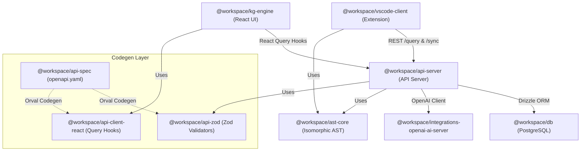
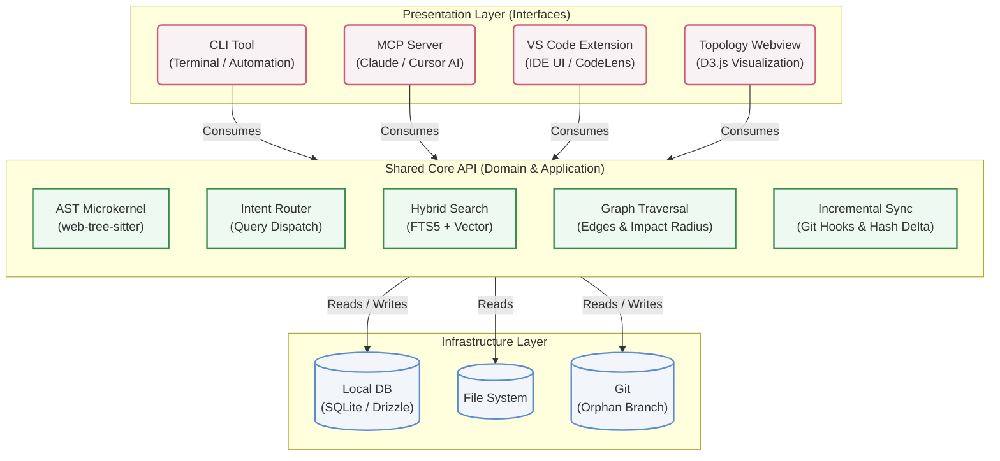
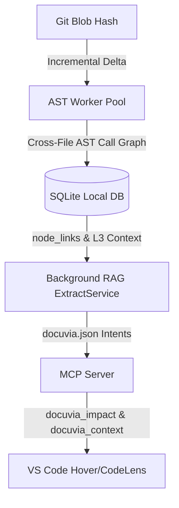

# 5. Building Block View

## 5.1 Level 1 – Monorepo Packages

| Package                                    | Location                                                                         | Depends On                                                                        | Key Exports / Role                                                                                                           |
| ------------------------------------------ | -------------------------------------------------------------------------------- | --------------------------------------------------------------------------------- | ---------------------------------------------------------------------------------------------------------------------------- |
| `@workspace/api-server`                    | [`artifacts/api-server/`](../../artifacts/api-server/)                           | `@workspace/db`, `@workspace/api-zod`, `@workspace/integrations-openai-ai-server` | All Express routes, MCP endpoints, ingestion pipeline, generate pipeline, [Agentic RAG](adrs/ADR-007-agentic-rag-routing.md) |
| `@workspace/kg-engine`                     | [`artifacts/kg-engine/`](../../artifacts/kg-engine/)                             | `@workspace/api-client-react`                                                     | React + Vite frontend: Dashboard, Pipeline, Query, Review, Settings pages                                                    |
| `@workspace/db`                            | [`lib/db/`](../../lib/db/)                                                       | (none within workspace)                                                           | Drizzle ORM schema definitions, migration helpers, `db` connection instance                                                  |
| `@workspace/api-spec`                      | [`lib/api-spec/`](../../lib/api-spec/)                                           | (none)                                                                            | [`openapi.yaml`](../../lib/api-spec/openapi.yaml) – single source of truth; codegen script (`pnpm run codegen`)              |
| `@workspace/api-zod`                       | [`lib/api-zod/`](../../lib/api-zod/)                                             | `@workspace/api-spec` (build-time)                                                | Orval-generated Zod validators for all API request/response shapes                                                           |
| `@workspace/api-client-react`              | [`lib/api-client-react/`](../../lib/api-client-react/)                           | `@workspace/api-spec` (build-time)                                                | Orval-generated React Query hooks for all API endpoints                                                                      |
| `@workspace/integrations-openai-ai-server` | [`lib/integrations-openai-ai-server/`](../../lib/integrations-openai-ai-server/) | (none)                                                                            | OpenAI-compatible LLM client; `LLMClient` interface and implementation                                                       |
| `@workspace/ast-core`                      | [`artifacts/ast-core/`](../../artifacts/ast-core/)                               | (none - standalone WebAssembly)                                                   | Web Worker pool, Tree-sitter WASM parsers, isomorphic AST interfaces.                                                        |
| `@workspace/vscode-client`                 | [`artifacts/vscode-client/`](../../artifacts/vscode-client/)                     | (standalone – REST to api-server)                                                 | VS Code Extension: TreeView, Commands, CodeLens, Hover, Chat participant, Webviews                                           |
| `@workspace/cli`                           | [`artifacts/cli/`](../../artifacts/cli/)                                         | `@workspace/ast-core`, `@workspace/db`                                            | Standalone CLI (`docuvia sync`, `docuvia init-agent`, `docuvia query local`)                                                 |

### Dependency Constraints

- `lib/*` packages **must not** import from `artifacts/*`
- `@workspace/api-server` may import from all `lib/*` packages
- `@workspace/kg-engine` may import from `@workspace/api-client-react` only (not from `@workspace/db` or server internals)
- `@workspace/vscode-client` is standalone; it communicates with `@workspace/api-server` exclusively via REST HTTP
- `@workspace/vscode-client` and `@workspace/api-server` may safely import `@workspace/ast-core`

---

## 5.1.1 Architectural Pattern: Shared Core API (Hexagonal Architecture)

As dictated by [ADR-021](adrs/ADR-021-shared-core-api-and-presentation-layers.md), Docuvia strictly isolates its core local-first capabilities into a **Shared Core API**. The various user and system interfaces (CLI, MCP Server, VS Code Extension, Webview) are treated purely as "Presentation Layers" or adapters. They do not hold business logic; they only format requests and present results from the Core API.

## 5.1.2 Local-First Pipeline: AST to VS Code

Docuvia's local-first architecture resolves cross-file target IDs through a highly optimized pipeline. The AST Call Graph determines target IDs by matching function and class signatures across files, establishing relationships (`node_links`) representing blast radius.

The Intent Router pipeline orchestrates background tasks guided by `docuvia.json`, classifying query intents and executing background extractions.

---

## 5.2 Level 2 – api-server Internal Modules

[`artifacts/api-server/src/`](../../artifacts/api-server/src/)

| Directory / File                                                                              | Responsibility                                                                                                                                                                                                                                                                                                                                                                                                                                                                                                                                     |
| --------------------------------------------------------------------------------------------- | -------------------------------------------------------------------------------------------------------------------------------------------------------------------------------------------------------------------------------------------------------------------------------------------------------------------------------------------------------------------------------------------------------------------------------------------------------------------------------------------------------------------------------------------------- |
| [`routes/`](../../artifacts/api-server/src/routes/)                                           | Express route handlers, one file per domain (e.g., [`projects.ts`](../../artifacts/api-server/src/routes/projects.ts), [`ingest.ts`](../../artifacts/api-server/src/routes/ingest.ts), [`generate.ts`](../../artifacts/api-server/src/routes/generate.ts), [`review_tasks.ts`](../../artifacts/api-server/src/routes/review_tasks.ts), [`mcp.ts`](../../artifacts/api-server/src/routes/mcp.ts), [`github_webhooks.ts`](../../artifacts/api-server/src/routes/github_webhooks.ts), [`export.ts`](../../artifacts/api-server/src/routes/export.ts)) |
| [`lib/intent-router.ts`](../../artifacts/api-server/src/lib/intent-router.ts)                 | Agentic RAG: [4-way LLM-based intent classification](adrs/ADR-007-agentic-rag-routing.md) (vector \| graph \| direct \| hybrid)                                                                                                                                                                                                                                                                                                                                                                                                                    |
| [`lib/github-client.ts`](../../artifacts/api-server/src/lib/github-client.ts)                 | GitHub REST API client (fetch PR commits, diffs, post comments)                                                                                                                                                                                                                                                                                                                                                                                                                                                                                    |
| [`lib/slack-teams-client.ts`](../../artifacts/api-server/src/lib/slack-teams-client.ts)       | Slack and Teams webhook notification dispatcher                                                                                                                                                                                                                                                                                                                                                                                                                                                                                                    |
| [`lib/extensions-service.ts`](../../artifacts/api-server/src/lib/extensions-service.ts)       | VS Code extension endpoint logic                                                                                                                                                                                                                                                                                                                                                                                                                                                                                                                   |
| [`lib/build-artifact-parser.ts`](../../artifacts/api-server/src/lib/build-artifact-parser.ts) | Parses build artifact files for knowledge extraction                                                                                                                                                                                                                                                                                                                                                                                                                                                                                               |
| [`lib/document-parser.ts`](../../artifacts/api-server/src/lib/document-parser.ts)             | Parses uploaded documents (PDF, Markdown, text)                                                                                                                                                                                                                                                                                                                                                                                                                                                                                                    |
| [`lib/svn-client.ts`](../../artifacts/api-server/src/lib/svn-client.ts)                       | SVN CLI wrapper (`svn log --xml`, `svn diff`)                                                                                                                                                                                                                                                                                                                                                                                                                                                                                                      |
| [`lib/embedding.ts`](../../artifacts/api-server/src/lib/embedding.ts)                         | Embedding generation (calls LLM `/v1/embeddings` endpoint)                                                                                                                                                                                                                                                                                                                                                                                                                                                                                         |
| [`lib/logger.ts`](../../artifacts/api-server/src/lib/logger.ts)                               | Structured logging (pino or equivalent)                                                                                                                                                                                                                                                                                                                                                                                                                                                                                                            |
| [`index.ts`](../../artifacts/api-server/src/index.ts)                                         | Express app setup, middleware, startup (throws if `PORT` missing)                                                                                                                                                                                                                                                                                                                                                                                                                                                                                  |

All request/response types are imported from `@workspace/api-zod` (generated). No hand-written type definitions for API shapes.

---

## 5.3 Level 2 – kg-engine Internal Structure

[`artifacts/kg-engine/src/`](../../artifacts/kg-engine/src/)

| Directory                                            | Responsibility                                                                                                                      |
| ---------------------------------------------------- | ----------------------------------------------------------------------------------------------------------------------------------- |
| [`pages/`](../../artifacts/kg-engine/src/pages/)     | Route-level React components: `Dashboard.tsx`, `Pipeline.tsx`, `Query.tsx`, `Review.tsx`, `Settings.tsx`, `ProjectDetail.tsx`, etc. |
| `components/`                                        | Shared UI components (tables, cards, modals, toasts) built on shadcn/ui                                                             |
| `hooks/`                                             | Custom React hooks wrapping generated React Query hooks from `@workspace/api-client-react`                                          |
| `lib/`                                               | Utility functions, formatters, date helpers                                                                                         |
| [`App.tsx`](../../artifacts/kg-engine/src/App.tsx)   | Root component, routing (React Router)                                                                                              |
| [`main.tsx`](../../artifacts/kg-engine/src/main.tsx) | Vite entry point                                                                                                                    |

All API calls are made exclusively through `@workspace/api-client-react` generated hooks. Direct `fetch()` calls to the API are forbidden.

---

## 5.4 Level 2 – db Package Schemas

All schema files reside in [`lib/db/src/schema/`](../../lib/db/src/schema/):

| Schema File                                                                  | Entity                                                                                        |
| ---------------------------------------------------------------------------- | --------------------------------------------------------------------------------------------- |
| [`projects.ts`](../../lib/db/src/schema/projects.ts)                         | Projects (repositories registered in Docuvia)                                                 |
| [`commits.ts`](../../lib/db/src/schema/commits.ts)                           | Ingested commits (with `processedAt` cursor)                                                  |
| [`documents.ts`](../../lib/db/src/schema/documents.ts)                       | Uploaded documents                                                                            |
| [`l1_tags.ts`](../../lib/db/src/schema/l1_tags.ts)                           | Global classification tags                                                                    |
| [`l2_nodes.ts`](../../lib/db/src/schema/l2_nodes.ts)                         | Module/package/component nodes (also defines `l2_node_l1_tags` junction table)                |
| [`l3_nodes.ts`](../../lib/db/src/schema/l3_nodes.ts)                         | Implementation decision/rule/rationale records (with embedding JSONB)                         |
| [`node_links.ts`](../../lib/db/src/schema/node_links.ts)                     | Directed relationships between L2/L3 nodes                                                    |
| [`review_tasks.ts`](../../lib/db/src/schema/review_tasks.ts)                 | Human-in-the-loop review queue                                                                |
| [`correction_examples.ts`](../../lib/db/src/schema/correction_examples.ts)   | Human-approved corrections ([few-shot feedback](adrs/ADR-006-self-evolution-architecture.md)) |
| [`prompt_templates.ts`](../../lib/db/src/schema/prompt_templates.ts)         | Per-project overridable LLM prompts                                                           |
| [`subscriptions.ts`](../../lib/db/src/schema/subscriptions.ts)               | Cross-team watch subscriptions                                                                |
| [`notifications.ts`](../../lib/db/src/schema/notifications.ts)               | Event feed for subscribed teams                                                               |
| [`pull_requests.ts`](../../lib/db/src/schema/pull_requests.ts)               | GitHub PR analysis records                                                                    |
| [`project_integrations.ts`](../../lib/db/src/schema/project_integrations.ts) | Slack/Teams/GitHub integration config per project                                             |
| [`llm_configs.ts`](../../lib/db/src/schema/llm_configs.ts)                   | LLM endpoint configuration per project or globally                                            |
| [`activity_log.ts`](../../lib/db/src/schema/activity_log.ts)                 | Audit trail for all significant system events                                                 |
| [`job_queue.ts`](../../lib/db/src/schema/job_queue.ts)                       | Async job queue for [metabolism mechanism](adrs/ADR-008-asynchronous-metabolism.md)           |
| [`error_reports.ts`](../../lib/db/src/schema/error_reports.ts)               | Dead Letter Queue for failed jobs                                                             |
| [`commit_l2_links.ts`](../../lib/db/src/schema/commit_l2_links.ts)           | Junction table linking commits to L2 nodes                                                    |

---

## 5.5 Level 2 – VS Code Extension

See [docs/design/vscode-client/00-router-overview.md](vscode-client/00-router-overview.md) for the authoritative routing architecture.

Key source files in [`artifacts/vscode-client/src/`](../../artifacts/vscode-client/src/):

| File                                                                                               | Role                                                                   |
| -------------------------------------------------------------------------------------------------- | ---------------------------------------------------------------------- |
| [`extension.ts`](../../artifacts/vscode-client/src/extension.ts)                                   | Entry point: activates extension, registers all commands and providers |
| [`ChatParticipant.ts`](../../artifacts/vscode-client/src/ChatParticipant.ts)                       | Copilot Chat `@docuvia` participant handler (slash commands)           |
| [`KnowledgeStore.ts`](../../artifacts/vscode-client/src/KnowledgeStore.ts)                         | Model layer: manages `.docuvia/` YAML snapshot; syncs to disk          |
| [`TaskRunner.ts`](../../artifacts/vscode-client/src/TaskRunner.ts)                                 | Orchestrates extraction and query tasks; calls api-server REST         |
| [`KnowledgeGraphTreeProvider.ts`](../../artifacts/vscode-client/src/KnowledgeGraphTreeProvider.ts) | VS Code TreeDataProvider for the Knowledge Graph sidebar view          |
| [`TaskQueueTreeProvider.ts`](../../artifacts/vscode-client/src/TaskQueueTreeProvider.ts)           | VS Code TreeDataProvider for the pending task queue sidebar view       |
| [`DashboardPanel.ts`](../../artifacts/vscode-client/src/DashboardPanel.ts)                         | Webview panel: embedded dashboard                                      |
| [`SearchResultsPanel.ts`](../../artifacts/vscode-client/src/SearchResultsPanel.ts)                 | Webview panel: displays MCP/RAG query results                          |
| [`DocuviaCodeLensProvider.ts`](../../artifacts/vscode-client/src/DocuviaCodeLensProvider.ts)       | CodeLens provider: shows L3 decision count above functions/classes     |
| [`DocuviaHoverProvider.ts`](../../artifacts/vscode-client/src/DocuviaHoverProvider.ts)             | Hover provider: shows L3 decision preview on symbol hover              |
| [`CentralServerClient.ts`](../../artifacts/vscode-client/src/CentralServerClient.ts)               | HTTP client wrapper for all api-server calls from the extension        |
| [`CredentialManager.ts`](../../artifacts/vscode-client/src/CredentialManager.ts)                   | Manages API key via VS Code SecretStorage                              |

---

## 5.6 Level 2 – ast-core Package

[`artifacts/ast-core/src/`](../../artifacts/ast-core/src/)

| Directory / File | Responsibility                                                           |
| ---------------- | ------------------------------------------------------------------------ |
| `worker/`        | Web Worker pool management, message passing, and WASM instantiation      |
| `parsers/`       | Language-specific parser registries and bindings to `tree-sitter.wasm`   |
| `interfaces/`    | Isomorphic AST interfaces shared across Node.js and VS Code environments |

---

## References

- [docs/design/vscode-client/00-router-overview.md](vscode-client/00-router-overview.md) – VS Code extension full routing architecture
- [docs/design/vscode-client/knowledge-graph/store.md](vscode-client/knowledge-graph/store.md) – KnowledgeStore design
- [do../roadmap/master-roadmap.md](../roadmap/master-roadmap.md) – Phase-by-phase implementation of these packages
- [VS Code Extension Design](vscode-client/00-router-overview.md) – VS Code extension architecture
