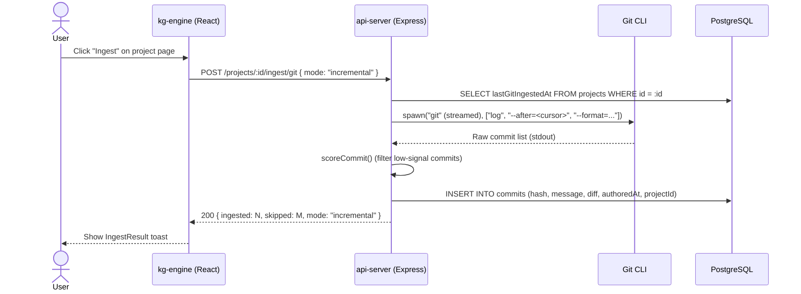
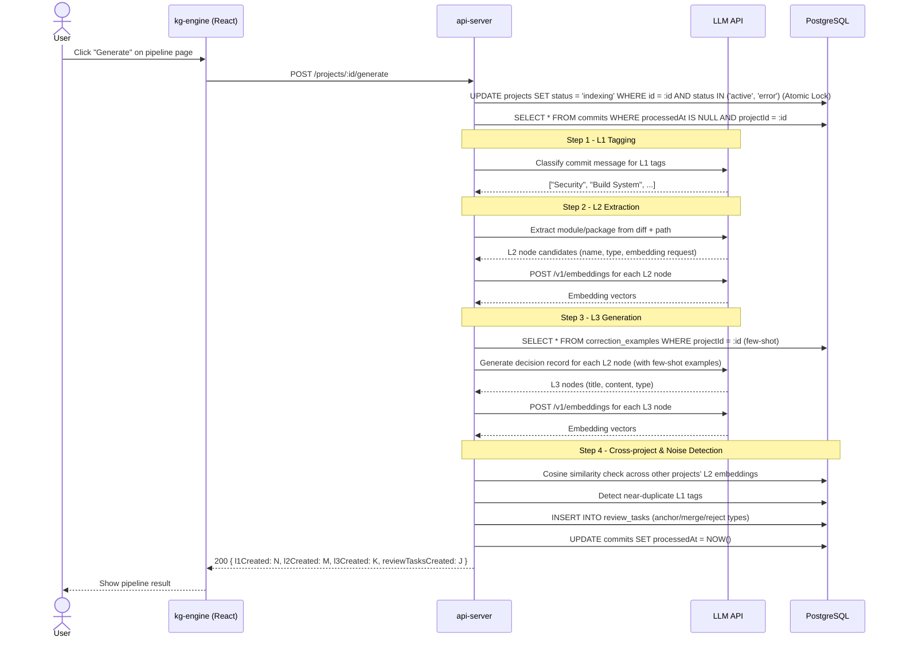
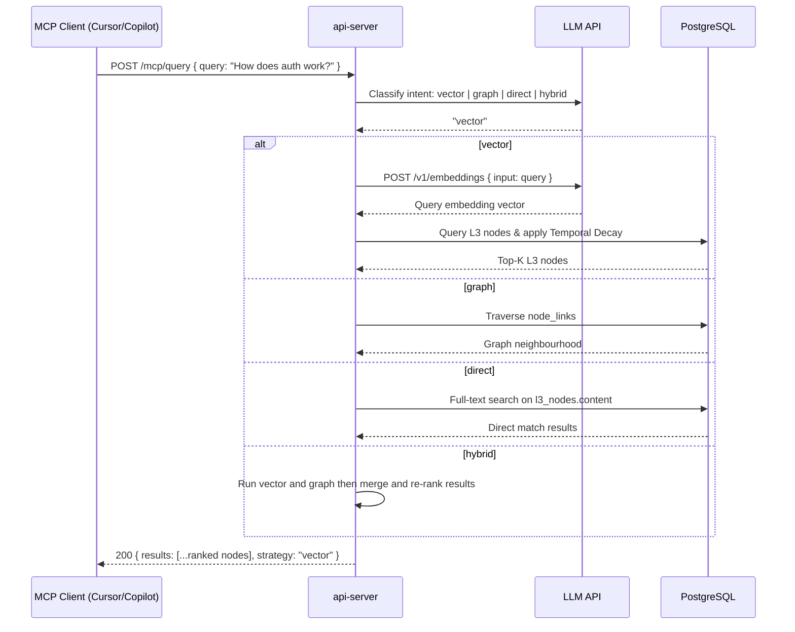
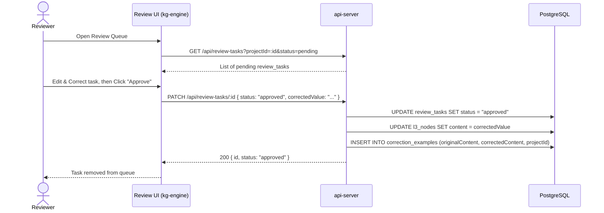
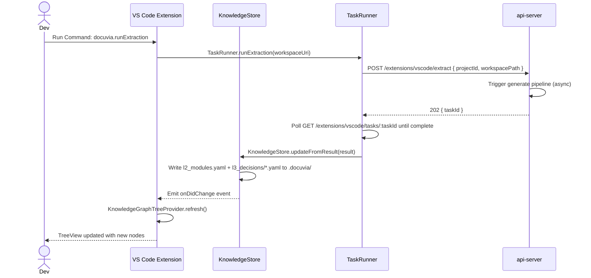
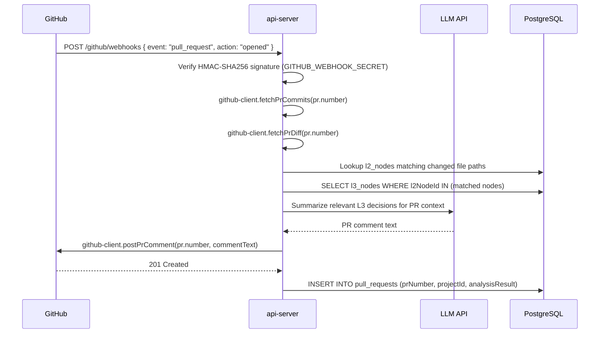
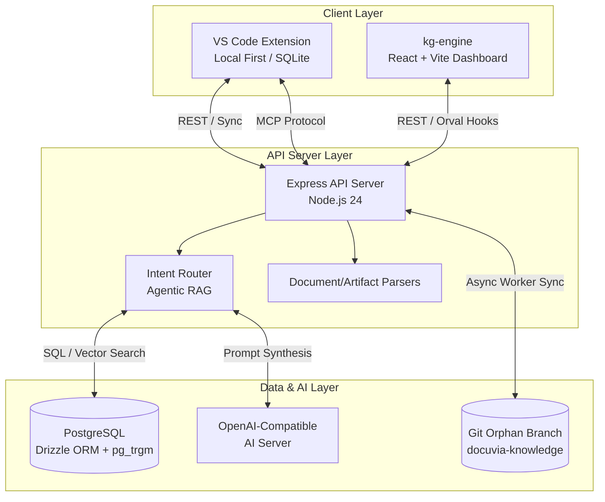

# 6. Runtime View

## 6.1 Scenario: Git Repository Ingestion

A developer registers a Git repository and triggers ingestion from the kg-engine UI.

- **Implementation Route**: [`artifacts/api-server/src/routes/ingest.ts`](../../artifacts/api-server/src/routes/ingest.ts) (specifically `POST /projects/:id/ingest/git`)

---

## 6.2 Scenario: Knowledge Generation Pipeline (Commit – L1/L2/L3)

The generate pipeline transforms raw commits into [structured knowledge graph nodes](adrs/ADR-005-knowledge-abstraction-strategy.md). It is protected by an atomic optimistic concurrency lock to prevent parallel execution conflicts.

- **Implementation Route**: [`artifacts/api-server/src/routes/generate.ts`](../../artifacts/api-server/src/routes/generate.ts) (specifically `POST /projects/:id/generate`)

---

## 6.3 Scenario: [Agentic RAG](adrs/ADR-007-agentic-rag-routing.md) Query (MCP)

An AI IDE sends a natural language query via MCP. The [intent router](adrs/ADR-007-agentic-rag-routing.md) classifies it and routes to the best retrieval strategy.

- **Implementation Route**: [`artifacts/api-server/src/routes/mcp.ts`](../../artifacts/api-server/src/routes/mcp.ts)
- **Orchestration Logic**: [`artifacts/api-server/src/lib/intent-router.ts`](../../artifacts/api-server/src/lib/intent-router.ts) (`routeQuery()`)

---

## 6.4 Scenario: Review Task Resolution

A reviewer approves an AI-generated L3 decision, creating a [correction example](adrs/ADR-006-self-evolution-architecture.md) for future pipeline runs.

- **Implementation Route**: [`artifacts/api-server/src/routes/review_tasks.ts`](../../artifacts/api-server/src/routes/review_tasks.ts) (specifically `POST /review_tasks/:id/resolve`)

---

## 6.5 Scenario: VS Code Knowledge Extraction

A developer triggers extraction from VS Code, which sends a task to the api-server's generate pipeline and stores the result in KnowledgeStore.

See [docs/design/vscode-client/command-palette/run-extraction.md](vscode-client/command-palette/run-extraction.md) for the detailed command flow.

- **VS Code Task Runner**: [`artifacts/vscode-client/src/TaskRunner.ts`](../../artifacts/vscode-client/src/TaskRunner.ts) (`runExtraction()`)
- **Implementation Route**: [`artifacts/api-server/src/routes/extensions_vscode.ts`](../../artifacts/api-server/src/routes/extensions_vscode.ts) (`POST /extensions/vscode/extract`)

---

## 6.6 Scenario: GitHub PR Analysis

A developer opens a PR. Docuvia receives the webhook, looks up affected L2/L3 nodes, and comments on the PR with relevant knowledge graph context.

- **Implementation Route**: [`artifacts/api-server/src/routes/github_webhooks.ts`](../../artifacts/api-server/src/routes/github_webhooks.ts)
- **GitHub Client Wrapper**: [`artifacts/api-server/src/lib/github-client.ts`](../../artifacts/api-server/src/lib/github-client.ts)

---

## References

- [docs/design/vscode-client/command-palette/run-extraction.md](vscode-client/command-palette/run-extraction.md) – Full VS Code extraction flow
- [docs/design/vscode-client/chat-participant/slash-commands.md](vscode-client/chat-participant/slash-commands.md) – Chat participant command flows
- [08-crosscutting-concepts.md](08-crosscutting-concepts.md#81-domain-model) – Domain model for L1/L2/L3 entities

## Runtime Architecture Flow

