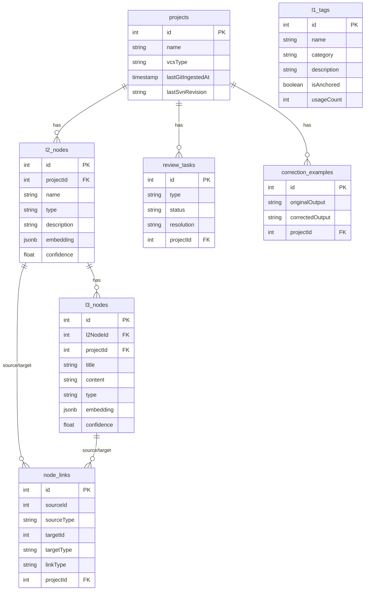

# 8. Crosscutting Concepts

## 8.1 Domain Model

### Three-Tier Knowledge Graph

The core data model is a three-tier hierarchy that maps VCS history to structured architectural knowledge.



**L1 Tags** — Global classification labels applied across all projects. Represent top-level architectural or functional areas (e.g., `Security`, `Networking`, `Build System`). AI-suggested L1 candidates always enter the review queue before being anchored. Stored in `l1_tags`.

**L2 Nodes** — Package, Module, or Component entities scoped to a single project. Extracted from commit diff paths and structure. Linked to L1 Tags. Store an embedding vector (JSONB) enabling semantic search. Stored in `l2_nodes`.

**L3 Nodes** — Implementation Decision, Rule, or Rationale records scoped to an L2 Node. The primary output of the generate pipeline. Store embedding vectors. Linked to source commits. Stored in `l3_nodes`.

**Node Links** — Directed relationships between L2 or L3 nodes (intra-project or cross-project). Created by human approval of cross-project similarity detection results. Stored in `node_links`.

> **Note (ADR correction):** L1 Tags are global — they have no `projectId` and are shared across all projects. The relationship `projects ||--o{ l1_tags` shown in earlier versions of this diagram was incorrect. The actual `l1_tags` table has no foreign key to `projects`. All projects share a single global L1 tag pool.

### Supporting Entities

| Entity               | Table                  | Purpose                                                                          |
| -------------------- | ---------------------- | -------------------------------------------------------------------------------- |
| Review Tasks         | `review_tasks`         | Human-in-the-loop work items (anchor / merge / reject)                           |
| Correction Examples  | `correction_examples`  | Approved human corrections; injected as few-shot examples into generate pipeline |
| Prompt Templates     | `prompt_templates`     | Per-project overridable LLM system prompts (L1, L2, L3 types)                    |
| Subscriptions        | `subscriptions`        | Cross-team watch subscriptions on projects or nodes                              |
| Notifications        | `notifications`        | Event feed entries for subscribed teams                                          |
| Pull Requests        | `pull_requests`        | GitHub PR analysis records                                                       |
| Project Integrations | `project_integrations` | Slack/Teams/GitHub integration config per project                                |
| LLM Configs          | `llm_configs`          | LLM endpoint and model configuration per project or global                       |
| Activity Log         | `activity_log`         | Audit trail for significant system events                                        |

---

## 8.2 Architecture Patterns

### API-First with Codegen

All API types are generated from `lib/api-spec/openapi.yaml` via Orval.

**Invariant:** NEVER hand-write API types. Edit `openapi.yaml` → run `pnpm --filter @workspace/api-spec run codegen` → commit generated files.

```
openapi.yaml → Orval → lib/api-zod/ (Zod validators) + lib/api-client-react/ (React Query hooks)
```

### Adapter Pattern for VCS Providers

All VCS ingestion uses a `child_process.execFile` adapter. New VCS providers must implement the same `IngestInput`/`IngestResult` contract as the Git and SVN adapters.

```
VcsIngestAdapter interface
    ├── GitIngestAdapter (git log, git diff)
    └── SvnIngestAdapter (svn log --xml, svn diff)
```

### Agentic RAG Intent Routing

Incoming `/mcp/query` requests are classified by an LLM into one of four strategies, then routed to the appropriate search mechanism:

```
Query → intent-router.ts (LLM classify) → vector | graph | direct | hybrid
                                               ↓         ↓        ↓        ↓
                                         SQL cosine dist  node_links  FTS   vector+graph merge
```

### Human-in-the-Loop Feedback Loop

```
generate pipeline
    → review_tasks (anchor / merge / reject)
        → human resolves
            → correction_examples (few-shot data)
                → next generate pipeline run (injected as few-shot examples)
```

### MVC for UI (VS Code Extension and React Frontend)

See [Section 8.3.2](#832-ui-architecture-mvc) for the full rule specification.

| Layer          | VS Code Extension                                                    | React kg-engine                                                   |
| -------------- | -------------------------------------------------------------------- | ----------------------------------------------------------------- |
| **View**       | `KnowledgeGraphTreeProvider`, `DashboardPanel`, `SearchResultsPanel` | `.tsx` page/component files                                       |
| **Controller** | `extension.ts` command handlers, `ChatParticipant.ts`                | Event handlers, `useQuery`/`useMutation` callsites                |
| **Model**      | `KnowledgeStore.ts` (YAML ↔ disk)                                    | `@workspace/api-client-react` generated hooks + React Query cache |

---

## 8.3 Coding Rules

> These rules are **mandatory** for all TypeScript source code in this project.
> Violations discovered during code review or automated lint checks must be fixed before merge.

---

### 8.3.1 Defensive Design

**Rule: Flatten conditional logic with early return / throw.**

All functions must use guard clauses (early return or early throw) to handle invalid states at the top of the function. Nested if/else chains are prohibited.

**Before (❌ FORBIDDEN — nested if/else):**

```typescript
function processCommit(commit: Commit | null) {
  if (commit) {
    if (commit.message) {
      if (commit.message.length > 0) {
        // do work
      }
    }
  }
}
```

**After (✅ CORRECT — early return / guard clauses):**

```typescript
function processCommit(commit: Commit | null) {
  if (!commit) return;
  if (!commit.message) return;
  if (commit.message.length === 0) return;
  // do work
}
```

The same principle applies to error handling — throw early rather than deeply nesting:

```typescript
// ❌ FORBIDDEN
function processNode(node: L2Node | null) {
  if (node) {
    if (node.embedding) {
      // ... logic
    } else {
      throw new Error("missing embedding");
    }
  } else {
    return null;
  }
}

// ✅ CORRECT
function processNode(node: L2Node | null) {
  if (!node) return null;
  if (!node.embedding) throw new Error("missing embedding");
  // ... logic
}
```

**Goals:** All logic paths must be clear, reliable, and independently traceable.

---

### 8.3.2 UI Architecture: MVC

All UI code — both kg-engine React components and VS Code Extension UI — must respect a strict three-layer separation:

| Layer                                                  | Responsibility                                                                                | Forbidden                                                                 |
| ------------------------------------------------------ | --------------------------------------------------------------------------------------------- | ------------------------------------------------------------------------- |
| **View** (`*.view.tsx` or component file)              | Renders JSX/HTML from props and state only                                                    | Business logic, API calls, direct state mutations outside of setter props |
| **Controller** (event handler / inline hook)           | Handles user events; orchestrates service calls; updates local state that triggers re-renders | Direct DOM manipulation, database access, rendering                       |
| **Model** (`*.model.ts` / query hook / KnowledgeStore) | Manages data persistence; syncs to DB/file/cache                                              | Rendering, UI event handling                                              |

**Flow:**

```
User interaction
    ↓
Controller (event handler, state mutation)
    ↓
Model (React Query mutation → POST /api/... | KnowledgeStore → disk write)
    ↓
View (re-renders via updated state / props)
```

**In the VS Code extension:**

- `KnowledgeGraphTreeProvider`, `DashboardPanel`, `SearchResultsPanel` = **View**
- `extension.ts` command handlers, `ChatParticipant.ts` = **Controller**
- `KnowledgeStore.ts` = **Model** (YAML ↔ disk)

**In the React frontend:**

- `.tsx` page/component files = **View**
- `useQuery`/`useMutation` hook callsites and event handlers = **Controller**
- `@workspace/api-client-react` generated hooks + React Query cache = **Model**

---

### 8.3.3 POP Design (Protocol-Oriented Programming)

All services and data-access layers must be defined behind a TypeScript interface (protocol) before implementation.

**Rules:**

- Every service that calls the database must implement an interface defined in the same file or a `types.ts` sibling.
- Every service that calls the LLM must depend on the `LLMClient` interface from `lib/integrations-openai-ai-server/`.
- Never instantiate a concrete class from a consumer — depend on the interface (inversion of control).

```typescript
// ✅ Define the protocol/interface first
interface CommitRepository {
  findUnprocessed(projectId: number): Promise<Commit[]>;
  markProcessed(commitId: number): Promise<void>;
}

// ✅ Implement it
class DrizzleCommitRepository implements CommitRepository {
  async findUnprocessed(projectId: number): Promise<Commit[]> {
    /* ... */
  }
  async markProcessed(commitId: number): Promise<void> {
    /* ... */
  }
}

// ✅ Depend on the interface (inversion of control)
class GeneratePipeline {
  constructor(private readonly commits: CommitRepository) {}
}
```

**For VCS adapters:**

```typescript
// ✅ Define the protocol first
interface VcsIngestAdapter {
  ingest(input: IngestInput): Promise<IngestResult>;
}

// ✅ Implement against the protocol
class GitIngestAdapter implements VcsIngestAdapter {
  async ingest(input: IngestInput): Promise<IngestResult> {
    /* ... */
  }
}

class SvnIngestAdapter implements VcsIngestAdapter {
  async ingest(input: IngestInput): Promise<IngestResult> {
    /* ... */
  }
}
```

This pattern applies to:

- All service classes in `artifacts/api-server/src/lib/`
- All database access modules
- All external API clients (`github-client.ts`, `slack-teams-client.ts`, `lib/integrations-openai-ai-server/`)

**Benefits:** Unit testing with mock implementations; provider swapping without consumer changes; clear contract documentation.

---

### 8.3.4 OOP for UI Structures

UI components and their cooperative behavior must be modeled as classes or well-defined objects with encapsulated state and behavior.

**Rules:**

- VS Code Providers (`TreeDataProvider`, `WebviewPanel`) **must be classes** because the VS Code Extension API demands it.
- Component state must be encapsulated — no scattered module-level mutable variables.
- Cooperative behavior between components (e.g., TreeView refresh after command execution) must be mediated by explicit event emitters or observable state, not direct cross-object method calls.

```typescript
// ✅ CORRECT — VS Code provider as a class with encapsulated state
class KnowledgeGraphTreeProvider implements vscode.TreeDataProvider<TreeNode> {
  private readonly _onDidChangeTreeData = new vscode.EventEmitter<TreeNode | undefined>();
  readonly onDidChangeTreeData = this._onDidChangeTreeData.event;

  private nodes: L2Node[] = [];

  refresh(): void {
    this._onDidChangeTreeData.fire(undefined);
  }

  getTreeItem(element: TreeNode): vscode.TreeItem {
    /* ... */
  }
  getChildren(element?: TreeNode): Promise<TreeNode[]> {
    /* ... */
  }
}
```

---

### 8.3.5 Code Style Rules

| Rule                        | Value                                                        | Rationale                                           |
| --------------------------- | ------------------------------------------------------------ | --------------------------------------------------- |
| **Maximum function length** | 100 lines                                                    | Single-responsibility enforcement                   |
| **Maximum line length**     | 100 characters                                               | Readability in split editors                        |
| **Indentation**             | 4 spaces (no tabs)                                           | Consistency across editors and terminals            |
| **Call-chain alignment**    | Each chained call on its own indented line                   | Readability of async database and Promise pipelines |
| **Import order**            | Node built-ins → third-party → workspace packages → relative | Consistent, tooling-enforceable                     |

**Call-chain alignment:**

```typescript
// ❌ FORBIDDEN — chain on single line
const result = await db
  .select()
  .from(commitsTable)
  .where(eq(commitsTable.projectId, projectId))
  .orderBy(desc(commitsTable.createdAt))
  .limit(50);

// ✅ CORRECT — each call on its own indented line
const result = await db
  .select()
  .from(commitsTable)
  .where(eq(commitsTable.projectId, projectId))
  .orderBy(desc(commitsTable.createdAt))
  .limit(50);
```

**Enforcement:** These rules should be encoded in `eslint.config.js` where tooling supports them (`max-lines-per-function`, `max-len`). The call-chain and indentation rules are enforced by Prettier with `tabWidth: 4` and `printWidth: 100`.

---

## 8.4 Security Concepts

### Zero-Trust Input Sanitization
All inputs passed to the Agentic RAG core must be sanitized.
- **LIKE Wildcard Escaping**: To prevent Broad-Match Denial of Service (DoS) attacks and ensure precise querying, user and LLM-generated search queries are filtered through `escapeLike()` before being inserted into PostgreSQL `LIKE` or `ILIKE` statements. This mitigates `%` and `_` wildcard injection.

### Route Authentication
Internal maintenance routes are strictly authenticated.
- **Fail-Closed Metabolism Auth**: The `/admin/metabolism-tick` route acts as a background worker orchestrator. It demands an `Authorization: Bearer` or `admin_token` that matches the server's `ADMIN_SECRET_TOKEN` environment variable. If the environment variable is not defined, the server **fails closed** (returns 500) rather than falling back to an insecure default, guaranteeing safety in production.

---

## References

- [02-constraints.md](02-constraints.md#23-conventions-coding-rules) — Constraint context for coding rules
- [09-architectural-decisions.md](09-architectural-decisions.md#adr-005-mvc-pattern-for-ui-layers) — ADR-005 rationale for MVC decision
- [artifacts/vscode-client/design/ROUTER.md](../../artifacts/vscode-client/design/ROUTER.md) — VS Code MVC application in practice
