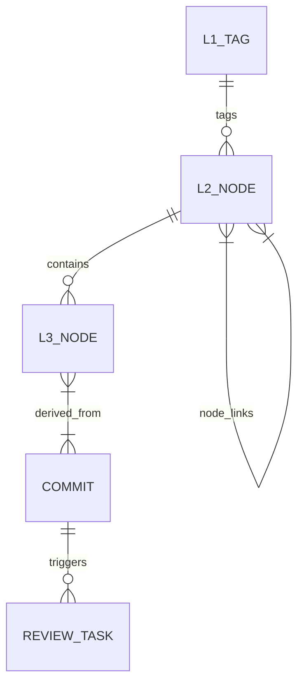

# 12. Glossary

## Core Domain Terms

| Term                            | Definition                                                                                                                                                                                                                                                                                                                                                                |
| ------------------------------- | ------------------------------------------------------------------------------------------------------------------------------------------------------------------------------------------------------------------------------------------------------------------------------------------------------------------------------------------------------------------------- |
| **L1 Tag**                      | A global classification label applied across all projects. Represents top-level architectural or functional areas (e.g., `Security`, `Networking`, `Build System`). AI-suggested L1 candidates always enter the review queue before anchoring. Stored in the `l1_tags` table.                                                                                             |
| **L2 Node**                     | A Package, Module, or Component scoped to a single project. Extracted from commit diff paths and code structure by the generate pipeline. Linked to one or more L1 Tags. Stores an embedding vector (JSONB) enabling semantic search. Stored in `l2_nodes`.                                                                                                               |
| **L3 Node**                     | An Implementation Decision, Rule, or Rationale record scoped to an L2 Node. The primary output of the generate pipeline and the deepest level of the knowledge graph. Stores an embedding vector. Linked to source commits. Stored in `l3_nodes`.                                                                                                                         |
| **Node Link**                   | A directed relationship between two **L2 nodes** (intra-project or cross-project). Node Links model module-level structural dependencies; L3 decisions are scoped within their parent L2 node and are not directly linked. Stored in `node_links`.                                                                                                                        |
| **Generate Pipeline**           | The 6-step LLM pipeline that transforms raw ingested commits into L1/L2/L3 nodes. Steps: (1) fetch unprocessed commits → (2) L1 tagging → (3) L2 extraction with embeddings → (4) L3 generation with embeddings → (5) cross-project similarity detection → (6) noise detection.                                                                                           |
| **Ingest**                      | The process of importing commit history from a VCS (Git or SVN) or uploading documents into Docuvia's database. Produces `commits` and `documents` rows. Uses `scoreCommit()` to filter low-signal commits.                                                                                                                                                               |
| **[Planned] Agentic RAG**       | Retrieval-Augmented Generation with LLM-based intent routing. A 4-way query strategy (vector \| graph \| direct \| hybrid) that selects the best retrieval method for a natural language query. Exposed at `/mcp/query`.                                                                                                                                                  |
| **[Implemented] Intent Router** | The LLM-powered component (`intent-router.ts`) that classifies incoming `/mcp/query` requests into one of four strategies and routes them to the appropriate search mechanism.                                                                                                                                                                                            |
| **Review Task**                 | A human-in-the-loop work item stored in the `review_tasks` table. Created by the generate pipeline for every AI-generated node. Types: `anchor` (confirm the node), `merge` (consolidate with another node), `reject` (discard the node).                                                                                                                                 |
| **Correction Example**          | A human-approved edit to an AI-generated node, stored in `correction_examples`. Injected as few-shot examples into subsequent generate pipeline runs to improve LLM accuracy over time.                                                                                                                                                                                   |
| **Prompt Template**             | A per-project overridable LLM system prompt for L1, L2, or L3 generation. Falls back to a built-in default if not set for a project. Stored in `prompt_templates`.                                                                                                                                                                                                        |
| **MCP**                         | Model Context Protocol — the HTTP-based protocol used by AI IDEs (Cursor, GitHub Copilot, Claude, etc.) to call Docuvia's knowledge graph as a set of tools. Exposed via `/mcp/*` Express routes.                                                                                                                                                                         |
| **Impact Analysis**             | A traversal of the `node_links` graph to determine which other modules or decisions are transitively affected by a change to a given node. Currently one-hop; multi-hop BFS/DFS traversal is planned.                                                                                                                                                                     |
| **Cross-Project Link**          | A `node_links` row connecting L2 nodes from different projects, detected via cosine similarity ≥ 0.85 between embeddings. Requires human review approval before the link is activated.                                                                                                                                                                                    |
| **Incremental Ingestion**       | An ingestion mode that processes only new commits since the last run, using cursor columns (`lastGitIngestedAt` on `projects` for Git, `lastSvnRevision` for SVN, and `processedAt` on `commits`).                                                                                                                                                                        |
| **Noise Detection**             | An automated step at the end of the generate pipeline that flags low-usage L1 tags and near-duplicate tag names, creating `anchor` and `merge` review tasks for human resolution.                                                                                                                                                                                         |
| **VS Code Client**              | The VS Code extension in `artifacts/vscode-client/`. Provides a Knowledge Graph TreeView, Command Palette commands (Init, Ingest, Extract, Search), a Copilot Chat participant (`@docuvia`), CodeLens, and Hover providers.                                                                                                                                               |
| **KnowledgeStore**              | The singleton service (`knowledge-store.ts`) in the VS Code extension that manages the in-memory snapshot of the `.docuvia/local.db` SQLite database and syncs changes to disk. Acts as the Model layer of the VS Code extension.                                                                                                                                         |
| **`.docuvia/local.db`**         | The per-workspace SQLite database created by the VS Code extension's `Init Project` command. Contains the local HEAD index of the knowledge graph (L1, L2, L3 nodes).                                                                                                                                                                                                     |
| **Orval**                       | The code generation tool that reads `lib/api-spec/openapi.yaml` and generates Zod validators (`lib/api-zod/src/generated/`) and React Query hooks (`lib/api-client-react/src/generated/`). Run via `pnpm --filter @workspace/api-spec run codegen`.                                                                                                                       |
| **scoreCommit()**               | The signal/noise scoring function applied during ingestion to filter out low-value commits (e.g., merge commits, `chore:` bumps, auto-generated changes). Returns a numeric score; commits below the threshold are skipped.                                                                                                                                               |
| **Knowledge Validity**          | A two-phase gate determining whether a knowledge node enters the canonical knowledge graph. Phase 1 (Local Review): a human confirms the AI-generated content is accurate. Phase 2 (Merge Gate): the source commit is confirmed to have been merged into the main branch. Both phases must pass for a node to be `valid`.                                                 |
| **Validity Status**             | The lifecycle state of an L3 node: `pending` (local-reviewed but not yet merged to main), `valid` (merged to main and reviewed), `orphaned` (source branch was abandoned — archived by default).                                                                                                                                                                          |
| **Orphan Knowledge Branch**     | A git orphan branch (e.g., `docuvia-knowledge`) that stores the canonical knowledge independently of the source code tree. The branch has no common ancestor with any source branch. Managed by the Docuvia server via git hook sync.                                                                                                                                     |
| **Misc Pool**                   | A global holding area for uploaded documents (`documents` rows with `projectId = null`) that have not yet been associated with any project. Documents in the misc pool are processed for content extraction but their L3 derivations are not anchored to the knowledge graph until the document is promoted to a specific project.                                        |
| **Content Hash**                | A SHA-256 hash of a document's raw content, stored in `documents.contentHash`. Used to detect duplicate uploads and to match already-processed documents during project promotion, avoiding redundant LLM re-processing.                                                                                                                                                  |
| **Occurrence Count**            | A counter on an L3 node (`occurrenceCount`) that increments each time a new commit's content is found to be semantically similar (cosine ≥ 0.85) to the existing node. When the count reaches the configured threshold (default: 30), an AI condensation run is triggered to enrich the node's content. High occurrence count indicates a core recurring design decision. |
| **Source Commits**              | A JSONB array column (`sourceCommits`) on `l3_nodes` storing the list of commit hashes that contributed to or were absorbed into this L3 node. Enables a reverse index from commit hash to L3 nodes.                                                                                                                                                                      |
| **L2 Bootstrap**                | The progressive first-run process for a new project: commits are processed in batches of 20, AI self-corrects module names across batches, and the resulting L2 module map is presented for human confirmation. Upon confirmation, module boundaries are fixed as file path patterns in `.docuvia/local.db`.                                                              |
| **Path Pattern**                | A glob pattern (e.g., `src/auth/**`) stored in `.docuvia/local.db` under a module definition. After L2 bootstrap confirmation, path patterns provide deterministic (non-LLM) commit-to-module assignment for all future commits.                                                                                                                                          |
| **Commit L2 Link**              | A row in the `commit_l2_links` junction table connecting a single commit to one or more L2 modules. Replaces the single `commits.l2NodeId` foreign key, correctly modeling the many-to-many relationship between commits and modules.                                                                                                                                     |
| **`docuvia sync`**              | The CLI command (not yet implemented) triggered by the `post-push` git hook. Uploads the local `.docuvia/local.db` database and any newly local-reviewed knowledge to the Docuvia server, which in turn updates the orphan knowledge branch and PostgreSQL.                                                                                                               |

---

## Acronyms

| Acronym | Expansion                                                                          |
| ------- | ---------------------------------------------------------------------------------- |
| VCS     | Version Control System                                                             |
| MCP     | Model Context Protocol                                                             |
| RAG     | Retrieval-Augmented Generation                                                     |
| LLM     | Large Language Model                                                               |
| ADR     | Architectural Decision Record                                                      |
| ORM     | Object-Relational Mapper                                                           |
| NFR     | Non-Functional Requirement                                                         |
| POP     | Protocol-Oriented Programming                                                      |
| OOP     | Object-Oriented Programming                                                        |
| MVC     | Model-View-Controller                                                              |
| HMAC    | Hash-based Message Authentication Code                                             |
| JSONB   | JSON Binary (PostgreSQL column type for binary-encoded JSON with indexing support) |
| ESM     | ECMAScript Modules                                                                 |
| HMR     | Hot Module Replacement                                                             |
| ANN     | Approximate Nearest Neighbour (used in vector search)                              |
| CI      | Continuous Integration                                                             |
| PR      | Pull Request                                                                       |
| YAML    | YAML Ain't Markup Language (used in `.docuvia/` workspace files)                   |
| FTS     | Full-Text Search                                                                   |
| BFS     | Breadth-First Search (planned multi-hop graph traversal algorithm)                 |
| DFS     | Depth-First Search (planned multi-hop graph traversal algorithm)                   |

---

## References

- [08-crosscutting-concepts.md](08-crosscutting-concepts.md#81-domain-model) — Full domain model entity-relationship diagram
- [05-building-blocks.md](05-building-blocks.md#54-level-2--db-package-schemas) — Full schema table list
- [AGENTS.md](../../AGENTS.md) — Product domain knowledge section
