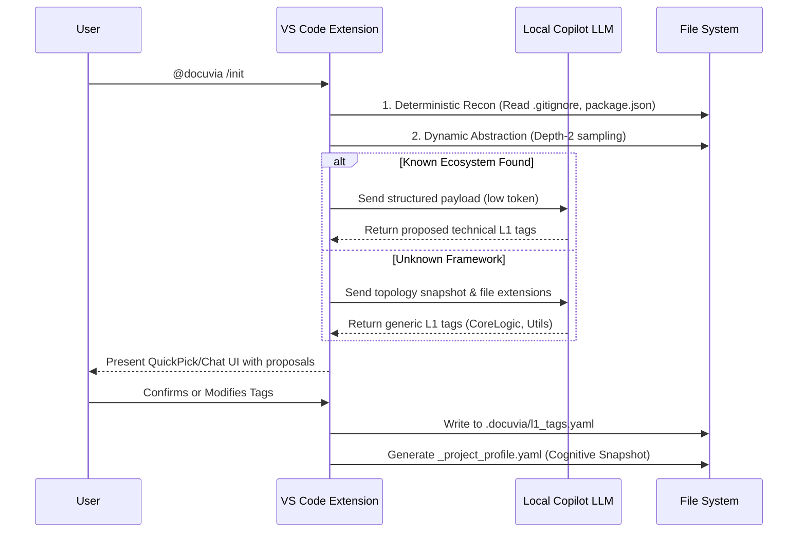

# VS Code Client Onboarding & Scope Discovery (Zero to One)

## Core Pain Points & Objectives

Achieve a "Zero to One" onboarding experience within 1 minute without forcing users to learn YAML. Prevent Token explosions and AI hallucinations using a "Pre-scanning, Intelligent Proposal, and Human Consent" flow.

## Zero-Trust & Dynamic Abstraction Workflow

### 1. State Checkpoint & Trigger

- VS Code TreeView detects the absence of the `.docuvia` directory and provides an `[Initialize Docuvia Knowledge Base]` button.

### 2. Deterministic Recon (Local)

- **Boundary Establishment**: Reads `.gitignore` to filter hidden directories.
- **Feature Sniffing**: Looks for ecosystem markers. Does not transmit massive trees; uses shallow sampling.

### 3. Unknown Framework Defense

- Calculates file extension ratios and uses generic software engineering directory conventions to propose safe fallback L1 tags.

### 4. Radical Candor & UI Consent

- Never blindly writes to YAML. Distinguishes between "Certain Technical Dimensions" and "Inferred Business Dimensions" in the UI.

### 5. Record & Cognitive Snapshot (`_project_profile.yaml`)

- Alongside `l1_tags.yaml`, generates a hidden `_project_profile.yaml` capturing the topology snapshot (e.g., CI/CD boundaries, primary depth). This acts as an $O(1)$ cache for future L2/L3 abstraction tasks, eliminating the need to rescan the workspace.

## Anchoring & Semantic Drift Prevention
The VS Code client utilizes standard `vscode.CodeLensProvider` and `vscode.HoverProvider`. To prevent line-number drift and Editor Host freezing, semantic re-anchoring of knowledge nodes relies exclusively on asynchronous `vscode.executeDocumentSymbolProvider` calls triggered strictly upon document save, never on keystrokes.
