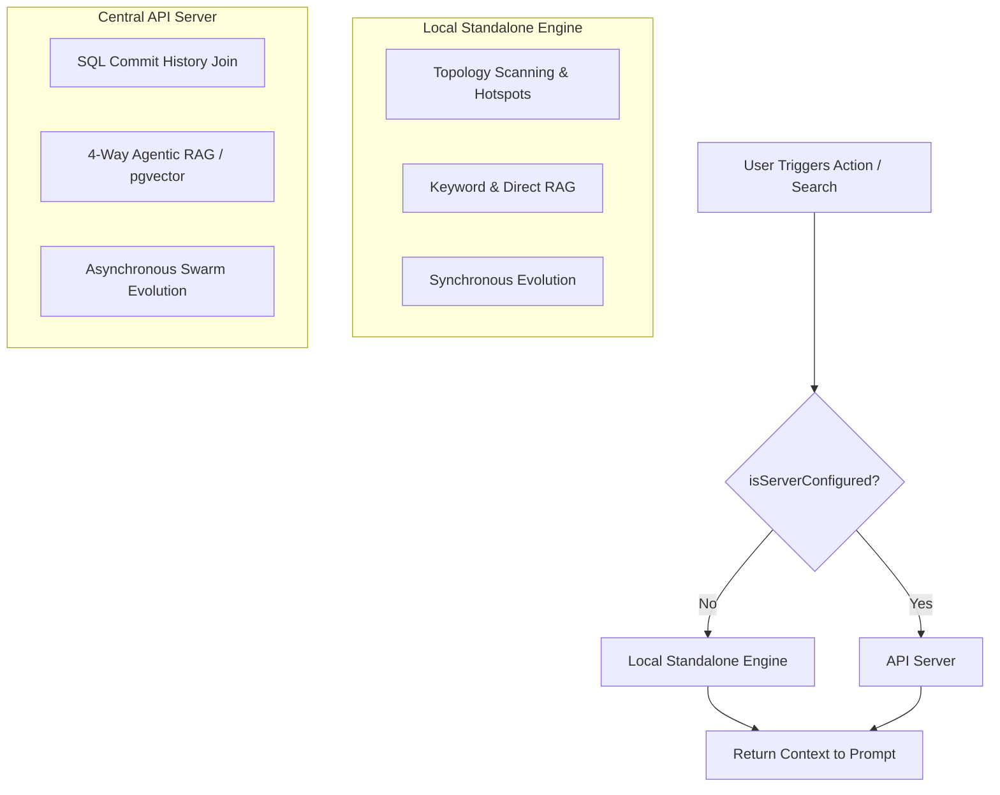

# Local-First Architecture & Graceful Server Degradation

## Core Principle

Docuvia utilizes a **"Local-First, Server-Augmented"** architecture. It provides immediate, standalone value using only the VS Code Extension, seamlessly unlocking team-scale performance when connected to the API Server.

## Architecture Flow

## 1. Standalone Mode (Local-First Fallback)

- **Implementation**: Relies on [`CentralServerClient.isServerConfigured()`](../../../artifacts/vscode-client/src/CentralServerClient.ts#L36) returning false.
- **Architecture Recovery**: Falls back to the [AST Microkernel](ADR-020-unified-isomorphic-ast-microkernel.md) for local topology scanning and [Git-Isomorphic Graph](ADR-004-git-isomorphic-graph.md) resolution, bypassing naive `git log -n 100` bounds (implemented in [`artifacts/vscode-client/src/KnowledgeStore.ts`](../../../artifacts/vscode-client/src/KnowledgeStore.ts)).
- **Agentic RAG**: Gracefully degrades to Keyword RAG and Direct Anchoring using `target_refs` (e.g. in [`artifacts/vscode-client/src/DocuviaCodeLensProvider.ts`](../../../artifacts/vscode-client/src/DocuviaCodeLensProvider.ts)).
- **Evolution**: Local garbage collection based on `last_verified_at` [decay](ADR-007-agentic-rag-routing.md) (Note: `last_verified_at` is currently not implemented, pending [metabolism](ADR-008-asynchronous-metabolism.md) workers).

## 2. Server-Augmented Mode (Team-Scale Ascension)

- **Heavy Computation Offloading**: API Server uses Drizzle [`commitsTable` in commits.ts](../../../lib/db/src/schema/commits.ts) to calculate true co-occurrence frequencies without local Git processing.
- **Full RAG**: Unlocks [`intent-router.ts`](../../../artifacts/api-server/src/lib/intent-router.ts) for [4-Way Agentic RAG](ADR-007-agentic-rag-routing.md), utilizing [pgvector](ADR-019-pgvector-migration.md) and Graph Traversal.
- **Asynchronous Evolution**: [Background jobs](ADR-008-asynchronous-metabolism.md) process [human-in-the-loop](ADR-006-self-evolution-architecture.md) corrections to protect all team members.

## Offline Writes & The Sync Outbox (CQRS)

To strictly adhere to both **Local-First** principles and the **Centralized Server Write Lock** (mandated to prevent split-brain), Docuvia employs the **Outbox Pattern**:

1. **Offline Writes**: When a developer creates a new [L3 decision](ADR-005-knowledge-abstraction-strategy.md) offline, the [VS Code client](ADR-001-vscode-client-onboarding.md) writes it immediately to its local database (SQLite) and queues the event in a local `SyncOutbox`. The VS Code UI reflects the change instantly (Local-First).
2. **Online Sync**: Upon network restoration, the client does _not_ execute a raw `git push`. Instead, it dispatches the outbox payloads via REST API (`POST /sync/push`) to the API Server.
3. **Server Gatekeeper**: The [API server](ADR-003-server-side-zero-to-one.md) coordinates concurrency via [Database-as-IPC](ADR-014-sql-indexed-graph-and-database-as-ipc.md) (replacing in-memory Mutex locks), validates the semantic integrity of the graph (preventing dangling nodes), commits the changes to the centralized [`docuvia-knowledge` orphan branch](ADR-017-tiered-storage-and-orphan-branch-graph-maintenance.md), and pushes to the Git remote.
4. **Local Rehydration**: The client subsequently performs a `git fetch` and `git merge` from the remote branch to finalize the state and flush its local outbox.

This topology guarantees zero downtime for the developer (100% local availability) while completely preventing Git Split-Brain on the remote repository.
