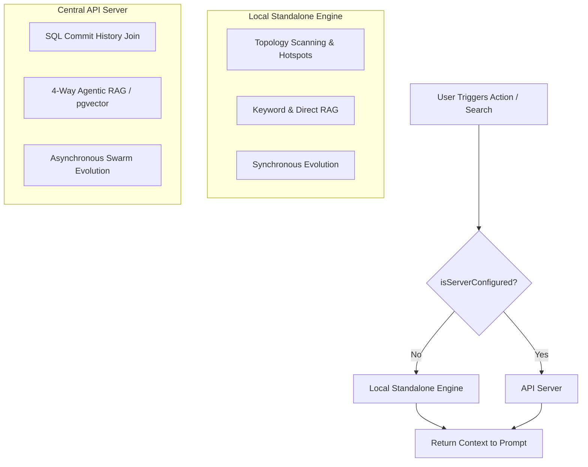

# Local-First Architecture & Graceful Server Degradation

## Status

**Implemented (Survival Update Complete)**

The "Survival Update" features have been successfully implemented, completing the Local-First vision:

- **WASM AST Worker Pool**: Local syntax analysis via `web-tree-sitter`.
- **SQLite Local DB**: Standalone graph persistence using `better-sqlite3`.
- **Git-Native Blob Hashing**: Incremental updates bypassing heavy checkouts.
- **Background L3 RAG**: Offline decision retrieval guided by `docuvia.json`.
- **VS Code CodeLens/Hover**: Surfacing blast radius via MCP tools `docuvia_impact` and `docuvia_context`.

## Core Principle

Docuvia utilizes a **"Local-First, Server-Augmented"** architecture. It provides immediate, standalone value using the VS Code Extension as a **Local HEAD Index**, seamlessly unlocking team-scale semantic capabilities when connected to the API Server's **Global Projection**.

## Architecture Flow

## 1. Standalone Mode (Local-First Fallback)

- **Implementation**: Relies on [`CentralServerClient.isServerConfigured()`](../../../artifacts/vscode-client/src/central-server-client.ts#L36) returning false.
- **Architecture Recovery**: Falls back to the [AST Microkernel](ADR-020-unified-isomorphic-ast-microkernel.md) for local topology scanning and [Git-Isomorphic Graph](ADR-004-git-isomorphic-graph.md) resolution, bypassing naive `git log -n 100` bounds (implemented in [`artifacts/vscode-client/src/knowledge-store.ts`](../../../artifacts/vscode-client/src/knowledge-store.ts)).
- **Agentic RAG**: Gracefully degrades to Keyword RAG and Direct Anchoring using `target_refs` (e.g. in [`artifacts/vscode-client/src/docuvia-code-lens-provider.ts`](../../../artifacts/vscode-client/src/docuvia-code-lens-provider.ts)).
- **Evolution**: Local garbage collection based on `last_verified_at` [decay](ADR-007-agentic-rag-routing.md) (Note: `last_verified_at` is currently not implemented, pending [metabolism](ADR-008-asynchronous-metabolism.md) workers).

## 2. Server-Augmented Mode (Team-Scale Ascension)

- **Heavy Computation Offloading**: API Server uses Drizzle [`commitsTable` in commits.ts](../../../lib/db/src/schema/commits.ts) to calculate true co-occurrence frequencies without local Git processing.
- **Full RAG**: Unlocks [`intent-router.ts`](../../../artifacts/api-server/src/lib/intent-router.ts) for [4-Way Agentic RAG](ADR-007-agentic-rag-routing.md), utilizing [pgvector](ADR-019-pgvector-migration.md) and Graph Traversal.
- **Asynchronous Evolution**: [Background jobs](ADR-008-asynchronous-metabolism.md) process [human-in-the-loop](ADR-006-self-evolution-architecture.md) corrections to protect all team members.

## Offline Writes & The Sync Outbox (CQRS)

To strictly adhere to both **Local-First** principles and the **Centralized Server Write Lock** (mandated to prevent split-brain), Docuvia employs the **Outbox Pattern**:

1. **Offline Writes**: When a developer creates a new [L3 decision](ADR-005-knowledge-abstraction-strategy.md) offline, the [VS Code client](ADR-001-vscode-client-onboarding.md) writes it immediately to its local SQLite database and records it as an append-only Delta (Event Sourcing) destined for the `docuvia-knowledge` Git branch.
2. **Online Sync**: Upon network restoration, the client simply executes a standard `git push origin docuvia-knowledge`.
3. **Server Gatekeeper**: The [API server](ADR-003-server-side-zero-to-one.md) detects the updated branch, pulls the newly appended events, and projects them into the PostgreSQL database.
4. **Conflict Resolution**: Since all events are Git commits on an orphan branch, multi-developer conflicts are naturally resolved via standard Git merge algorithms, eliminating split-brain data loss.

This topology guarantees zero downtime for the developer (100% local availability) while completely preventing Git Split-Brain on the remote repository.
