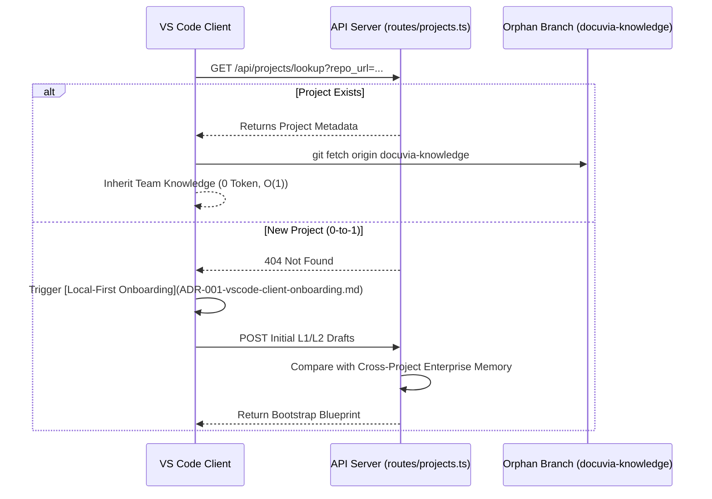

# API Server: The 0-to-1 Handshake & Multi-tenant Synchronization

## Core Dilemma

How does the API Server discover a project for the first time without burning millions of tokens analyzing history blindly, and how does it handle team synchronization?

## The Discovery Handshake

### 1. Cross-Project Catalyst (The Bootstrap Blueprint)

When a new project is initialized, the Server LLM uses its global context across multiple tenants to suggest standard [L1/L2 structures](ADR-005-knowledge-abstraction-strategy.md) (e.g., standardizing `UI Components` for all React repos) before local extraction (powered by the [AST Microkernel](ADR-020-unified-isomorphic-ast-microkernel.md) via our [Local-First Architecture](ADR-002-local-first-architecture.md)) begins.

### 2. The [Orphan Branch Protocol](ADR-017-tiered-storage-and-orphan-branch-graph-maintenance.md)

- **Implementation**: `orphan-branch-writer.ts`.
- Massive knowledge indexes ([L3 markdown files](ADR-005-knowledge-abstraction-strategy.md), semantic keys) are pushed to the `docuvia-knowledge` [orphan branch](ADR-004-git-isomorphic-graph.md).
- The API Server reads this branch to run [asynchronous global clustering](ADR-008-asynchronous-metabolism.md) without polluting the main source code's commit history.

### 3. Conflict Resolution (The Orchestrator)

When Developers A and B push overlapping L2 definitions, the Server LLM performs a horizontal comparison and resolves the collision automatically, merging them into a unified L2 node via [Database-as-IPC](ADR-014-sql-indexed-graph-and-database-as-ipc.md) during the [background synchronization phase](ADR-008-asynchronous-metabolism.md).
