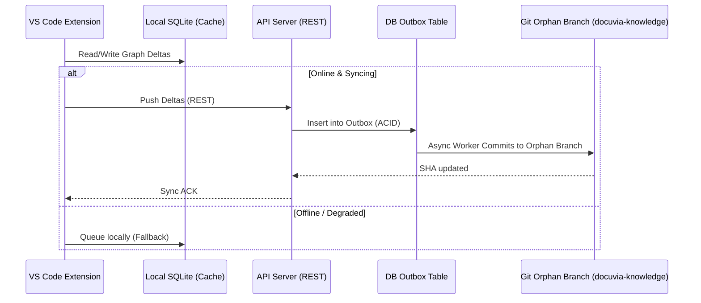

# Git-Isomorphic Knowledge Graph (Incremental Deltas)

## Core Philosophy

Knowledge is an immutable, distributed Directed Acyclic Graph (DAG) built upon Incremental Deltas (Knowledge Patches), perfectly isomorphic with the Git commit tree.

## The Temporal Alignment Architecture

```mermaid
flowchart LR
    subgraph Server Graph
        C1((Commit 1)) --> C2((Commit 2))
        C2 --> L3[L3: cursor_rule]
    end

    subgraph Local Workspace
        C2 --> C3((Commit 3: Hotfix))
        C3 --> C4((Commit 4: HEAD))
    end

    C4 -.-> |git merge-base| C2
    C2 -.-> |Inherit Baseline| C4
    C4 --> |Extract Delta| NewL3[New L3: hotfix_rule]
    NewL3 --> |API Request| Server Graph
    Server Graph --> |Central Lock + Commit| Orphan Branch
```

## 1. The Baseline Inheritance (Nearest Ancestor)

- **Implementation**: When checking out an unknown branch, the system executes `git merge-base HEAD origin/main`.
- The client queries the server for the knowledge snapshot of this ancestor commit, instantly inheriting historical guardrails without rescanning.

## 2. Local-Side Incremental Analysis (Knowledge Patch)

- The developer only extracts new L3 decisions for the files modified in the delta between the ancestor and `HEAD`.
- These new L3s are explicitly anchored to the Git history via Temporal Range Anchors (`introduced_in_commit` and `verified_until_commit` columns in Drizzle schema `l3NodesTable`). This eliminates JSONB array bloat.

## 3. Server-Side Incremental Merge

- When patches are submitted via API, the API Server (running under distributed advisory locks to prevent split-brain) performs a standard Git 3-way merge on the orphan branch. If conflicts occur, it returns `409 Conflict`. in [`generate.ts`](file:///d:/GitHub/Docuvia/artifacts/api-server/src/routes/generate.ts)) simply attaches the new nodes and edges to the existing DAG.
- **Zero-Waste Validation**: Re-evaluating the entire codebase is avoided. Every token spent produces an immutable brick anchored to a specific point in space-time in [`commitsTable` in commits.ts](file:///d:/GitHub/Docuvia/lib/db/src/schema/commits.ts).


## System Flow & Boundaries



## Verifiability

The local-first syncing mechanism and graph extraction MUST be testable without a live API server:
- **Extension Offline Resilience:** `@vscode/test-electron` test suites MUST launch the extension with the API server mocked as unreachable (503). The test MUST assert that local knowledge graph modifications successfully persist to the local SQLite cache without throwing unhandled exceptions to the user.
- **Outbox Sync Guarantee:** API server integration tests MUST use `withRollback(...)` to insert a pending Git synchronization event into the Outbox table. A worker tick MUST assert the `git` command execution (via mocked `child_process` or equivalent) and the subsequent deletion/status-update of the Outbox row.
