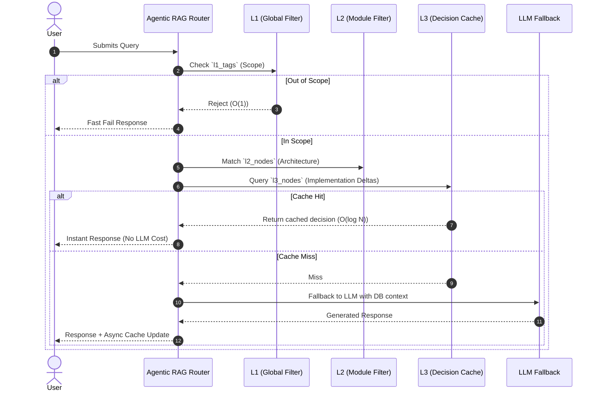

# Knowledge Abstraction & Architecture Recovery (L3 -> L2)

## Core Pain Points & Objectives

Specific implementation rules (L3) are highly fragmented. We need Non-intrusive Architecture Recovery to deduce L2 modules automatically without disrupting developer flow or blowing out token limits (see [ADR-009](ADR-009-token-management.md) and [ADR-010](ADR-010-context-compression-and-proxy.md)).

## Top-Down Archaeology Strategy

```mermaid
flowchart TD
    subgraph Rich-Semantic Recovery
        R1[Read CHANGELOG.md] --> L2[L2 Candidates]
        R2[Sniff azure-pipelines / Makefile] --> L2
    end

    subgraph VCS-Only Fallback (Degradation)
        F1[git log -n 100 --name-only] --> Hotspots[Hotspot Dirs]
        F2[Depth-2 Topology Scan] --> Hotspots
        F3[L3 Self-Anchoring Paths] --> Hotspots
    end

    L2 --> LLM[LLM Map-Reduce Naming]
    Hotspots --> LLM
    LLM --> Draft[L2 Classification Draft]
    Draft --> UI[User Drags & Approves via TreeView]
```

## 1. Priority Tier: Rich-Semantic Recovery

- Extract `## Headers` from `CHANGELOG.md` or GitHub Releases. These are pure business L2 boundaries created by humans ($O(1)$ cost).
- Extract CI/CD pipelines to define deployment boundaries.

## 2. Degradation Fallback: VCS-Only Snapshot

- If no releases exist, execute a lightweight `git log -n 100` and a Depth-2 directory scan, enriched locally by the [WASM Microkernel AST](ADR-020-unified-isomorphic-ast-microkernel.md) running via our [Local-First Architecture](ADR-002-local-first-architecture.md).
- Parse the source paths of unclassified L3 decisions (e.g., `Extracted from src/core/auth.ts`) to perform physical path aggregation leveraging [Git Blob Native Identity](ADR-016-git-blob-native-identity-and-checkout-thrashing-defense.md).

## 3. High-Density Payload Assembly (Local Map)

- **DO NOT** transmit full Git logs or L3 content.
- Only bundle extracted boundaries and L3 titles. Payload must remain under 1000 Tokens ([ADR-009](ADR-009-token-management.md)). The LLM names the clusters, and the user approves via UI drag-and-drop in the [VS Code Client](ADR-001-vscode-client-onboarding.md) (closing the [Human-in-the-Loop](ADR-006-self-evolution-architecture.md) cycle).

## Caching Topology & Query Flow

While L1, L2, and L3 represent knowledge abstractions, operationally they function as a **tiered, semantic caching topology**. This fall-through mechanism ensures token efficiency and prevents expensive, high-latency LLM generation calls by intercepting queries at the most granular cached layer available.



### Schema Mapping & Performance

This topology maps directly to our PostgreSQL database schema (managed via Drizzle ORM), operating through [Database-as-IPC](ADR-014-sql-indexed-graph-and-database-as-ipc.md) and augmented by [pgvector](ADR-019-pgvector-migration.md):

- **L1 (Global Filter):** Mapped to the `l1_tags` table. Provides **O(1)** domain boundary checks to instantly reject out-of-scope queries.
- **L2 (Module Filter):** Mapped to the `l2_nodes` table. Clusters architecture into traversable sub-graphs for localized context.
- **L3 (Decision Cache):** Mapped to the `l3_nodes` table. Contains immutable, commit-anchored implementation rules ([ADR-016](ADR-016-git-blob-native-identity-and-checkout-thrashing-defense.md)) synchronized globally via [Orphan Branch Maintenance](ADR-017-tiered-storage-and-orphan-branch-graph-maintenance.md). Database indexing allows **O(log N)** retrieval for exact or near-exact semantic matches.

## Verifiability

To ensure the caching topology behaves as designed and does not silently degrade into executing 100% LLM calls, it must be automatically verified in our CI pipelines:

1.  **Integration Testing:** All routing paths must be covered by package integration tests located in `artifacts/api-server/test/integration/`.
2.  **Test Isolation:** Tests must use the `withRollback(...)` utility from `artifacts/api-server/test/support/db.ts` to seed mock `l1_tags`, `l2_nodes`, and `l3_nodes` records before execution.
3.  **LLM Bypass Assertions:** Tests must assert that a query with a valid L3 cache match _never_ triggers an external HTTP call to the LLM. This is verified by ensuring the MSW interceptors (`artifacts/api-server/test/setup/msw/handlers.ts`) do not register a call to the OpenAI-compatible endpoint during an L3 cache hit.
