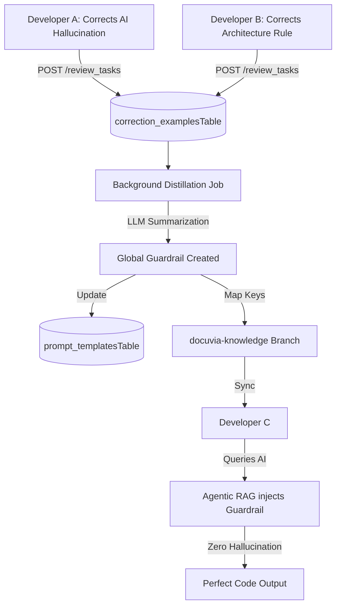

# Self-Evolution & Swarm Intelligence

## Core Philosophy

The system must possess vitality. Perfect cognition in a single session is meaningless if it cannot persist. Docuvia uses a closed loop of **"Attempt -> Failure -> Human Correction -> Memory Compression -> Rule Evolution"**.

## The Swarm Intelligence Pipeline

## 1. Capturing the Lesson (Human Overrides)

- **Implementation Route**: User edits trigger [`review_tasks.ts`](../../../artifacts/api-server/src/routes/review_tasks.ts) (specifically resolution paths), logging the original and corrected content into the [`correction_examplesTable` in correction_examples.ts](../../../lib/db/src/schema/correction_examples.ts).

## 2. Server-Side Distillation

- The server detects patterns (e.g., multiple developers replacing `console.log` with `pino`) across the `correction_examplesTable`.
- **Implementation Route**: The background distillation job (see [Asynchronous Metabolism](ADR-008-asynchronous-metabolism.md)) is implemented in `artifacts/api-server/src/routes/metabolism.ts`. It selects rows from `correction_examplesTable` where `processedAt IS NULL`, uses the LLM to compress these raw corrections into high-level Architectural Guardrails, inserts them into `prompt_templatesTable`, and updates the `processedAt` timestamp.

## 3. Experience Rollout (O(1) Fast-Path Filters)

- Guardrails and common query structures are identified by the router without LLM latency, utilizing direct database queries per [Database-as-IPC](ADR-014-sql-indexed-graph-and-database-as-ipc.md).
- When a new developer queries the AI, the router in `intent-router.ts` (handling both [Local-First](ADR-002-local-first-architecture.md) and Server-Augmented queries via [Agentic RAG Routing](ADR-007-agentic-rag-routing.md)) runs O(1) checks for `#attach` or specific domain keywords mapped from [L1/L2 database names](ADR-005-knowledge-abstraction-strategy.md) to pre-inject the guardrail natively.
- **Implementation client sync**: Exposes synchronisation through [`CentralServerClient.ts`](../../../artifacts/vscode-client/src/CentralServerClient.ts#L79) (`sync()` and `pullSnapshot()`), fetching from the [Orphan Branch](ADR-017-tiered-storage-and-orphan-branch-graph-maintenance.md) to maintain the [Git-Isomorphic Graph](ADR-004-git-isomorphic-graph.md).

## 4. Tool Maker Integration

When the system encounters edge cases or domain-specific semantic patterns that the [AST Microkernel](ADR-020-unified-isomorphic-ast-microkernel.md) cannot resolve naturally, the fallback is to use the LLM (via [Progressive Enrichment](ADR-015-progressive-enrichment-and-ast-lsp-dual-engine.md)). However, because LLM execution burns API tokens, this represents a recurring cost.

To reduce token burn, highly deterministic new rules discovered by the LLM can trigger the Tool Maker agent. The Tool Maker will generate dedicated, lightweight parsing scripts (e.g., Python/Node.js `sniff_xyz.py` utilities or regex-based heuristic scanners) to permanently handle that specific pattern locally, offloading the work from the LLM back to local compute.

- **Gap Note**: The automated Tool Maker trigger mechanism is _not implemented_.
