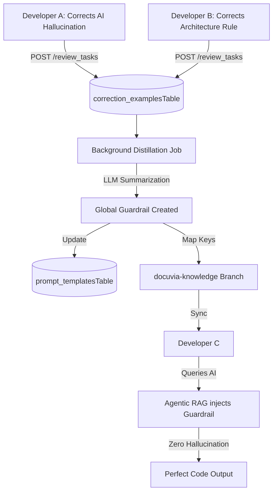

# Self-Evolution & Swarm Intelligence

## Core Philosophy

The system must possess vitality. Perfect cognition in a single session is meaningless if it cannot persist. Docuvia uses a closed loop of **"Attempt -> Failure -> Human Correction -> Memory Compression -> Rule Evolution"**.

## The Swarm Intelligence Pipeline

## 1. Capturing the Lesson (Human Overrides)

- **Implementation Route**: User edits trigger [`review_tasks.ts`](../../../artifacts/api-server/src/routes/review_tasks.ts) (specifically resolution paths), logging the original and corrected content into the [`correction_examplesTable` in correction_examples.ts](../../../lib/db/src/schema/correction_examples.ts).

## 2. Server-Side Distillation

- The server detects patterns (e.g., multiple developers replacing `console.log` with `pino`) across the `correction_examplesTable`.
- **Implementation Route**: The background distillation job is implemented in `artifacts/api-server/src/routes/metabolism.ts`. It selects rows from `correction_examplesTable` where `processedAt IS NULL`, uses the LLM to compress these raw corrections into high-level Architectural Guardrails, inserts them into `prompt_templatesTable`, and updates the `processedAt` timestamp.

## 3. Experience Rollout (O(1) Fast-Path Filters)

- Guardrails and common query structures are identified by the router without LLM latency.
- When a new developer queries the AI, the local router in `intent-router.ts` runs O(1) checks for `#attach` or specific domain keywords mapped from L1/L2 database names to pre-inject the guardrail natively.
- **Implementation client sync**: Exposes synchronisation through [`CentralServerClient.ts`](../../../artifacts/vscode-client/src/CentralServerClient.ts#L79) (`sync()` and `pullSnapshot()`).

## 4. Tool Maker Integration

Highly deterministic new rules can trigger the Tool Maker agent to generate local Python/Node.js scanning scripts (`sniff_xyz.py`) permanently.

- **Gap Note**: The automated Tool Maker trigger mechanism is _not implemented_.
