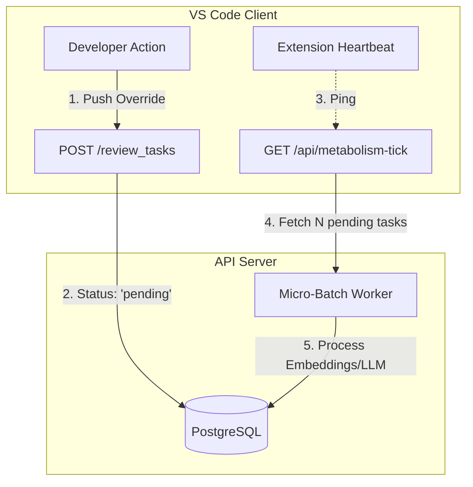
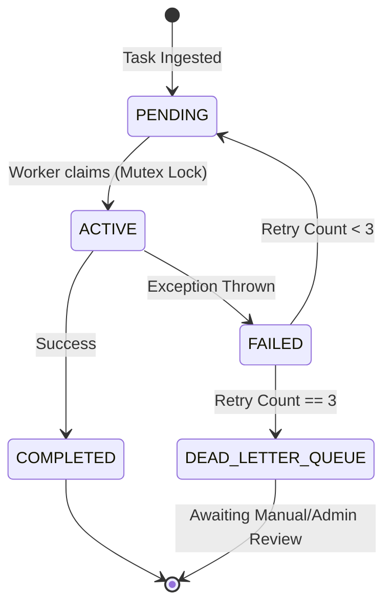

# Asynchronous Metabolism (Database-Driven Queue)

## Core Dilemma

The API Server must handle heavy tasks ([Vector Embeddings](ADR-019-pgvector-migration.md), LLM Experience Distillation, [Temporal Decay](ADR-007-agentic-rag-routing.md), and [AST Parsing via Microkernel](ADR-020-unified-isomorphic-ast-microkernel.md)) asynchronously without blocking the Node.js Event Loop. However, to keep the [local-first architecture](ADR-002-local-first-architecture.md) lightweight, we strictly avoid introducing heavy infrastructure like Redis, BullMQ, or Celery.

## Solution: DB-Backed Queue & Micro-Batching

We invert the triggering mechanism, utilizing PostgreSQL as the state machine ([Database-as-IPC](ADR-014-sql-indexed-graph-and-database-as-ipc.md)) and the VS Code Client as the heartbeat.

### 1. The PostgreSQL State Machine

Heavy operations do not execute during the HTTP request cycle. Instead, actions (like capturing a [human correction](ADR-006-self-evolution-architecture.md)) are written to the database (e.g., [`correction_examplesTable` in correction-examples.ts](../../../lib/db/src/schema/correction-examples.ts)) with a status flag like `status: 'pending'` or `processedAt: null`. The API immediately returns `200 OK`.

- **Review Task routes**: [`review-tasks.ts`](../../../artifacts/api-server/src/routes/review-tasks.ts)

### 2. Client-Driven Heartbeat (The Drip Feed)

- The [VS Code Extension](ADR-001-vscode-client-onboarding.md) periodically pings the server (e.g., to fetch the [orphan branch](ADR-017-tiered-storage-and-orphan-branch-graph-maintenance.md) or check for notifications).
- These routine pings trigger a **Micro-batch** execution on the Server. The server selects a small chunk (e.g., 5 pending tasks) to process in the background.
- This approach fragments the computational load, preventing the server from being overwhelmed by a massive backlog, and turns the users' continuous activity into the engine that powers the server's evolution.
- **Implementation Note**: The active client heartbeat-driven `metabolism-tick` worker is implemented in `metabolism.ts` and triggered periodically by the VS Code extension's `CentralServerClient`. It is protected by a distributed Postgres job queue using `FOR UPDATE SKIP LOCKED` combined with a `locked_at` timestamp. This prevents split-brain race conditions when multiple API servers poll for tasks, and allows for automatic background zombie-reaper recovery.

### 3. Dedicated Admin Endpoint (Optional Cron)

For fully idle periods (e.g., nighttime), a dedicated `/admin/metabolism-tick` route is exposed. Administrators can use simple OS-level cron jobs or GitHub Actions to periodically hit this endpoint, ensuring complete garbage collection and graph recalculation without needing Redis.

- **Security Note**: This endpoint is strictly authenticated via the `Authorization: Bearer` header or `admin_token` query parameter against the `ADMIN_SECRET_TOKEN` environment variable. It is designed to **fail closed**—if the environment variable is missing (and not explicitly running in local dev mode), the route will return a `500 Internal Server Error` to prevent unauthorized execution.

## Concurrency Protection (Atomic Mutexes)

Heavy generation pipelines (like [Knowledge Graph node generation](ADR-005-knowledge-abstraction-strategy.md) in `POST /projects/:id/generate`) rely on database-level atomic conditional updates instead of just in-memory checks.

- We use optimistic locking via conditional `UPDATE` statements (`WHERE status = 'active'`).
- Failed pipelines will transition the project to `error` status.
- **Error Recovery Strategy**: A new pipeline can successfully reclaim the project if it is in an `active` or `error` state, or if a crashed process left it in a stale `indexing` state for over 30 minutes.

## System Flow & Boundaries

## Verifiability

Asynchronous workers are prone to poison pills. The CI pipeline MUST enforce resilience via the following hooks:

- **DLQ Routing Proof:** Vitest DB tests using `withRollback(...)` MUST inject a mocked deterministic-failing task. The test MUST tick the worker 3 times and explicitly assert the task transitions to the `DEAD_LETTER_QUEUE` status without crashing the runner.
- **Mutex Lock Proof:** Concurrent test runners MUST attempt to claim the same pending task simultaneously. DB assertions MUST prove exactly `1` worker transitions the task to `ACTIVE` while the others receive a `0 rows affected` response from PostgreSQL.
