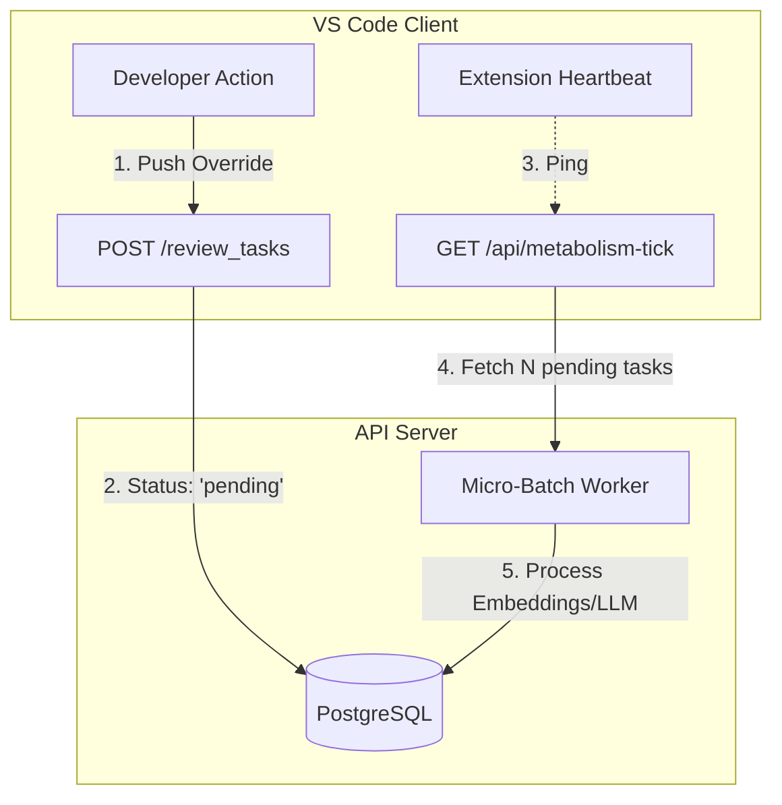

# Asynchronous Metabolism (Database-Driven Queue)

## Core Dilemma

The API Server must handle heavy tasks (Vector Embeddings, LLM Experience Distillation, Temporal Decay) asynchronously without blocking the Node.js Event Loop. However, to keep the self-hosting architecture lightweight, we strictly avoid introducing heavy infrastructure like Redis, BullMQ, or Celery.

## Solution: DB-Backed Queue & Micro-Batching

We invert the triggering mechanism, utilizing PostgreSQL as the state machine and the VS Code Client as the heartbeat.

### 1. The PostgreSQL State Machine

Heavy operations do not execute during the HTTP request cycle. Instead, actions (like capturing a human correction) are written to the database (e.g., [`correction_examplesTable` in correction_examples.ts](file:///d:/GitHub/Docuvia/lib/db/src/schema/correction_examples.ts)) with a status flag like `status: 'pending'` or `processedAt: null`. The API immediately returns `200 OK`.

- **Review Task routes**: [`review_tasks.ts`](file:///d:/GitHub/Docuvia/artifacts/api-server/src/routes/review_tasks.ts)

### 2. Client-Driven Heartbeat (The Drip Feed)

- The VS Code Extension periodically pings the server (e.g., to fetch the orphan branch or check for notifications).
- These routine pings trigger a **Micro-batch** execution on the Server. The server selects a small chunk (e.g., 5 pending tasks) to process in the background.
- This approach fragments the computational load, preventing the server from being overwhelmed by a massive backlog, and turns the users' continuous activity into the engine that powers the server's evolution.
- **Gap Note**: While designed above, the active client heartbeat-driven `metabolism-tick` worker is currently _not implemented_ in [`artifacts/api-server/src/routes/sync.ts`](file:///d:/GitHub/Docuvia/artifacts/api-server/src/routes/sync.ts) or [`artifacts/vscode-client/src/CentralServerClient.ts`](file:///d:/GitHub/Docuvia/artifacts/vscode-client/src/CentralServerClient.ts). Instead, ingestion and generation run as direct execution pathways on request.

### 3. Dedicated Admin Endpoint (Optional Cron)

For fully idle periods (e.g., nighttime), a dedicated `/api/admin/metabolism-tick` route is exposed. Administrators can use simple OS-level cron jobs or GitHub Actions to periodically hit this endpoint, ensuring complete garbage collection and graph recalculation without needing Redis.

- **Gap Note**: The `/api/admin/metabolism-tick` route is currently _missing_ from the routes directory.
