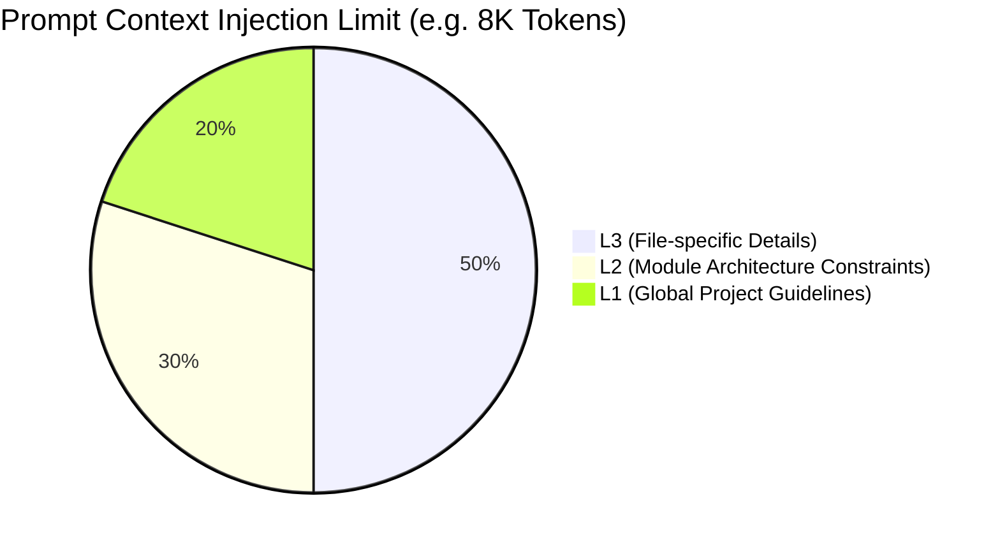

# Token Management & Extraction Efficiency

## Core Philosophy

1. **"Solidify known boundaries and strictly adhere to them" (Local Deterministic Constraints)**
2. **"Let the LLM explore unknown boundaries and continuously convert the unknown into the known" (Evolutionary Solidification)**

## Context Weight Allocation ([Agentic RAG](ADR-007-agentic-rag-routing.md))

## 1. Consumption Phase: Interception and Allocation

- **[Local Pre-processing](ADR-002-local-first-architecture.md)**: [Active Editor anchoring](ADR-001-vscode-client-onboarding.md) identifies [L3 rules](ADR-005-knowledge-abstraction-strategy.md) related to the file, traces upstream to L2 and L1, and truncates irrelevant noise on the Local side before LLM execution.
- **O(1) Map Key Lookups**: Relies on cached definitions to prevent wasting tokens on intent arbitration.

## 2. Evolution Phase: Local Solidification (1900 -> 300 Tokens)

- **Unknown to Known**: The system initially uses 1900 Tokens to ask the LLM to find hotspots in 100 git commit paths (resolved via [Git Blob Native Identity](ADR-016-git-blob-native-identity-and-checkout-thrashing-defense.md) and persisted to the [Orphan Branch](ADR-017-tiered-storage-and-orphan-branch-graph-maintenance.md)).
- **Solidification**: The system evolves by offloading deterministic structural extraction to the [AST Microkernel](ADR-020-unified-isomorphic-ast-microkernel.md) locally. When AST parsing is insufficient, the system generates dedicated scripts (e.g., a local Trie algorithm for path compression) via the [Tool Maker](ADR-006-self-evolution-architecture.md#4-tool-maker-integration) to permanently solidify the rule.
- **Efficiency Breakthrough**: On the next run, the Local side performs [Context Compression](ADR-010-context-compression-and-proxy.md) on the paths, shrinking the payload to under 300 Tokens, freeing up LLM compute for higher-level semantic tasks.

## 3. Batching & Chunking

- Configurations like `docuvia.extraction.maxFileSizeKBWarning` must be exposed. Massive `/analyze_l2` tasks are sliced into chunks and queued via [Database-as-IPC](ADR-014-sql-indexed-graph-and-database-as-ipc.md) to be processed by the [Asynchronous Metabolism](ADR-008-asynchronous-metabolism.md) workers to prevent context overflow.
