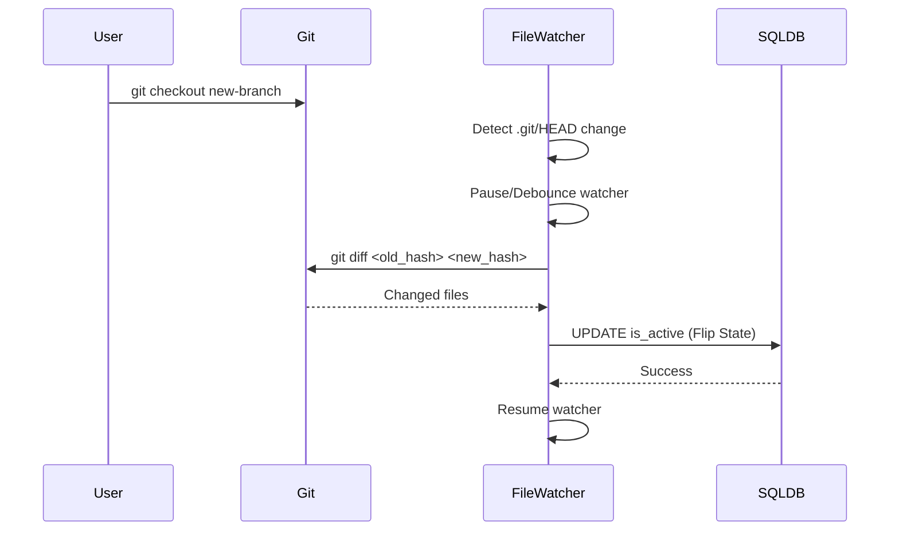

# ADR-016: Git Blob-Native Identity & Checkout Thrashing Defense

## Context

_(Ref: [`docs/architecture/comparisons/05-data-pipeline-sync.md`](../../architecture/comparisons/05-data-pipeline-sync.md), [`docs/evaluate/12-file-hash-delta-detection.md`](../../evaluate/12-file-hash-delta-detection.md))_

When dynamically analyzing code, AST tree-diffing algorithms are computationally expensive. Additionally, when a user switches branches (e.g., `git checkout`), thousands of files may change instantly, causing a File-Watcher to trigger massive, unnecessary graph rebuilds and generate useless [database tombstones](ADR-017-tiered-storage-and-orphan-branch-graph-maintenance.md) (thrashing).
Competitor analysis showed that utilizing Git's native tree objects could provide near-instant incremental scanning and deep git integration to map diff hunks.

## Decision

Docuvia will implement an "Environment-Aware Ingestion Pipeline" that heavily leverages native Git objects when a VCS is present (aligning with our [Git-Isomorphic Graph](ADR-004-git-isomorphic-graph.md)).

- **Git Blob-Native Identity**: For projects with Git, the graph will use the `git_blob_hash` as the anchor for file-level nodes, and a custom `content_hash` (SHA-256 of the source string) for function/class-level AST nodes. Renames and moves are handled as zero-cost `UPDATE` statements by querying `git diff --name-status` and matching hashes, rather than fully parsing files again.
- **Checkout Thrashing Defense**: Docuvia will monitor `.git/HEAD`. During branch checkouts, the File-Watcher is paused (debounced). The system determines differences via `git diff <old_hash> <new_hash>`, and utilizes existing hashes from the graph to merely flip the `is_active` boolean state in SQL instead of deleting and creating new nodes. Ephemeral checkouts will enter a read-only mode to prevent [polluting the history](ADR-017-tiered-storage-and-orphan-branch-graph-maintenance.md).
- **Environment-Aware Fallback**: If no Git repository is detected, the pipeline degrades gracefully to rely solely on local file hashing and basic [AST parsing](ADR-020-unified-isomorphic-ast-microkernel.md).

## Consequences

- **Positive**: Practically zero computational cost for file rename/move tracking.
- **Positive**: Eliminates CPU spikes and database thrashing during branch switches.
- **Positive**: Adapts to both Git-versioned repositories and unversioned folders.
- **Negative**: Adds Git CLI integration dependencies and complexity to the ingest pipeline.

## Diagram

