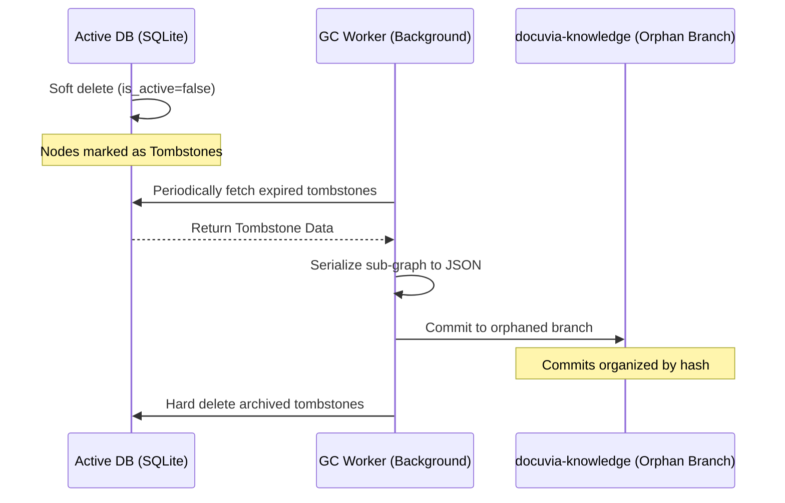

# ADR-017: Tiered Storage & Orphan Branch Graph Maintenance

## Context

To prevent the [local PostgreSQL database](ADR-014-sql-indexed-graph-and-database-as-ipc.md) from growing infinitely as the project evolves through frequent edits and refactors, the graph needs a garbage collection (GC) mechanism. However, we cannot permanently delete historical knowledge (such as lessons learned from past bugs) simply because the code was refactored.

## Decision

### Architecture Diagram

We will adopt a "Tiered Storage" strategy involving soft deletions and a [Git-Isomorphic Graph](ADR-004-git-isomorphic-graph.md) maintenance process:

- **Stable Node Identity & Tombstoning**: Nodes will have a UUID based on semantic fingerprints. Deleted code is soft-deleted (`is_active = false`) and marked as a Tombstone.
- **Hot Storage (Local SQL)**: The local database will hold the current version of the [AST graph](ADR-020-unified-isomorphic-ast-microkernel.md) (HEAD) plus recent tombstones (e.g., last 30 days or 100 commits) for immediate blast radius and historical queries.
- **Cold Storage (Orphan Branch)**: A low-priority [Background GC Worker](ADR-008-asynchronous-metabolism.md) will periodically archive expired tombstones and temporal edges. It will serialize this sub-graph into compact JSON, organized by Git commit hashes (e.g., `commits/<user_commit_hash>/`), and commit them strictly asynchronously to an invisible `docuvia-knowledge` orphan branch.
- **Hydration**: The system can retrieve and hydrate historical data from the orphan branch into the local memory/DB if an Agent queries ancient code.

## Consequences

- **Positive**: Keeps the primary local database extremely lean and fast.
- **Positive**: Preserves valuable historical context and [L3 deltas](ADR-005-knowledge-abstraction-strategy.md) indefinitely without bloat.
- **Positive**: Enables remote synchronization; new team members can fetch the `docuvia-knowledge` branch and instantly inherit the team's entire historical knowledge graph.
- **Negative**: Requires robust asynchronous worker management to prevent locking the editor during GC serialization.
