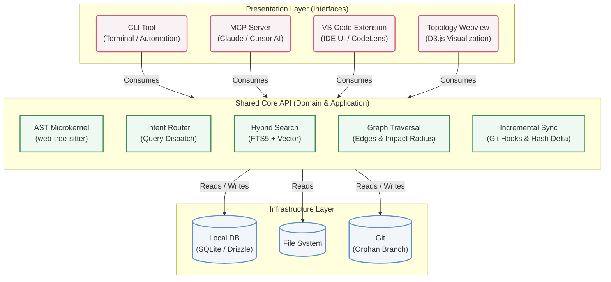

# ADR 021: Shared Core API and Presentation Layers (Hexagonal Architecture)

## Context

As Docuvia evolves, it surfaces multiple entry points and user interfaces: a Command Line Interface (CLI), a Model Context Protocol (MCP) server for AI agents, a VS Code Extension (Client) for developer interaction, and an interactive Topology Webview.

If business logic, indexing processes, and query routing are duplicated across these interfaces, the system will become extremely difficult to maintain. Feature parity will drift (e.g., the CLI might implement an AST parse correctly, but the MCP tool might use a different, outdated logic).

## Decision

We adopt a strict **Ports and Adapters (Hexagonal) Architecture**.

All core capabilities must be abstracted into a **Shared Core API**. This Core API acts as the single source of truth for all local-first functionalities.

The CLI, MCP, VS Code Client, and Webview are treated strictly as **Presentation Layers** (Adapters). They must only serve as "shells" that handle user input, formatting, and UI/UX representation, delegating all actual work to the Core API.

### Architectural Diagram

## Parity and Naming Rule

To enforce this, we apply a strict naming and feature parity rule:

1. Every capability must exist in the Core API.
2. The CLI must expose this capability with a standardized command name (e.g., `docuvia analyze`).
3. The MCP server must expose the exact same capability using a matching tool name (e.g., `analyze_workspace`).
4. The VS Code Client must expose the same capability using a matching command ID (e.g., `docuvia.analyze`).

By aligning the interfaces structurally and conceptually, we drastically reduce cognitive load for developers and ensure complete feature parity across all tools.

## Consequences

- **Positive:** Single source of truth for business logic. Zero drift between the CLI and the MCP server. Easier testing (we only need to test the Core API thoroughly, while presentation tests can be shallow).
- **Positive:** Faster development cycles when adding new competitors' features, as they only need to be implemented once in the Core API and exposed via the existing presentation shells.
- **Negative:** Requires strict discipline. Developers cannot write "quick scripts" or "quick hacks" inside the VS Code extension code or CLI code directly; it must be pushed down to the Core API.
