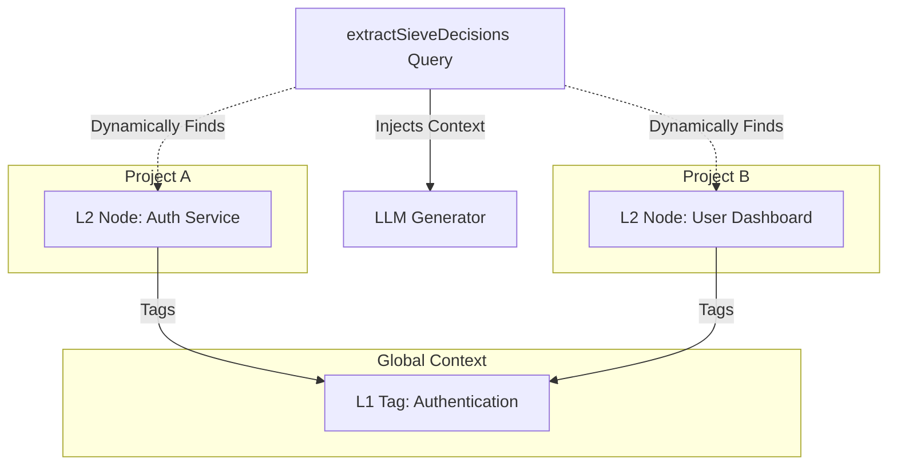

# ADR-024: Cross-Project Soft Linking via Global L1 Tags

## Context

When extracting architectural decisions and knowledge (L3 nodes) across a large workspace or enterprise, AI agents need context from other related projects to make consistent decisions. However, creating hardcoded foreign key relationships (`SIMILAR_LINK` or physical edges) between projects violates microservice and repository autonomy boundaries. If a project drops a dependency or a module, the hard link becomes stale and creates dangling relationships.

## Decision

We will implement **"Cross-Project Soft Linking"** exclusively through dynamic joins on global **L1 Tags**.

1. **No Inter-Project Foreign Keys**: Projects will not directly reference each other's L2 or L3 nodes in the database.
2. **Dynamic Context Assembly**: During decision extraction (`extractSieveDecisions`), the system will dynamically query the database for other projects that currently share the same global L1 Tags (`l1_tags` <-> `l2_node_l1_tags`).
3. **Prompt-Time Injection**: The discovered cross-project L2 nodes will be serialized into text and injected into the LLM `systemPrompt` as purely informational context.
4. **Immediate Consistency**: By relying on dynamic Drizzle queries (or a PostgreSQL View), any change to a project's L1 tags instantly updates its relationship with other projects without requiring asynchronous edge-deletion sweeps or materialized view refreshes.

## Consequences

- **Positive**: High resilience. Projects remain completely decoupled at the schema level.
- **Positive**: Immediate consistency. Removing an L1 tag from a local node instantly severs the cross-project relationship.
- **Negative**: Dynamic joins slightly increase database read latency during the LLM prompt assembly phase compared to traversing pre-computed graph edges.

## Diagram

