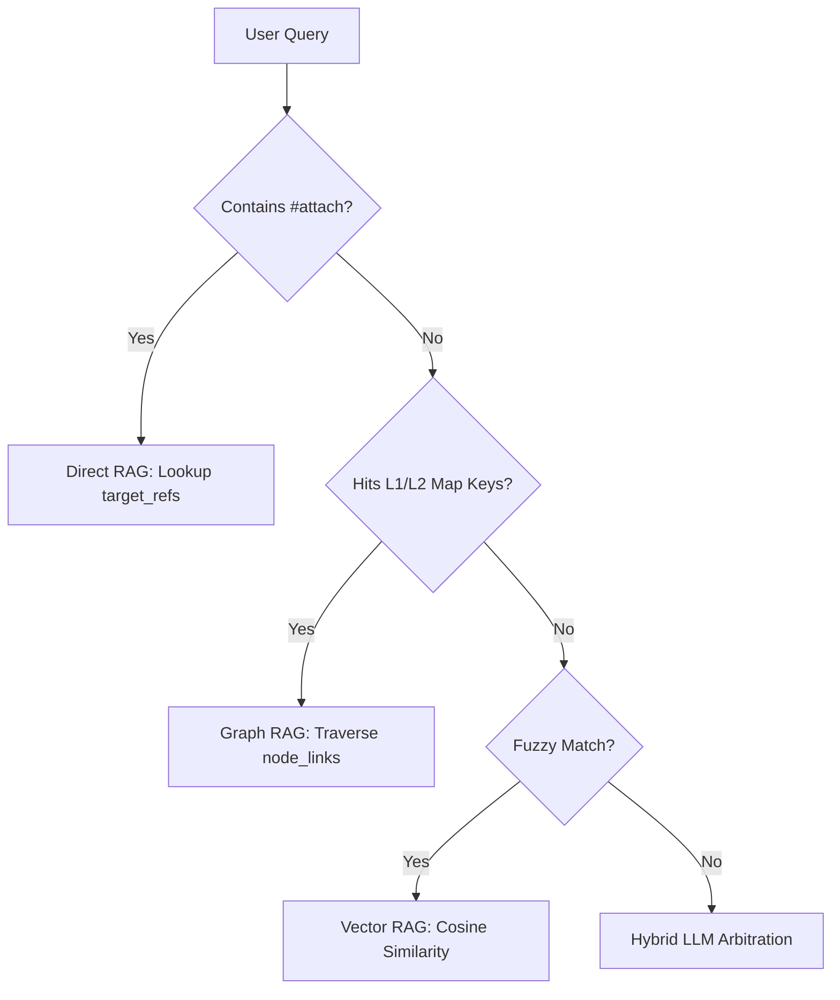

# Agentic RAG 4-Way Routing & Temporal Decay

## Core Architecture

Docuvia's [`intent-router.ts`](file:///d:/GitHub/Docuvia/artifacts/api-server/src/lib/intent-router.ts) dynamically selects the optimal retrieval strategy. Routing arbitration prioritizes $O(1)$ local caches over expensive LLM inference.

## The Routing Funnel (O(1) Arbitration)

## 1. External Document Anchoring (The Floating Knowledge Catcher)

- **Implementation Schema**: [`documentsTable` in documents.ts](file:///d:/GitHub/Docuvia/lib/db/src/schema/documents.ts) with `status: "unaffiliated"`.
- When a 50-page PDF is uploaded, it is initially `unaffiliated`. The LLM scans it to find semantic anchors in existing L2 nodes or recent commits. Once approved via [`review_tasks.ts`](file:///d:/GitHub/Docuvia/artifacts/api-server/src/routes/review_tasks.ts) (Drizzle schema: [`review_tasks.ts`](file:///d:/GitHub/Docuvia/lib/db/src/schema/review_tasks.ts)), it is firmly anchored in the space-time of the Git graph, preventing anachronistic hallucinations.

## 2. The 4-Way Strategies

- **Direct RAG**: $O(1)$ lookup via `target_refs` (e.g., in [`artifacts/vscode-client/src/DocuviaCodeLensProvider.ts`](file:///d:/GitHub/Docuvia/artifacts/vscode-client/src/DocuviaCodeLensProvider.ts)).
- **Graph RAG**: Traverses [`node_linksTable` in node_links.ts](file:///d:/GitHub/Docuvia/lib/db/src/schema/node_links.ts) to find structural dependencies (Neighbor Infection).
- **Vector RAG**: Standard embedding similarity via PGVector ([`embedding.ts`](file:///d:/GitHub/Docuvia/artifacts/api-server/src/lib/embedding.ts)).
- **Hybrid RAG**: Intersection of graph constraints and vector similarities (implemented as `hybridSearch()` in [`intent-router.ts`](file:///d:/GitHub/Docuvia/artifacts/api-server/src/lib/intent-router.ts)).

## 3. Temporal Decay & Garbage Collection

- Knowledge nodes contain `created_at` and `last_verified_at` (Note: `last_verified_at` is planned but currently absent from the Drizzle schemas of [`l2_nodes.ts`](file:///d:/GitHub/Docuvia/lib/db/src/schema/l2_nodes.ts) and [`l3_nodes.ts`](file:///d:/GitHub/Docuvia/lib/db/src/schema/l3_nodes.ts)).
- **Implementation**: The router applies a temporal decay function to vector/graph scores. Knowledge untouched naturally sinks to the bottom.
- When old knowledge correctly answers a query, its `last_verified_at` is updated, "refreshing" its lifespan.
