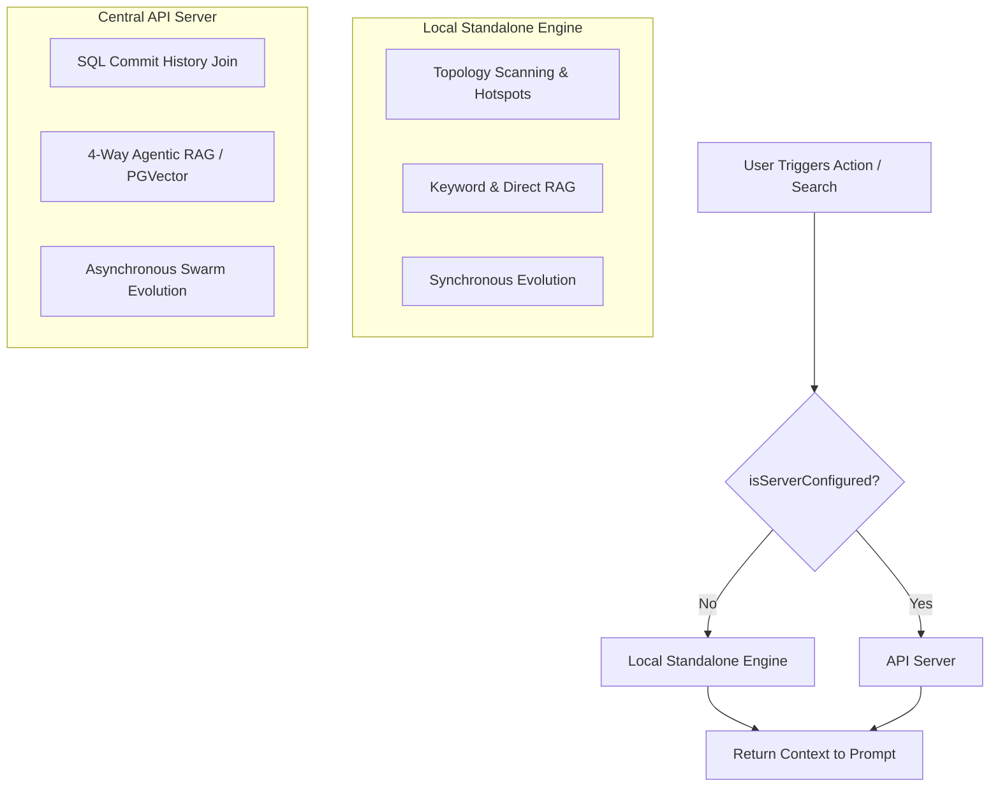

# Local-First Architecture & Graceful Server Degradation

## Core Principle
Docuvia utilizes a **"Local-First, Server-Augmented"** architecture. It provides immediate, standalone value using only the VS Code Extension, seamlessly unlocking team-scale performance when connected to the API Server.

## Architecture Flow

## 1. Standalone Mode (Local-First Fallback)
*   **Implementation**: Relies on `CentralServerClient.isServerConfigured()` returning false.
*   **Architecture Recovery**: Falls back to Depth-2 topology scanning and `git log -n 100`.
*   **Agentic RAG**: Gracefully degrades to Keyword RAG and Direct Anchoring using `target_refs`.
*   **Evolution**: Local garbage collection based on `last_verified_at` decay.

## 2. Server-Augmented Mode (Team-Scale Ascension)
*   **Heavy Computation Offloading**: API Server uses `commitsTable` to calculate true co-occurrence frequencies without local Git processing.
*   **Full RAG**: Unlocks `intent-router.ts` for Vector and Graph Traversal.
*   **Asynchronous Evolution**: Background jobs process corrections to protect all team members.