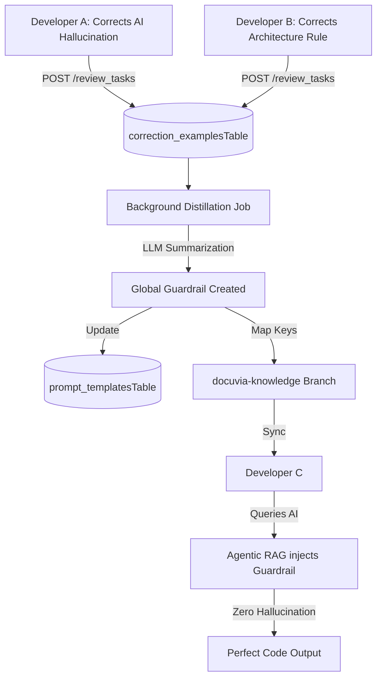

# Self-Evolution & Swarm Intelligence

## Core Philosophy
The system must possess vitality. Perfect cognition in a single session is meaningless if it cannot persist. Docuvia uses a closed loop of **"Attempt -> Failure -> Human Correction -> Memory Compression -> Rule Evolution"**.

## The Swarm Intelligence Pipeline

## 1. Capturing the Lesson (Human Overrides)
*   **Implementation**: User edits trigger `review_tasks.ts`, logging the original and corrected content into the `correction_examplesTable`.

## 2. Server-Side Distillation
*   The server detects patterns (e.g., multiple developers replacing `console.log` with `pino`) across the `correction_examplesTable`.
*   The LLM compresses these raw corrections into high-level Architectural Guardrails.

## 3. Experience Rollout (O(1) Map Keys)
*   Guardrails are transformed into `Map Keys` (e.g., `keyword: console.log -> constraint: use pino`) and pushed to the orphan branch. 
*   When a new developer queries the AI, the local cache hits the Map Key in $O(1)$ time, pre-injecting the guardrail without requiring LLM arbitration.

## 4. Tool Maker Integration
Highly deterministic new rules can trigger the Tool Maker agent to generate local Python/Node.js scanning scripts (`sniff_xyz.py`) permanently.