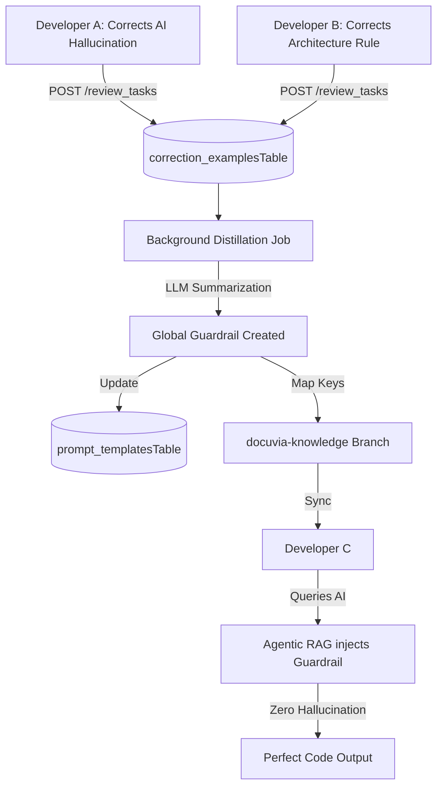

# Self-Evolution & Swarm Intelligence

## Core Philosophy

The system must possess vitality. Perfect cognition in a single session is meaningless if it cannot persist. Docuvia uses a closed loop of **"Attempt -> Failure -> Human Correction -> Memory Compression -> Rule Evolution"**.

## The Swarm Intelligence Pipeline

## 1. Capturing the Lesson (Human Overrides)

- **Implementation Route**: User edits trigger [`review_tasks.ts`](file:///d:/GitHub/Docuvia/artifacts/api-server/src/routes/review_tasks.ts) (specifically resolution paths), logging the original and corrected content into the [`correction_examplesTable` in correction_examples.ts](file:///d:/GitHub/Docuvia/lib/db/src/schema/correction_examples.ts).

## 2. Server-Side Distillation

- The server detects patterns (e.g., multiple developers replacing `console.log` with `pino`) across the `correction_examplesTable`.
- The LLM compresses these raw corrections into high-level Architectural Guardrails.
- **Gap Note**: The background distillation job is _not implemented_. Corrections reside in `correction_examplesTable` but are not compiled automatically by any background processes into `prompt_templatesTable` rules.

## 3. Experience Rollout (O(1) Map Keys)

- Guardrails are transformed into `Map Keys` (e.g., `keyword: console.log -> constraint: use pino`) and pushed to the orphan branch (`docuvia-knowledge`).
- When a new developer queries the AI, the local cache hits the Map Key in $O(1)$ time, pre-injecting the guardrail without requiring LLM arbitration.
- **Implementation client sync**: Exposes synchronisation through [`CentralServerClient.ts`](file:///d:/GitHub/Docuvia/artifacts/vscode-client/src/CentralServerClient.ts#L79) (`sync()` and `pullSnapshot()`).
- **Gap Note**: O(1) Map Keys injection on query and the specific `docuvia-knowledge` orphan git branch storage engine details are _not implemented_.

## 4. Tool Maker Integration

Highly deterministic new rules can trigger the Tool Maker agent to generate local Python/Node.js scanning scripts (`sniff_xyz.py`) permanently.

- **Gap Note**: The automated Tool Maker trigger mechanism is _not implemented_.
