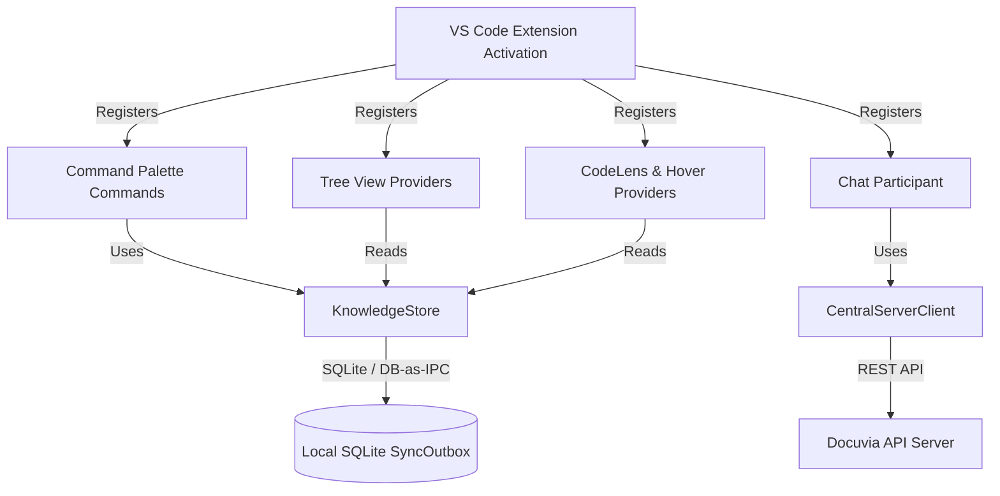

# VS Code Client Design Router

This directory contains the structural and functional design documentation for the Docuvia VS Code Client (`@workspace/vscode-client`).

AI Agents and developers should consult these files to understand the architecture, command flows, and component responsibilities before making changes to the extension.

## Extension Component Architecture

## Documentation Index

### 1. Knowledge Graph View (`design/knowledge-graph/`)

- [Tree Nodes & Multi-root Structure](knowledge-graph/nodes.md) – Explains `KGNode` hierarchy (`project` -> `l1tag` -> `l2module` -> `l3entry`) and workspace scoping. Implemented in [`knowledge-graph-tree-provider.ts`](../../../artifacts/vscode-client/src/knowledge-graph-tree-provider.ts).
- [Inline Init Action](knowledge-graph/init-action.md) – Describes the contextual `Init` button for uninitialized workspace folders. Registered in [`extension.ts`](../../../artifacts/vscode-client/src/extension.ts).
- [Knowledge Store Singleton](knowledge-graph/store.md) – Details the `KnowledgeStore` architecture, snapshot management, and `FileSystemWatcher` integration. Implemented in [`knowledge-store.ts`](../../../artifacts/vscode-client/src/knowledge-store.ts).

### 2. Command Palette Flows (`design/command-palette/`)

- [Init Project](command-palette/init-project.md) – Workflow for `docuvia.initProject` (setting up the [Local-First Architecture](../adrs/ADR-002-local-first-architecture.md) via [VS Code Onboarding](../adrs/ADR-001-vscode-client-onboarding.md)). Implemented in [`extension.ts`](../../../artifacts/vscode-client/src/extension.ts).
- [Add Decision](command-palette/add-decision.md) – Workflow for `docuvia.addDecision` and `addDecisionFromSelection`, including L2 module assignment. Implemented in [`extension.ts`](../../../artifacts/vscode-client/src/extension.ts).
- [Run Extraction](command-palette/run-extraction.md) – Workflow for `docuvia.runExtraction`, including [Token Management](../adrs/ADR-009-token-management.md) limits, powered by the [AST Microkernel](../adrs/ADR-020-unified-isomorphic-ast-microkernel.md). Orchestrated by [`task-runner.ts`](../../../artifacts/vscode-client/src/task-runner.ts).
- [Cross-Project Search](command-palette/search.md) – Workflow for `docuvia.openSearch`, mapping results to Webview or Copilot Chat (via [Agentic RAG Routing](../adrs/ADR-007-agentic-rag-routing.md)). Implemented in [`search-results-panel.ts`](../../../artifacts/vscode-client/src/search-results-panel.ts).

### 3. Settings & Configuration (`design/configuration/`)

- [Settings Overview](configuration/settings.md) – List of user-configurable options defined in [`package.json`](../../../artifacts/vscode-client/package.json).

### 4. Copilot Chat Integration (`design/chat-participant/`)

- [Slash Commands](chat-participant/slash-commands.md) – Registration and routing logic for `@docuvia` chat commands (`/explore`, `/query`, `/extract`, `/help`). Implemented in [`chat-participant.ts`](../../../artifacts/vscode-client/src/chat-participant.ts).

### 5. UI/UX Guidelines (`design/ui-ux/`)

- [User Journeys & Scenarios](ui-ux/user-journeys.md) – The 5 core user journeys and how features connect together.
- [Notifications & Prompts](ui-ux/notifications-and-prompts.md) – Standards for toasts, quick picks, and destructive actions.
- [Webview Panels](ui-ux/webview-panels.md) – Design goals and theming for custom views (Search Results, Dashboard). Implemented in [`search-results-panel.ts`](../../../artifacts/vscode-client/src/search-results-panel.ts) and [`dashboard-panel.ts`](../../../artifacts/vscode-client/src/dashboard-panel.ts).
- [Editor Integration](ui-ux/editor-integration.md) – Guidelines for CodeLens and Hover providers to ensure unobtrusive assistance (relying on [Progressive Enrichment](../adrs/ADR-015-progressive-enrichment-and-ast-lsp-dual-engine.md)). Implemented in [`docuvia-code-lens-provider.ts`](../../../artifacts/vscode-client/src/docuvia-code-lens-provider.ts) and [`docuvia-hover-provider.ts`](../../../artifacts/vscode-client/src/docuvia-hover-provider.ts).

---

**Note to AI Agents:** When asked to implement or modify a feature in `vscode-client`, always read the corresponding design document here first to ensure you adhere to the established architecture and UX patterns.
