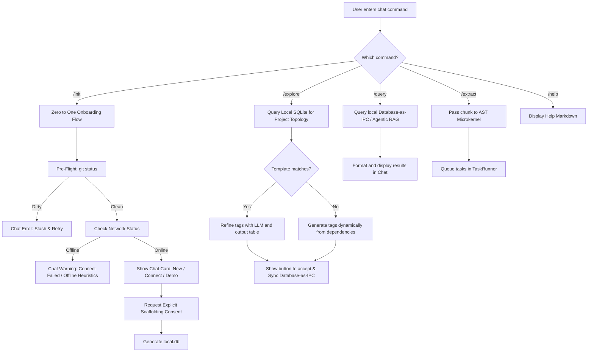

> **DEPRECATION NOTICE**: This document describes legacy client-side implementations (`KnowledgeStore`, `TaskRunner`, `CentralServerClient`). Per [ADR-021](../../adrs/ADR-021-shared-core-api-and-presentation-layers.md), these responsibilities have moved to the Shared Core API (`@workspace/core`). This document is pending a rewrite.

> **DEPRECATION NOTICE**: This document describes legacy client-side implementations (`KnowledgeStore`, `TaskRunner`, `CentralServerClient`). Per [ADR-021](../../adrs/ADR-021-shared-core-api-and-presentation-layers.md), these responsibilities have moved to the Shared Core API (`@workspace/core`). This document is pending a rewrite.

# Chat Participant: @docuvia

## Registration Details

- **ID**: `docuvia.assistant`
- **Name**: `docuvia`
- **Full Name**: `Docuvia Knowledge Graph`
- **Source Code**: [`chat-participant.ts`](../../../../artifacts/vscode-client/src/chat-participant.ts)

## Handlers & Slash Commands

### `/explore`

- **Description**: Detect project type and suggest L1 tags for [Database-as-IPC](../../adrs/ADR-014-sql-indexed-graph-and-database-as-ipc.md) via [Three-tier knowledge graph](../../adrs/ADR-005-knowledge-abstraction-strategy.md)
- **Flow**:

  #### 1. Keyword type override (fast path)

  If the user's prompt contains a recognised project-type token (`backend`, `frontend`, `library`, `data-science`, `cli`, `fullstack`, `monorepo`), Docuvia skips workspace detection and immediately matches the token against the built-in `L1_TEMPLATES` array. The matching template's tags are formatted as markdown and streamed to chat.

  > ⚠️ NOTE: `data-science` is present in `TYPE_TOKENS` (`chat-participant.ts:157`) but has no corresponding entry in `L1_TEMPLATES`. The `if (template)` guard never fires, so workspace detection is **not** skipped – this is a dead token and a known code gap (addressed in Round 2).

  #### 2. Workspace detection (default path)

  When no type keyword is found:
  1. Reads `README.md` and `package.json` from `workspaceFolders[0]` (first workspace only).
  2. Calls `detectProjectTypes()` – scores each of the 6 built-in templates by counting how many of the template's `keywords` appear in the README text (lowercased) or the `package.json` dependency names. Returns all templates with a non-zero score.
  3. If one or more templates match, calls `refineTagsWithLM()` – sends the detected template tags and the README excerpt to `request.model` (the user's currently selected Copilot model) for refinement. The AI is instructed to generate a comprehensive list (typically 10-25 tags) of structured L1 tags.
  4. **Dynamic AI Analysis**: If no built-in template matches, it calls `generateTagsDynamically()` – sending all discovered `dependencies`/`devDependencies` and the README excerpt to `request.model` for zero-shot architectural analysis. The AI dynamically generates 10-25 custom L1 tags based on the domain (e.g. Data Science, IoT, Game Engine).
  5. If dynamic AI analysis also fails (e.g. API error), it falls back to an interactive clarification message asking the user to reply with `/explore <type>`.

  #### 3. Built-in L1 Templates (`L1_TEMPLATES`)

  | `projectType` | Label                    | Sample keywords                         |
  | ------------- | ------------------------ | --------------------------------------- |
  | `frontend`    | Frontend Application     | react, vue, angular, vite, next         |
  | `backend`     | Backend / API Server     | express, fastify, nestjs, django        |
  | `fullstack`   | Fullstack Application    | fullstack, trpc, remix, sveltekit       |
  | `monorepo`    | Monorepo / Multi-package | monorepo, turborepo, nx, pnpm-workspace |
  | `library`     | Library / SDK / Package  | library, sdk, npm, publish              |
  | `cli`         | CLI Tool                 | cli, commander, yargs, oclif            |

  #### 4. Output Rendering and Accept Action

  The resulting structured data from either the static templates or dynamic AI analysis is parsed by `formatYamlAsTable()` and presented to the user as a clean Markdown table in the chat (showing Name and Description).

  After streaming the table, Docuvia renders a `stream.button` with the label **"Accept & Write to .docuvia/local.db"**. Clicking it invokes the internal command `docuvia.acceptL1Tags(tagData)` (registered in [`extension.ts`](../../../../artifacts/vscode-client/src/extension.ts)), which writes the tags directly to `workspaceFolders[0]/.docuvia/local.db`.

  > ⚠️ **Single-workspace limitation**: `docuvia.acceptL1Tags` is hardcoded to write to `vscode.workspace.workspaceFolders?.[0]`, i.e. the **first** workspace folder. In a multi-root workspace with the second folder active, the tags will be written to the wrong project. The command is registered with `enablement: never` to prevent it from being invoked directly from the Command Palette.

### `/init`

- **Description**: Zero to One onboarding flow via Chat.
- **Interactive Flow**:
  - **Chat Cards & Options**: The command initiates by presenting the user with three explicit choices rendered as trusted command links within a chat message: `[✨ Initialize Knowledge Graph here (New)](command:docuvia.initNew)`, `[🔗 Connect to Remote Graph (Existing)](command:docuvia.initConnect)`, and `[📚 Clone & Explore Demo Sandbox (Demo)](command:docuvia.initDemo)`.
  - **Natural Language Parsing**: The chat participant actively parses free-text replies (e.g., "I want a new project", "connect to existing", or simply "yes" to confirmation prompts) and maps them to the corresponding onboarding actions to ensure a fluid conversational UX.
- **Error Handling**:
  - **Dirty Git Tree**: If the workspace has uncommitted changes, scaffolding is blocked. The participant replies with a clear error: _"Please commit or stash your changes before initializing Docuvia. Creating an orphan branch requires a clean working tree."_ It includes an actionable button: `[Stash & Retry](command:docuvia.stashAndRetry)`.
  - **Missing/Corrupt Configurations**: If existing `.docuvia/` files are corrupted, it prompts with a `[Repair Workspace](command:docuvia.repair)` button.
  - **Network Failures**: If "Connect" is chosen but the API is unreachable, the system fails fast, displaying an offline warning and offering a fallback to initialize locally.
- **Scaffolding Consent**:
  - **Transparent Generation**: Before creating the `.docuvia` directory or any orphan branches, the participant generates proposed contents for `local.db` based on workspace analysis.
  - **Preview & Explicit Confirmation**: These files are previewed directly in the chat as markdown code blocks. The user must explicitly consent by clicking an `[Approve & Generate](command:docuvia.approveScaffold)` button or by typing a clear affirmative (e.g., "Looks good, approve").

### `/query`

- **Description**: Search local knowledge graph via [Agentic RAG Routing](../../adrs/ADR-007-agentic-rag-routing.md). Legacy remote Central Server API logic is deprecated per [Local-First Architecture](../../adrs/ADR-002-local-first-architecture.md).
- **Flow**: Acts as the primary target for local search, or acts as the fallback display for cross-project search if `search.defaultView` is set to `chat`.

### `/extract`

- **Description**: Queue L3 decision extraction on target files via the [AST Microkernel](../../adrs/ADR-020-unified-isomorphic-ast-microkernel.md) to respect [Token Management](../../adrs/ADR-009-token-management.md) boundaries.
- **Flow**:
  1. **Target Resolution**: Uses the provided path, or the active editor's file. If neither is provided, defaults to the root of the first open workspace folder.
  2. **Directory Scanning**: If the target is a directory, recursively scans for files. It automatically ignores `.git`, `node_modules`, and `.docuvia`.
  3. **Pattern Filtering**: Applies `minimatch` against `docuvia.extraction.includePatterns` (configured in settings) to ensure only valid source code files are processed.
  4. **Task Queuing**: Reads the content of all matched files and queues individual L3 extraction tasks via [`task-runner.ts`](../../../../artifacts/vscode-client/src/task-runner.ts).

### `/help`

- **Description**: Show available commands and usage
- **Flow**: Displays standard markdown instructions for using the Docuvia extension.
