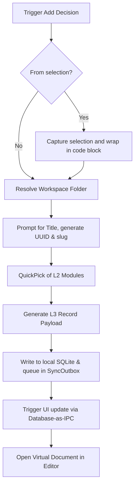

> **DEPRECATION NOTICE**: This document describes legacy client-side implementations (`KnowledgeStore`, `TaskRunner`, `CentralServerClient`). Per [ADR-021](../../adrs/ADR-021-shared-core-api-and-presentation-layers.md), these responsibilities have moved to the Shared Core API (`@workspace/core`). This document is pending a rewrite.

> **DEPRECATION NOTICE**: This document describes legacy client-side implementations (`KnowledgeStore`, `TaskRunner`, `CentralServerClient`). Per [ADR-021](../../adrs/ADR-021-shared-core-api-and-presentation-layers.md), these responsibilities have moved to the Shared Core API (`@workspace/core`). This document is pending a rewrite.

# Command: Docuvia Add Decision

## Command Details

- **Command IDs**:
  - `docuvia.addDecision` (Command Palette)
  - `docuvia.addDecisionFromSelection` (Editor Right-Click Context Menu)
- **Title**: `Docuvia: Add Decision` / `Docuvia: Add Decision from Selection`
- **Registration**: Implemented in [`extension.ts`](../../../../artifacts/vscode-client/src/extension.ts).

## Functional Flow

1. **Selection Handling (Optional)**:
   - If triggered via `addDecisionFromSelection`, capture the active text editor's selection and language ID.
   - Wrap the selection in markdown code blocks to pass as `prefillBody`.

2. **Workspace Resolution**:
   - Prefer the workspace folder of the active text editor if available and initialized.
   - If unable to resolve via editor context:
     - Check initialized workspaces in the store.
     - If exactly 1, use it.
     - If > 1, prompt the user with a `QuickPick` to choose the target initialized project.
     - If 0, show an error requiring the user to run `Init Project` first.

3. **Metadata Gathering**:
   - Prompt the user for a "Decision title".
   - Generate a UUID for the decision.
   - Generate a slugified filename based on the title.
   - Capture current date.

4. **Module Assignment (L2)**:
   - Load the available L2 modules from the local SQLite database (`l2_nodes` table) ([ADR-005](../../adrs/ADR-005-knowledge-abstraction-strategy.md)) via [Database-as-IPC](../../adrs/ADR-014-sql-indexed-graph-and-database-as-ipc.md).
   - Present a `QuickPick` of available L2 Modules.
   - Always append an option: `$(add) Create new module later... (unassigned)`. This prevents blocking users who haven't set up L2 modules yet.

5. **Record Generation & Storage**:
   - Generate the L3 decision record payload containing `id`, `l2_module_id`, `title`, `date`, and `status`.
   - If the user selected `(unassigned)` during module assignment, explicitly set `l2_module_id` to an unassigned state.
   - Generate the markdown body sections (`## Context`, `## Decision`, `## Consequences`).
   - If `prefillBody` was provided, inject it into the `## Context` section.
   - Write the record immediately to the local SQLite database (`l3_nodes` table) and queue the event in the `SyncOutbox` ([ADR-002](../../adrs/ADR-002-local-first-architecture.md)). This eventually syncs to the centralized `docuvia-knowledge` orphan branch ([ADR-017](../../adrs/ADR-017-tiered-storage-and-orphan-branch-graph-maintenance.md)).

6. **Post-Action**:
   - Trigger a UI update by querying the SQLite database via [Database-as-IPC](../../adrs/ADR-014-sql-indexed-graph-and-database-as-ipc.md), deprecating the old YAML-based [`KnowledgeStore`](../../../../artifacts/vscode-client/src/knowledge-store.ts) file reload.
   - Open the newly created decision as a Virtual Document in the editor so the user can finish filling it out (edits sync back to SQLite).
