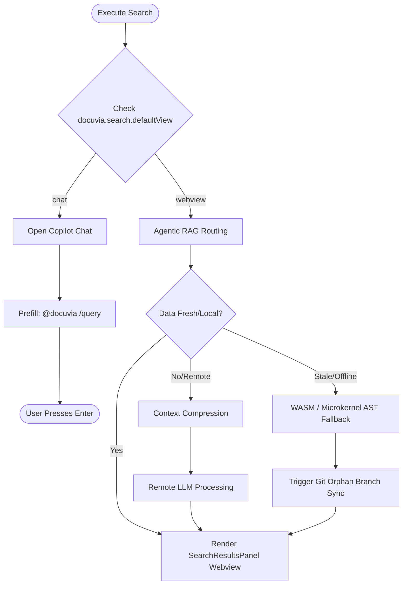

# Knowledge Graph Cross-Project Search

## Settings & Configuration

- **Setting**: `docuvia.search.defaultView`
- **Values**: `chat` (default) or `webview`
- **Description**: Determines where search results are displayed when the user triggers a search.

## Commands

### `docuvia.openSearch`

- Triggered via Command Palette or view title icon.
- Prompts the user with an input box: "Search cross-project knowledge". (Queries the [Git-Isomorphic Graph](../../adrs/ADR-004-git-isomorphic-graph.md) utilizing the [Three-tier knowledge graph](../../adrs/ADR-005-knowledge-abstraction-strategy.md) abstraction).
- Triggers the underlying `executeSearch` flow.

### `docuvia.searchFromSelection`

- Triggered via Editor Right-Click Context Menu.
- Condition: `editorHasSelection`
- Takes the highlighted text and passes it directly into the `executeSearch` flow without prompting.

## `executeSearch` Flow

1. Evaluates the `docuvia.search.defaultView` setting.
2. **If `chat`**:
   - Programmatically executes `workbench.action.chat.open` with the query prefilled as `@docuvia /query <user_query>`.
   - Delegates the display and interaction to the Copilot Chat UI (refer to [VS Code Client Onboarding](../../adrs/ADR-001-vscode-client-onboarding.md)).
   - _Technical Note_: Due to limitations in the current VS Code Chat API, this command can only prefill the chat input box. **The user must manually press Enter** to submit the query.
3. **If `webview`**:
   - Routes the query via [Agentic RAG Routing](../../adrs/ADR-007-agentic-rag-routing.md), interacting with local data via [Database-as-IPC](../../adrs/ADR-014-sql-indexed-graph-and-database-as-ipc.md) instead of legacy Central Server API calls (aligning with our [Local-First Architecture](../../adrs/ADR-002-local-first-architecture.md)).
   - If remote LLM processing is required, applies [Context Compression](../../adrs/ADR-010-context-compression-and-proxy.md) to respect [Token Management](../../adrs/ADR-009-token-management.md) constraints.
   - On success, opens or updates the `SearchResultsPanel` (Webview) with [Progressive Enrichment](../../adrs/ADR-015-progressive-enrichment-and-ast-lsp-dual-engine.md).
   - If local data is stale or unindexed, it leverages the [WASM / Microkernel AST](../../adrs/ADR-020-unified-isomorphic-ast-microkernel.md) for offline syntax fallback and triggers [Orphan Branch Maintenance](../../adrs/ADR-017-tiered-storage-and-orphan-branch-graph-maintenance.md) to sync knowledge via Git.
