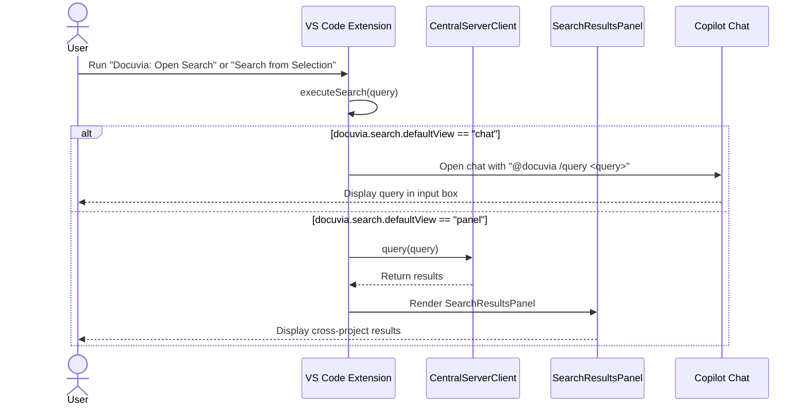

> **DEPRECATION NOTICE**: This document describes legacy client-side implementations (`KnowledgeStore`, `TaskRunner`, `CentralServerClient`). Per [ADR-021](../../adrs/ADR-021-shared-core-api-and-presentation-layers.md), these responsibilities have moved to the Shared Core API (`@workspace/core`). This document is pending a rewrite.

> **DEPRECATION NOTICE**: This document describes legacy client-side implementations (`KnowledgeStore`, `TaskRunner`, `CentralServerClient`). Per [ADR-021](../../adrs/ADR-021-shared-core-api-and-presentation-layers.md), these responsibilities have moved to the Shared Core API (`@workspace/core`). This document is pending a rewrite.

# User Journeys & Scenarios

This document outlines all primary user journeys for the Docuvia VS Code Extension, covering every implemented command, provider, and UI panel. Each journey includes a happy path, known implementation issues found through 3× simulation against the actual source code, and bad cases documenting how the system behaves when encountering undefined, corrupt, or unexpected inputs.

---

## ⚠️ Known Active Bugs (Critical & High Severity)

| ID        | Severity     | Summary                                                                                                | Journeys Affected |
| --------- | ------------ | ------------------------------------------------------------------------------------------------------ | ----------------- |
| A-1       | **Critical** | `acceptL1Tags` does not create `.docuvia/` directory — fails silently if folder missing                | A, M              |
| A-3 / M-2 | **Critical** | `acceptL1Tags` always writes to `workspaceFolders[0]`, corrupting wrong project in multi-root          | A, M              |
| B-1       | **Critical** | `TaskRunner` always writes `l2_module_id: ""` — all extracted decisions are orphaned                   | B, H              |
| D-1       | **High**     | Journey descriptions previously claimed AST/hash anchoring — actual implementation is line-number only | D                 |
| D-2       | **High**     | CodeLens drifts when lines are inserted above the anchored function                                    | D                 |
| A-2       | **High**     | `acceptL1Tags` doesn't create `local.db` or `l3_decisions/` skeleton                                   | A                 |
| E-1       | **High**     | No prerequisite documentation for token setup — user hits 401 with no guidance                         | E                 |
| E-2       | **High**     | Local `/query` uses naive `.includes()` — vocabulary-different terms return zero results               | E                 |
| N-1       | **High**     | SearchResultsPanel mode has no local fallback when server is unavailable                               | N                 |

---

## Journey A: The Onboarding Experience (Project Discovery) `[CORRECTED]`

**Goal:** Introduce Docuvia to a new or existing codebase via the chat exploration flow.

**Trigger:** User opens an uninitialized repository. The Activity Bar Knowledge Graph view shows a welcome message with a `✨ Analyze Project Architecture` button.

### Happy Path

1. User clicks the button. `docuvia.startExplore` fires, opening `@docuvia /explore` in Copilot Chat.
2. Extension scans `package.json` and `README.md` in the first workspace folder.
3. Project type is detected (or dynamically inferred via LLM fallback). A tailored L1 taxonomy is rendered as a Markdown table.
4. User reviews the table and clicks **"Accept & Write to .docuvia/local.db"**.
5. `docuvia.acceptL1Tags` fires and writes the tags.
6. If `.docuvia/` already existed (e.g., from a prior `Init Project` run), the file is updated. The KG TreeView refreshes.

**⚠️ Critical Workaround:** Step 4 only writes `local.db`. It does NOT create the `.docuvia/` directory, `local.db`, or `l3_decisions/`. Before clicking "Accept & Write", users must first run `Docuvia: Init Project` from the Command Palette to ensure the full skeleton exists (see Journey G). If the folder does not exist, the write fails silently.

### Known Implementation Issues

- **BUG A-1 [Critical]:** `acceptL1Tags` calls `vscode.workspace.fs.writeFile` without first calling `createDirectory`. If `.docuvia/` does not exist, the write throws `FileNotFound` — but only an "updated" toast is shown, masking the failure.
- **BUG A-2 [High]:** `acceptL1Tags` never creates `local.db` or `l3_decisions/`. Any subsequent `store.load()` silently returns an empty snapshot for modules and decisions. The TreeView shows only L1 tags with no L2/L3 tree.
- **BUG A-3 [Critical]:** In a multi-root workspace, `acceptL1Tags` always writes to `workspaceFolders[0]`. If the user ran `/explore` while focused on workspace #2, the tags for project #2 are written into project #1's `.docuvia/`. See Journey M.

### Bad Cases

| Condition                                                            | Current Behavior                                                                                                                           | Expected Behavior                                                                  | Severity |
| -------------------------------------------------------------------- | ------------------------------------------------------------------------------------------------------------------------------------------ | ---------------------------------------------------------------------------------- | -------- |
| `.docuvia/` folder does not exist when "Accept & Write" is clicked   | Write silently fails. Toast says "updated" but no file is created.                                                                         | Extension creates the directory and all skeleton files before writing `local.db`.  | Critical |
| User is in a multi-root workspace and ran `/explore` on workspace #2 | Tags are written to workspace #1's `.docuvia/`, corrupting it.                                                                             | `acceptL1Tags` resolves target workspace from chat context.                        | Critical |
| `README.md` is absent (e.g. a brand-new repo)                        | `/explore` continues without README content. Template detection relies on `package.json` only. May produce generic tags.                   | Acceptable — LLM fallback handles it. Warn user that results may be less accurate. | Low      |
| `package.json` is malformed JSON                                     | `JSON.parse` throws. Extension catches the error and continues with empty `pkgJson`. Project type detection falls through to LLM fallback. | Acceptable — LLM handles it. No crash.                                             | Low      |
| LLM API is unavailable (no Copilot subscription / rate limit)        | `generateTagsDynamically` returns `null`. The interactive fallback message is shown asking the user to type their project type.            | Acceptable — fallback to interactive mode.                                         | Medium   |
| User cancels the "Accept & Write" step and closes VS Code            | `.docuvia/` may exist (if `initProject` was run) with no `local.db`. On restart `store.load()` silently returns no tags.                   | Extension should show a "pending" state in the TreeView, not silently empty.       | Low      |

---

## Journey B: Deep Knowledge Extraction ("Let it run") `[CORRECTED]`

**Goal:** Automatically retro-document an existing large module or folder.

**Trigger:** User wants to extract architectural decisions from a legacy folder (e.g., `/src/auth`). They type `@docuvia /extract src/auth` in chat.

### Happy Path

1. `/extract src/auth` is entered. The extension resolves the absolute path.
2. `vscode.workspace.fs.stat` checks the path is a directory.
3. The extension scans recursively, filtering via `.gitignore` and `docuvia.extraction.includePatterns` (`minimatch`).
4. Valid source files are chunked into the background `TaskQueue` (4000-char line-based chunks).
5. Each chunk is sent to GPT-4o via the VS Code LM API. Results are parsed as YAML.
6. L3 markdown decision files are written to `.docuvia/l3_decisions/`. `local.db` is updated.
7. Task Queue TreeView shows progress per task. When all tasks complete, store is reloaded.

**⚠️ Known Limitation:** All extracted decisions are saved with `l2_module_id: ""` (orphaned). They are never automatically linked to an L2 module. The phrase "automatically categorized under appropriate L2 Modules" from previous documentation was incorrect.

### Known Implementation Issues

- **BUG B-1 [Critical]:** `TaskRunner.writeExtractionResults()` always writes `l2_module_id: ""`. No logic exists to match extracted decisions to L2 modules. Every decision is orphaned immediately upon creation and unreachable via the L2 hierarchy in the TreeView.
- **BUG B-2 [Medium]:** `GlobalConfig.chunking_strategy` field is defined in the type schema as `'line' | 'ast'`, but `TaskRunner` completely ignores this config value. AST-based chunking is never activated regardless of user settings.

### Bad Cases

| Condition                                                         | Current Behavior                                                                                              | Expected Behavior                                                             | Severity |
| ----------------------------------------------------------------- | ------------------------------------------------------------------------------------------------------------- | ----------------------------------------------------------------------------- | -------- |
| Path does not exist (`/extract nonexistent/path`)                 | `vscode.workspace.fs.stat` throws `FileNotFound`. No clear user feedback.                                     | Show "Path not found: \`nonexistent/path\`" in chat.                          | High     |
| Path exists but is a binary file                                  | `stat.type` is `FileType.File`. Binary content is chunked and sent to LLM. Content is garbled.                | Warn if file is binary; check extension or MIME type.                         | Medium   |
| All files in the directory are excluded by `includePatterns`      | No tasks are queued. No output in chat. User sees nothing happen.                                             | Show "No files matched include patterns in `src/auth`." in chat.              | Medium   |
| LM API returns malformed YAML for a chunk                         | `parseYaml()` throws. Chunk's error is logged and silently skipped.                                           | Acceptable — but surface chunk-level failure count in the Task Queue summary. | Low      |
| LM API times out mid-extraction (cancellation token fires)        | Task is marked "Failed: Cancelled". Already-written decisions remain on disk.                                 | Acceptable. Clarify in Task Queue that partial results exist.                 | Medium   |
| `.docuvia/` folder missing when extraction tries to write results | `writeExtractionResults` writes to `l3_decisions/slug.md`. If directory does not exist, write fails silently. | Extension must `createDirectory` for `.docuvia/l3_decisions/` before writing. | High     |

---

## Journey C: Micro-Decision Recording (Context Capture) `[CORRECTED]`

**Goal:** Capture the "Why" behind a complex piece of code immediately after writing it.

**Trigger:** User finishes writing a complex bug fix. They highlight the code block, right-click, and select `Docuvia: Add Decision from Selection`.

### Happy Path

1. `docuvia.addDecisionFromSelection` fires with the selected text.
2. `addDecision()` is called with the selected code pre-filled in a fenced markdown block.
3. If multiple initialized workspaces are open, a QuickPick asks which project to target.
4. `showInputBox` prompts for a decision title.
5. `showQuickPick` lists available L2 modules. User selects one (or "unassigned").
6. L3 markdown file is written to `.docuvia/l3_decisions/<slug>.md` with frontmatter.
7. `store.load()` is called. File opens in editor for the user to fill in context.

**⚠️ Note:** The decision is visible in the TreeView after the file-system watcher triggers or after `store.load()`. The phrase "instantly mapped to the codebase" from previous documentation overstates the current behavior.

### Known Implementation Issues

- **BUG C-1 [Medium]:** `addDecision` writes the L3 markdown file but does NOT append a new entry to `local.db`. The router index is the primary lookup source for CodeLens and Hover. Decisions not in the router are invisible to those providers until a full reload of the router file occurs.
- **BUG C-2 [Medium]:** When user selects "unassigned", `l2_module_id: "unassigned"` (a string sentinel, not UUID or empty) is written. Downstream systems expecting a UUID format may reject or silently skip this decision.
- **BUG C-3 [Medium]:** No slug collision check. If a decision titled "Use Redis for caching" already exists, the second write with the same title silently overwrites the first. All content and the UUID of the first decision are permanently lost.

### Bad Cases

| Condition                                                      | Current Behavior                                                                                                                                                   | Expected Behavior                                                             | Severity |
| -------------------------------------------------------------- | ------------------------------------------------------------------------------------------------------------------------------------------------------------------ | ----------------------------------------------------------------------------- | -------- |
| No code is selected when command runs                          | Warning: "Select code first." Command aborts. ✓                                                                                                                    | Correct behavior.                                                             | —        |
| `.docuvia/` not initialized                                    | `addDecision` attempts to read `store.snapshot`. Modules list is empty. Decision may be written to wrong workspace path.                                           | Block command with "Initialize Docuvia first".                                | High     |
| User enters a title with only special characters (e.g., `!!!`) | Slug generation strips special characters. May produce an empty slug → file path becomes `.docuvia/l3_decisions/.md`. VS Code may error or write to a hidden file. | Validate slug is non-empty after generation.                                  | Medium   |
| Decision title is identical to an existing decision            | Same slug computed. Existing `.md` file is overwritten silently.                                                                                                   | Check file existence before write; prompt "Overwrite?" or append `-2` suffix. | Medium   |
| L2 modules list is empty (no modules defined yet)              | QuickPick shows only "Create new module later…". User can only create orphaned decisions.                                                                          | Show hint: "Define L2 modules in `.docuvia/local.db` to link decisions."      | Low      |
| User dismisses the title input box (presses Escape)            | `addDecision` returns early without writing any file. ✓                                                                                                            | Correct behavior.                                                             | —        |

---

## Journey D: Contextual Retrieval (Editor Integration) `[CORRECTED]`

**Goal:** Prevent developers from breaking established architectural rules when modifying code.

**Trigger:** A developer opens a file that is referenced in an L2 module's `source_paths`. The CodeLens provider detects function/class declarations and displays `🧠 Docuvia: N Decision(s)` above them.

### Happy Path

1. File is opened. `DocuviaCodeLensProvider.provideCodeLenses()` runs.
2. The file's workspace root is resolved. `store.getSnapshotFor(document.uri)` is called.
3. L2 modules whose `source_paths` match the file's relative path are found.
4. Regex patterns detect function and class declarations in the file.
5. A CodeLens is placed at each declaration line showing the count from the best-matching module.
6. Developer clicks the lens. `docuvia.showDecisionsForLens` fires, showing a QuickPick of relevant decisions.
7. Developer selects a decision. `docuvia.openDecision` opens the markdown file in the editor.

**⚠️ Implementation Reality:** Line-number anchoring is used exclusively. There is NO AST-based or hash-based anchoring. "Drift Protection" is a planned feature, not yet implemented. Previous design documents that claimed otherwise were incorrect.

### Known Implementation Issues

- **BUG D-1 [High]:** Previous design documents stated "robust AST-based or hash-based anchoring (Drift Protection)." The actual implementation uses `findDeclarationLines()` which is pure regex on line text. No AST parsing, no snippet hashing. This was a documentation error — now corrected.
- **BUG D-2 [High]:** When lines are inserted above a function that has a lens, the lens shifts to the wrong line on the next render cycle. The decision annotation appears above the wrong function. This is the CodeLens Drift bug tracked in the roadmap.
- **BUG D-3 [Medium]:** The `initProject` skeleton creates `local.db` with `source_paths: []` by default. New users who do not manually populate `source_paths` will never see any CodeLens. No UI guidance prompts them to populate these paths.

### Bad Cases

| Condition                                                                       | Current Behavior                                                                                                                    | Expected Behavior                                                               | Severity |
| ------------------------------------------------------------------------------- | ----------------------------------------------------------------------------------------------------------------------------------- | ------------------------------------------------------------------------------- | -------- |
| `source_paths` entries use absolute paths instead of relative                   | `findMatchingModules` computes `relPath`. If `source_paths` stores absolute paths, no match occurs. No CodeLens, no error.          | Normalize paths on load; warn on malformed `source_paths`.                      | Medium   |
| File is in a workspace folder with no initialized `.docuvia/`                   | `store.getSnapshotFor()` returns `undefined`. `provideCodeLenses` returns `[]`. No crash.                                           | Acceptable — no lens for uninitialized workspaces.                              | —        |
| `showDecisionsForLens` is called but the decision file no longer exists on disk | `docuvia.openDecision` calls `openTextDocument`. VS Code throws `FileNotFound`. No user-friendly message.                           | Catch the error; show "Decision file was deleted. Refresh the knowledge graph." | High     |
| Decision `.md` file has malformed frontmatter                                   | `store.load()` fails to parse that decision; it is absent from the store. CodeLens count is lower than expected. No error surfaced. | Log parse errors prominently; show a "parse warning" badge in the TreeView.     | Medium   |
| Lines are inserted above the anchored function                                  | Lens drifts to the wrong line on next `provideCodeLenses` call.                                                                     | Implement AST or snippet-hash anchoring (tracked in roadmap Phase 4).           | High     |
| File has no function/class declarations (e.g., constants file)                  | `findDeclarationLines` returns `[]`. No CodeLens shown even if module is linked.                                                    | Acceptable — CodeLens targets functions/classes only.                           | —        |

---

## Journey E: Cross-Project Breadth Search `[CORRECTED]`

**Goal:** Leverage institutional knowledge across the entire organization to answer cross-project queries.

**Trigger:** A developer is designing a new RBAC system and types `@docuvia /query how do other projects handle RBAC?`.

**Prerequisite:** A Docuvia server API token must be set via Journey K (Credential Setup), AND `server_url` must be configured in `~/.docuvia/local.db`. Without these, breadth queries silently return empty results or show "Authentication required."

### Happy Path

1. `handleQuery` detects the phrase "other projects" → routes to `handleBreadthQuery`.
2. `CentralServerClient.query()` is called. `credentialManager.getToken()` retrieves the stored token.
3. `POST /query` is sent to the central server with `x-docuvia-token` header.
4. Results are rendered in chat: title, project name, L1 tags, snippet.

### Known Implementation Issues

- **BUG E-1 [High]:** The breadth query flow has no upfront prerequisite check. Users who haven't configured a token or server URL will hit 401 or a generic `TypeError` with no prior guidance. Journey K must be completed first.
- **BUG E-2 [High]:** Local queries (non-breadth) use `str.toLowerCase().includes(query)` matching. A query for "auth pattern" fails to match decisions that use the word "authentication". Zero results are returned with no suggestion to broaden the search.
- **BUG E-3 [Low]:** Local `/query` searches only L3 decision titles and bodies. L2 module names and descriptions are not searched.

### Bad Cases

| Condition                                                  | Current Behavior                                                                                                              | Expected Behavior                                                                                        | Severity |
| ---------------------------------------------------------- | ----------------------------------------------------------------------------------------------------------------------------- | -------------------------------------------------------------------------------------------------------- | -------- |
| No `server_url` in `~/.docuvia/local.db`                   | `CentralServerClient.query()` returns `[]` immediately. Tip to configure `server_url` is shown. ✓                             | Acceptable.                                                                                              | —        |
| Token not set                                              | Server returns 401. `CentralServerAuthError` thrown. Chat shows "Authentication required. Run 'Docuvia: Set Server Token'." ✓ | Acceptable.                                                                                              | —        |
| Central server is down / network unreachable               | `fetch` throws `TypeError`. Caught as generic error. Chat shows "_Cross-project search failed: TypeError: Failed to fetch_".  | Show user-friendly message: "Could not reach the Docuvia server. Check your connection or `server_url`." | Medium   |
| User queries with vocabulary not matching stored decisions | Local `.includes()` returns zero results. No synonym suggestion.                                                              | Document as known limitation. LLM-based query expansion planned for Phase 5.                             | High     |
| Local query on empty `.docuvia/` snapshot                  | "No `.docuvia/` folder loaded. Run **Docuvia: Init Project** first." ✓                                                        | Acceptable.                                                                                              | —        |

---

## Journey F: Dashboard Overview `[NEW]`

**Goal:** Get a high-level view of the project's knowledge health — tag count, module coverage, recent decisions, and background task status.

**Trigger:** User runs `Docuvia: Open Dashboard` from the Command Palette.

### Happy Path

1. `docuvia.openDashboard` fires. `DashboardPanel.createOrShow()` is called.
2. A Webview panel opens showing:
   - Total L1 tag count, L2 module count, L3 decision count.
   - 5 most recent decisions (by date), clickable to open in editor.
   - Top 5 L2 modules by decision count.
   - Pending and in-progress task counts from the Task Queue.
3. User clicks a recent decision item → `docuvia.openDecision` fires → markdown file opens in editor.
4. User clicks the bottom-bar search button → `workbench.action.chat.open` fires with `@docuvia` context.

### Known Implementation Issues

- **BUG F-1 [Low]:** When `.docuvia/` is not initialized, the Dashboard shows all zeros. This looks identical to an initialized-but-empty project, potentially confusing new users.
- **BUG F-2 [Medium]:** The Dashboard Webview is not subscribed to `KnowledgeStore.onDidLoad` events after initial construction. Once opened, the counts are frozen until the user closes and re-opens the panel. There is no "Refresh" button.

### Bad Cases

| Condition                                                         | Current Behavior                                                        | Expected Behavior                                                                     | Severity |
| ----------------------------------------------------------------- | ----------------------------------------------------------------------- | ------------------------------------------------------------------------------------- | -------- |
| No workspace is open                                              | Dashboard opens with `workspaceName: 'Workspace'` and all zeros.        | Show "No workspace open."                                                             | Low      |
| `.docuvia/` not initialized                                       | All zeros. Indistinguishable from empty-but-initialized state.          | Add "Not initialized" badge or "Initialize Project" CTA button.                       | Low      |
| Clicking a recent decision whose file has been deleted externally | `docuvia.openDecision` throws `FileNotFound`. No user-friendly message. | Catch error; show "File no longer exists. Refresh the knowledge graph."               | Medium   |
| Dashboard is already open; user extracts new decisions            | Panel shows stale counts. No auto-refresh.                              | Subscribe to `store.onDidLoad`; push updated data to webview automatically (BUG F-2). | Medium   |

---

## Journey G: Manual Init & Refresh `[NEW]`

**Goal:** Initialize a project without the chat `/explore` flow, and force-reload the knowledge graph after external file edits.

**Trigger:** User runs `Docuvia: Init Project` from the Command Palette or from the TreeView inline button on an uninitialized project node.

### Happy Path

1. `docuvia.initProject` fires.
2. If multi-root: QuickPick shows uninitialized folders. User selects one.
3. `showInputBox` prompts for project name (pre-filled with folder name).
4. If already initialized: warning "This project is already initialized. Overwrite?" → user chooses Overwrite or Cancel.
5. Extension creates `.docuvia/` with skeleton: `local.db` (empty), `local.db` (empty), `l3_decisions/` folder.
6. `store.load()` is called. TreeView refreshes — project node appears as initialized.
7. Later, user manually edits `local.db` in their editor of choice.
8. User runs `Docuvia: Refresh Knowledge Graph` (`docuvia.refreshKnowledgeGraph`).
9. Store is reloaded. TreeView shows updated modules.

### Known Implementation Issues

- **BUG G-1 [Low]:** `showInputBox` for project name does not validate for empty strings. Only `undefined` (Escape) aborts. Submitting an empty string writes `project_name: ""` to `local.db`. The TreeView shows a project node with a blank label.
- **BUG G-2 [Medium]:** `KnowledgeStore.load()` uses a `_loading` flag + `_pendingReload` pattern for re-entrancy protection, but concurrent calls from the file-system watcher and explicit refresh command may race. If both fire in tight succession, one load may be dropped silently.

### Bad Cases

| Condition                                                     | Current Behavior                                                                      | Expected Behavior                                                                 | Severity |
| ------------------------------------------------------------- | ------------------------------------------------------------------------------------- | --------------------------------------------------------------------------------- | -------- |
| User submits empty project name                               | Skeleton is created with `project_name: ""`. TreeView shows blank project label.      | Add `validateInput` to reject empty names.                                        | Low      |
| `docuvia.refreshKnowledgeGraph` when no `.docuvia/` exists    | Warning: "No .docuvia/ folder found in this workspace." ✓                             | Correct behavior.                                                                 | —        |
| `.docuvia/local.db` contains malformed SQLite data            | `parseModules` throws. `store.load()` catches and continues with empty modules array. | Acceptable — but surface a parse error notification/warning icon in the TreeView. | Medium   |
| Overwrite confirmed on a workspace with actual knowledge data | All existing L1/L2/L3 content is destroyed.                                           | ⚠️ Warn user explicitly that overwriting will delete all existing knowledge data. | High     |

---

## Journey H: Task Queue Management `[NEW]`

**Goal:** Run an extraction task from the Command Palette, monitor its progress in the Task Queue panel, and clean up completed tasks.

**Trigger:** User opens `src/services/payment.ts` and runs `Docuvia: Run Extraction` from the Command Palette.

### Happy Path

1. `docuvia.runExtraction` fires on the active file.
2. **Gate 1 — Include Patterns:** If file extension is not in `docuvia.extraction.includePatterns`, warning appears. User confirms.
3. **Gate 2 — Line Count:** If file has > `docuvia.extraction.maxLinesWarning` lines (default 1000), size warning appears. User proceeds.
4. **Gate 3 — File Size KB:** If file is > `docuvia.extraction.maxFileSizeKBWarning` KB (default 50), size warning appears. User proceeds.
5. `taskRunner.queueExtraction()` is called. Task appears in Task Queue TreeView with status "Pending".
6. `TaskRunner` chunks content into 4000-char line-based chunks. Each chunk is sent to GPT-4o.
7. L3 decision `.md` files are written. `local.db` is updated. Store is reloaded.
8. Task status changes to "Done: N decision(s) extracted".
9. User runs `Docuvia: Clear Completed Tasks` → done tasks removed from panel.

**⚠️ Critical:** All extracted decisions will have `l2_module_id: ""` (orphaned). They are unreachable via the L2 hierarchy in the TreeView (BUG B-1/H-1).

### Known Implementation Issues

- **BUG H-1 [Critical]:** All extracted decisions are orphaned (identical to BUG B-1).
- **BUG H-2 [Low]:** `minimatch` include pattern check may fail for nested paths on Windows due to path separator handling.
- **BUG H-3 [Low]:** No minimum content check before queuing. Binary files or empty files produce zero decisions silently.

### Bad Cases

| Condition                                               | Current Behavior                                                                                | Expected Behavior                                                                   | Severity |
| ------------------------------------------------------- | ----------------------------------------------------------------------------------------------- | ----------------------------------------------------------------------------------- | -------- |
| No active editor when command runs                      | Warning: "Open a file to extract decisions from." ✓                                             | Correct.                                                                            | —        |
| Active file is a binary (e.g., `.png`, `.pdf`)          | Command runs; content is garbled. Task completes with "0 decisions extracted". No error.        | Check file type/extension before queuing; reject binary files with a clear message. | Medium   |
| Active file is empty                                    | Task queued. LLM sent empty content. Returns `[]`. Task completes with "0 decisions extracted". | Consider pre-check: "File is empty. No extraction needed."                          | Low      |
| LM API reports no models available (no Copilot license) | Task is marked "Failed: No LM model available". Output channel logs the error.                  | Surface error visibly in the Task Queue item tooltip or notification.               | Medium   |
| GPT-4o request fails due to rate limit                  | Per-chunk `sendRequest` throws. Error is logged. Chunk is skipped. Other chunks continue.       | Consider exponential backoff for retries.                                           | Medium   |
| User closes VS Code mid-extraction                      | In-progress tasks are lost. Written `.md` files remain on disk (partial extraction).            | On next activation, show "Unfinished extraction tasks were found."                  | Medium   |
| `docuvia.extraction.includePatterns` is empty (default) | `includePatterns.some(...)` returns `false` for all files. Gate 1 fires for EVERY file.         | If `includePatterns` is empty, skip the pattern gate (treat as "allow all").        | Medium   |

---

## Journey I: L3 Decision Lifecycle `[NEW]`

**Goal:** Manually create an L3 architectural decision, link it to an L2 module, evolve its status, and navigate to it from the TreeView.

**Trigger:** User decides to document a database connection pooling decision. They run `Docuvia: Add Decision` from the Command Palette.

### Happy Path

1. `docuvia.addDecision` fires.
2. If multiple initialized workspaces exist and no file is active, QuickPick asks which project.
3. `showInputBox` prompts for decision title.
4. `showQuickPick` lists available L2 modules + "unassigned" option. User selects a module.
5. L3 markdown file is written: `.docuvia/l3_decisions/<slug>.md` with frontmatter `status: "proposed"` and `l2_module_id: "<selected-id>"`.
6. `store.load()` is called. File opens in editor.
7. User writes decision body (Context / Decision / Consequences).
8. User changes frontmatter `status: "proposed"` → `status: "accepted"` and saves.
9. File-system watcher triggers `store.load()`. TreeView shows decision under linked L2 module.
10. Later, user navigates to the decision via the KG TreeView or `docuvia.openDecision`.

**⚠️ Limitation:** `addDecision` does NOT update `local.db`. The decision depends on the file-system watcher to trigger a re-read. Until reload completes, the decision is absent from CodeLens and Hover lookups.

### Known Implementation Issues

- **BUG I-1 [Medium]:** `addDecision` does not append to `local.db`. Decision is invisible to all router-based lookups until a full reload.
- **BUG I-2 [Medium]:** Selecting "unassigned" writes `l2_module_id: "unassigned"` (non-UUID string sentinel). Downstream systems expecting UUIDs will silently skip or reject this.
- **BUG I-3 [Medium]:** No slug collision check. Two decisions with the same title produce the same slug; the second write silently destroys the first.

### Bad Cases

| Condition                                                 | Current Behavior                                                                                                                                    | Expected Behavior                                                                                      | Severity |
| --------------------------------------------------------- | --------------------------------------------------------------------------------------------------------------------------------------------------- | ------------------------------------------------------------------------------------------------------ | -------- |
| User cancels the title `showInputBox` (presses Escape)    | `addDecision` returns early, no file written. ✓                                                                                                     | Correct.                                                                                               | —        |
| Title contains only special characters (e.g., `!!!`)      | Slug generation strips all non-alphanumeric chars → slug is empty → file path becomes `l3_decisions/.md`. VS Code may error or write a hidden file. | Validate slug is non-empty after generation: "Title must contain at least one alphanumeric character." | High     |
| Decision with same slug already exists                    | Second write silently overwrites the first. UUID and content from the first decision are lost.                                                      | Check file existence; prompt "A decision with this name already exists. Overwrite or rename?"          | Medium   |
| `.docuvia/l3_decisions/` folder does not exist            | `writeFile` throws `FileNotFound`. No user message.                                                                                                 | Ensure `l3_decisions/` directory is created before write.                                              | High     |
| User writes invalid YAML frontmatter in the decision file | On next `store.load()`, `parseDecision` throws. Decision is skipped in the snapshot. TreeView does not show it.                                     | Log parsing error with file path; surface as a warning icon in the TreeView.                           | Medium   |

---

## Journey J: Hover Provider Interaction `[NEW]`

**Goal:** Understand a function's architectural context by hovering, or get navigation hints when editing `.docuvia` SQLite/Markdown databases/files.

**Trigger A (Code Hover):** Developer hovers over a function in a TypeScript file covered by an L2 module's `source_paths`.  
**Trigger B (SQLite Hover):** Developer opens `.docuvia/local.db` and hovers.  
**Trigger C (L3 Hover):** Developer opens `.docuvia/l3_decisions/some-decision.md` and hovers.

### Happy Path (Trigger A)

1. `DocuviaHoverProvider.provideHover()` fires for the TypeScript file.
2. Provider finds L2 modules matching the file's relative path via `source_paths`.
3. Decisions linked to those modules (via router index) are retrieved.
4. A `MarkdownString` hover popup renders the most relevant decisions.

### Happy Path (Trigger B/C)

1. Hover fires on a `.docuvia` SQLite or Markdown file.
2. Provider renders contextual information about the structure (e.g., field explanations).

### Known Implementation Issues

- **BUG J-1 [Medium]:** Path matching in `source_paths` may fail if the stored path format differs from the computed relative path (e.g., leading `./`, Windows separators, absolute vs. relative). A mismatch produces silent empty hover.
- **BUG J-2 [Low]:** Hover on L3 `.md` files may render raw YAML frontmatter content, which is unformatted and unhelpful.
- **BUG J-3 [Medium]:** Default skeleton writes `source_paths: []`. All new users see no hover for any code file until manually populating these paths. No UI guidance exists.

### Bad Cases

| Condition                                                     | Current Behavior                                                                    | Expected Behavior                                                                                           | Severity |
| ------------------------------------------------------------- | ----------------------------------------------------------------------------------- | ----------------------------------------------------------------------------------------------------------- | -------- |
| `source_paths` is empty for all modules                       | No hover shown for any code file.                                                   | Show a one-time info hover: "No source paths configured. Edit `.docuvia/local.db` to enable hover context." | Medium   |
| Hovered file belongs to uninitialized workspace               | `store.getSnapshotFor()` returns `undefined`. No hover.                             | Acceptable — no hover for uninitialized workspaces.                                                         | —        |
| Decision file referenced in hover no longer exists            | Hover renders decision title/status but the open-file link leads to a deleted file. | Check file existence before rendering the open link.                                                        | Low      |
| `source_paths` contains absolute paths (cross-platform issue) | No match. No hover.                                                                 | Normalize and warn on absolute paths during `store.load()`.                                                 | Medium   |

---

## Journey K: Credential Setup `[NEW]`

**Goal:** Configure the Docuvia server API token to enable cross-project breadth search.

**Trigger:** User attempts a cross-project query and receives "Authentication required", or proactively runs `Docuvia: Set Server Token` from the Command Palette.

### Happy Path (Set Token)

1. `docuvia.setServerToken` fires.
2. `showInputBox` with `password: true` prompts for token. Whitespace-only input is rejected.
3. `credentialManager.setToken(token.trim())` saves to VS Code `SecretStorage` (OS keychain).
4. "Server token saved." toast shown.

### Happy Path (Clear Token)

1. `docuvia.clearServerToken` fires.
2. Token is deleted from OS keychain. "Server token cleared." toast shown.

### Known Implementation Issues

- **BUG K-1 [Medium]:** There is no VS Code Setting or Command for setting `server_url`. It must be configured by manually editing `~/.docuvia/local.db`. If this file does not exist or `server_url` is absent, `CentralServerClient` receives `undefined` as the URL. `fetch(undefined)` throws `TypeError`. The user sees a generic "Search failed" error with no guidance on how to set the URL.

### Bad Cases

| Condition                                                            | Current Behavior                                                                                               | Expected Behavior                                                                                                          | Severity |
| -------------------------------------------------------------------- | -------------------------------------------------------------------------------------------------------------- | -------------------------------------------------------------------------------------------------------------------------- | -------- |
| Token saved but `server_url` not configured in `~/.docuvia/local.db` | Token saved. Subsequent breadth queries fail with `TypeError: Failed to fetch undefined`. Generic error shown. | After saving token, check if `server_url` is configured. If not, prompt: "Also set `server_url` in `~/.docuvia/local.db`." | High     |
| `~/.docuvia/local.db` has `http://` URL (not `https://`)             | `GlobalConfigSchema` validation rejects it. Falls back to `undefined`. `fetch` fails with TypeError.           | Show validation error: "server_url must use HTTPS."                                                                        | Medium   |
| VS Code `SecretStorage` is unavailable (rare environment issue)      | `context.secrets.store()` throws. May show unhandled error to user.                                            | Wrap in try/catch with a user-friendly message.                                                                            | Medium   |
| User runs `setServerToken` while offline                             | Token is saved locally. Future queries will fail when network is needed.                                       | Acceptable — saving to keychain is local.                                                                                  | —        |

---

## Journey L: Command Palette Extraction (Active File) `[NEW]`

**Goal:** Extract L3 decisions from the currently active file using the Command Palette, leveraging the three-gate warning system.

**Trigger:** User opens `src/services/payment.ts` and runs `Docuvia: Run Extraction` from the Command Palette.

_Note: This journey focuses on the three-gate UX and the distinction from the chat `/extract` command. The underlying extraction mechanism is shared with Journey H._

### Key Distinction from `@docuvia /extract`

| Feature           | Command Palette `runExtraction` | Chat `/extract <path>`           |
| ----------------- | ------------------------------- | -------------------------------- |
| Scope             | **Active file only**            | File OR directory (recursive)    |
| Pattern filtering | `minimatch` on active file      | `minimatch` + `.gitignore`       |
| Gate checks       | 3 gates (type, lines, KB)       | None (queues all matching files) |

### Known Implementation Issues

- **BUG L-1 [Medium]:** The Command Palette version only operates on the active file. The chat `/extract` command supports full directory traversal. This asymmetry is not documented anywhere in the UI, leading to user confusion when expecting directory-level extraction from the Command Palette.
- **BUG L-2 [Low]:** If the active file belongs to a workspace with no `.docuvia/` initialized, the extraction task still queues. `TaskRunner` uses `workspaceFolders?.[0]` when resolving the output path. Extracted `.md` files may land in the wrong workspace's `.docuvia/`.

### Bad Cases

| Condition                                                   | Current Behavior                                                                        | Expected Behavior                                                            | Severity |
| ----------------------------------------------------------- | --------------------------------------------------------------------------------------- | ---------------------------------------------------------------------------- | -------- |
| `docuvia.extraction.includePatterns` is empty (default)     | Gate 1 fires warning for EVERY file type — every extraction requires user confirmation. | If `includePatterns` is empty, skip the pattern gate (treat as "allow all"). | Medium   |
| File size is exactly at the KB threshold                    | Gate 3 prompt fires. User must confirm.                                                 | Correct behavior.                                                            | —        |
| Active file belongs to uninitialized workspace              | Task is queued. Extraction output may land in wrong workspace.                          | Detect uninitialized workspace; prompt "Initialize this project first."      | High     |
| User has multiple files open in split editors; runs command | Only the active (focused) editor's file is used. Other open files are ignored.          | Document this behavior in the command description.                           | Low      |

---

## Journey M: Multi-Workspace Knowledge Isolation `[NEW]`

**Goal:** Work with two separate projects in the same VS Code window, each with isolated `.docuvia/` knowledge.

**Trigger:** User has two workspace folders open: `/projects/frontend` (initialized) and `/projects/backend` (initialized).

### Happy Path

1. Both workspaces are loaded. `KnowledgeStore._snapshots` map has two entries.
2. User opens a backend file. KG TreeView shows both projects in the tree.
3. `@docuvia /query auth pattern` runs. `store.snapshot` (aggregated) is used → searches both workspaces.
4. Results show decisions from both projects.
5. User runs `docuvia.initProject`. Since both are initialized, QuickPick shows only uninitialized folders (none) → message: "All workspace folders are already initialized."

### Known Implementation Issues

- **BUG M-1 [Medium]:** Multi-root `/query` results include decisions from all workspaces but do not indicate which workspace each result came from. In a complex multi-project workspace, this creates ambiguity.
- **BUG M-2 [Critical]:** `acceptL1Tags` always writes to `workspaceFolders[0]`. Running `/explore` on `/projects/backend` (workspace #2) and clicking "Accept & Write" overwrites `/projects/frontend`'s `local.db` with backend tags.

### Bad Cases

| Condition                                                                                 | Current Behavior                                                                          | Expected Behavior                                               | Severity |
| ----------------------------------------------------------------------------------------- | ----------------------------------------------------------------------------------------- | --------------------------------------------------------------- | -------- |
| User runs `/explore` on workspace #2 and clicks "Accept & Write"                          | `acceptL1Tags` writes to `workspaceFolders[0]`. Workspace #1 is corrupted.                | `acceptL1Tags` must use the workspace where `/explore` was run. | Critical |
| Both workspaces have L3 decisions with identical titles                                   | Aggregated `snapshot.decisions` map uses UUID as key. No UUID collision. ✓                | Correct — UUIDs prevent collisions.                             | —        |
| `docuvia.runExtraction` with a backend file open                                          | `workspaceFolder` resolved from active editor's URI. Writes to backend's `.docuvia/`. ✓   | Correct.                                                        | —        |
| `@docuvia /query` returns results from both workspaces                                    | No workspace attribution in results. User cannot tell which project a decision came from. | Tag each result with its source workspace root.                 | Medium   |
| Overwrite confirmed during `initProject` on workspace #2 while workspace #1 is unaffected | Only workspace #2's `.docuvia/` is recreated. ✓                                           | Correct.                                                        | —        |

---

## Journey N: Cross-Project Search Panel `[NEW]`

**Goal:** Perform a cross-project search and view results in the dedicated `SearchResultsPanel` webview.

**Trigger:** User runs `Docuvia: Open Search` from the Command Palette. OR: User has selected text in editor and runs `Docuvia: Search from Selection`.

### Happy Path (Open Search)

1. `docuvia.openSearch` fires. `showInputBox` prompts for search query.
2. `executeSearch(context, centralClient, query)` is called.
3. If `docuvia.search.defaultView` is `"chat"` (default): opens `@docuvia /query <query>` in chat. Routes through the breadth/local detection logic.
4. If `docuvia.search.defaultView` is `"panel"`: calls `CentralServerClient.query()` → opens `SearchResultsPanel` Webview with results.

### Happy Path (Search from Selection)

1. `docuvia.searchFromSelection` fires.
2. Selected text from active editor is used as query.
3. Same `executeSearch` flow as above.

### Known Implementation Issues

- **BUG N-1 [High]:** When `defaultView` is `"panel"`, `executeSearch` calls `CentralServerClient.query()` directly and bypasses the chat's local-search fallback. If the server is unavailable, the user receives a generic error and no results. There is no fallback to local knowledge search.
- **BUG N-2 [Low]:** `searchFromSelection` passes the selected text as-is to the server. No length cap. A user who accidentally selects their entire file would send thousands of characters to the central server, potentially exposing private code or causing an oversized request.

### Bad Cases

| Condition                                                          | Current Behavior                                                                                                         | Expected Behavior                                                                      | Severity |
| ------------------------------------------------------------------ | ------------------------------------------------------------------------------------------------------------------------ | -------------------------------------------------------------------------------------- | -------- |
| User dismisses the query `showInputBox` (Escape)                   | Command returns early. No panel opened. ✓                                                                                | Correct.                                                                               | —        |
| User enters whitespace-only query                                  | `query.trim().length === 0` check fires. Command returns early. ✓                                                        | Correct.                                                                               | —        |
| `defaultView = "panel"` and server is down                         | `fetch` throws. Generic "Search failed" error. Panel never opens.                                                        | Show error with guidance. Fall back to local search.                                   | High     |
| `searchFromSelection` with an entire file selected (10,000+ chars) | Full text sent to server as query. Large HTTP body. May timeout or expose sensitive code.                                | Cap query length at ~2000 chars with a truncation notice.                              | Medium   |
| `defaultView = "panel"` and no `server_url` configured             | `CentralServerClient.query()` returns `[]` immediately. Panel opens but is empty. No hint that server is not configured. | Show "Server not configured. Set `server_url` in `~/.docuvia/local.db`." in the panel. | Medium   |
| Search results contain HTML in the snippet field                   | If central server returns unescaped HTML, rendering in the Webview could enable XSS.                                     | Sanitize all server-returned content before rendering in the Webview.                  | High     |
