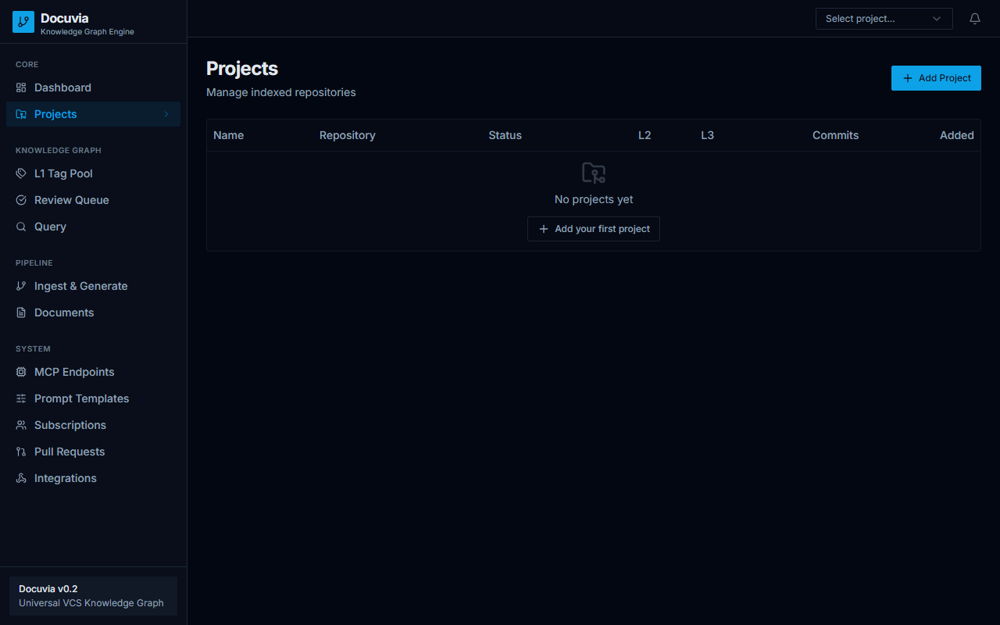
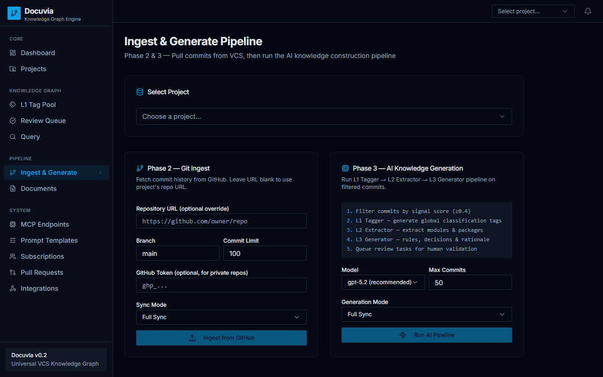
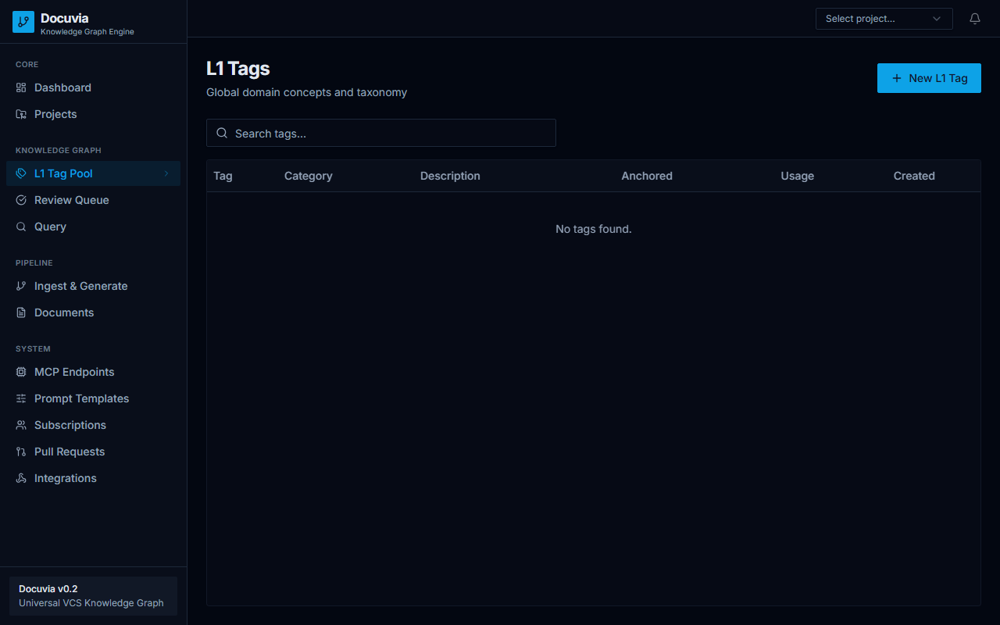
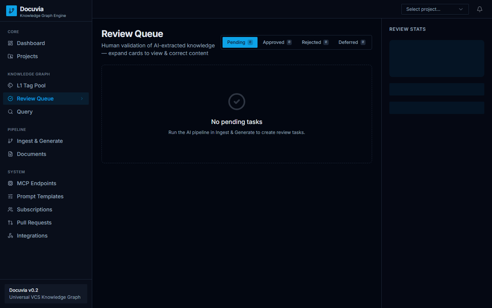
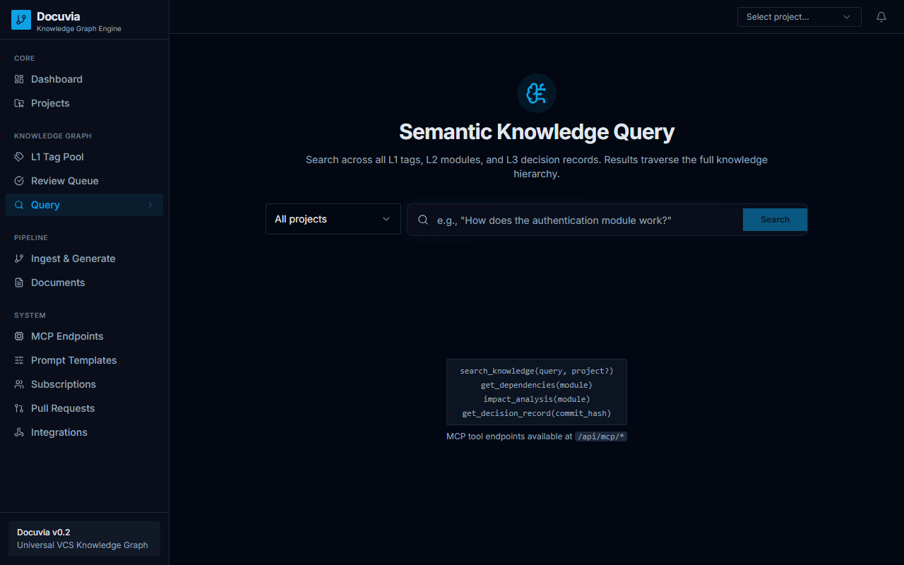

# Chapter 2: User Guide

This guide explains how to use the Docuvia user interface to manage projects, ingest code, review AI-generated knowledge nodes, and perform queries.

## 2.1 Creating Your First Project

1. Navigate to the **Projects** page from the sidebar.
2. Click on **Add Project**.
3. Fill in the **Project Name** and the **Repository URL** (in GitHub URL format).
4. Note that the **Remote URL** acts as the canonical identity for the repository.

## 2.2 The Ingest & Generate Pipeline

- **Ingest**: Extracts commits, diffs, and metadata from your Git or SVN repository.
- **Generate**: AI transforms the ingested data into structured L1, L2, and L3 knowledge nodes.
- **How to execute**: Go to the **Pipeline** page to monitor and trigger ingest/generate tasks.
- **Incremental vs. Full Update**: 
  - **Incremental** only processes new commits.
  - **Full** processes the entire repository history from scratch.

## 2.3 Viewing Knowledge Nodes

Docuvia organizes knowledge across three layers:
- **L1 Tag Pool**: Global categorization tags used across all projects.
- **L2 Nodes**: Module, package, or component level concepts.
- **L3 Nodes**: Specific implementation rules, decision records, and technical reasoning.

## 2.4 Using the Review Queue

- AI-generated knowledge nodes are placed in the **Review Queue**.
- In the **Review** tab, inspect each proposed node.
- You can **Approve**, **Reject**, or **Defer**.
- Manual corrections act as a **Few-shot mechanism**, providing feedback to improve future AI generations.

## 2.5 Semantic Queries

- Go to the **Query** page to ask natural language questions about your codebase.
- **Routing**: The system dynamically selects between Vector Search, Graph Traversal, or a Hybrid approach depending on your intent.
- **Examples**:
  - *"What is this PCD responsible for?"*
  - *"If I replace this module, what downstream components are affected?"*

## 2.6 Exporting the Knowledge Base
- **Supported Formats**: JSON and Markdown.
- Go to your Project settings to trigger an export for offline usage or backup.
