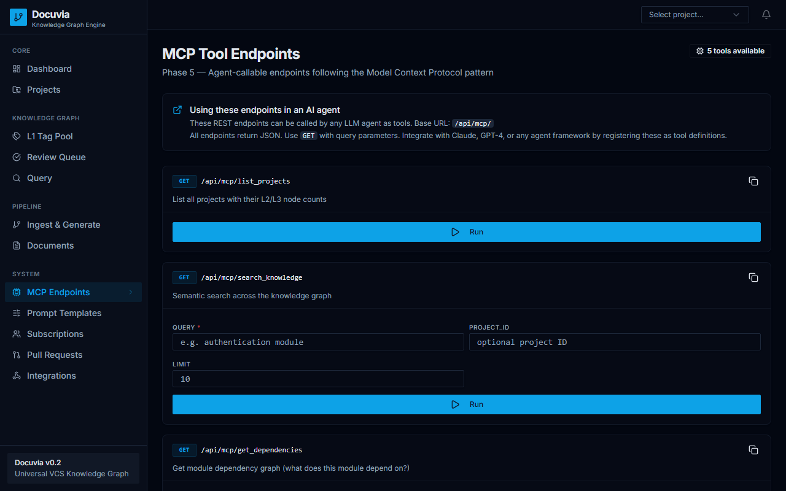

# Chapter 4: Core Concepts

Understand the architectural concepts that power the Docuvia Knowledge Graph.

## 4.1 The Three-layer Knowledge Architecture
- **L1 Pool**: Global tags acting as high-level categorizations across your organization.
- **L2 Nodes**: Architectural components, packages, and modules.
- **L3 Nodes**: Micro-level design decisions, reasoning, and implementation details.

## 4.2 Commit Filter Mechanism
- The system automatically filters out low-value commits (e.g., `chore`, `merge`, `auto-generated`) to maintain a high signal-to-noise ratio.
- The target signal rate is ~60% of all repository commits.

## 4.3 Vector Index vs. Graph Index
- **Vector Index**: Used for semantic search when querying abstract concepts.
- **Graph Index**: Used for dependency analysis, tracking relationships, and assessing impact.
- **Complementary Roles**: The system uses both simultaneously to provide accurate context.

## 4.4 Agentic RAG Query Routing
- The AI autonomously selects between 4 routing strategies: `vector`, `graph`, `direct`, and `hybrid`.
- The `intent-router.ts` service classifies user questions to determine the optimal retrieval method.

## 4.5 MCP Endpoints
The Model Context Protocol (MCP) enables external AI clients to interact with Docuvia.

Provided tools include:
- `search_knowledge`
- `get_dependencies`
- `impact_analysis`
- `get_decision_record`
- `list_projects`
- `POST /mcp/query` (Agentic RAG)
