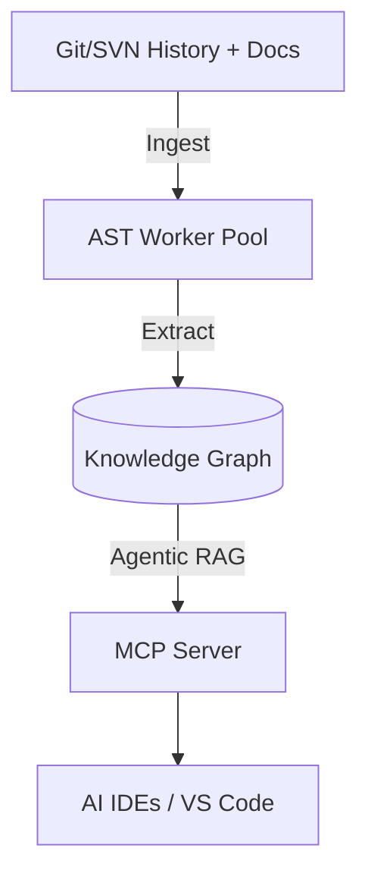

# Docuvia Docs

> Universal VCS Knowledge Graph Engine: ingest Git (and planned SVN) history, documents, and build artifacts, construct a queryable three-tier knowledge graph (L1 → L2 → L3), and expose it to AI agents via REST, MCP, and a VS Code extension.

Docuvia mines commit history, diffs, and spec documents alongside static code to surface the _why_ behind every decision — not just the _what_ — so AI agents and engineers stop re-deriving context that already exists in the repo's history.

## How to Use This Documentation

Whether you want to use Docuvia in your projects or contribute to its core engine, choose your path below:

### 🧑‍💻 I'm a User

- **[Getting Started](getting-started/installation.md)** — Install the extension, set up the CLI, and initialize your first graph.
- **[User Guide](user-guide/vscode-client.md)** — Learn how to use the VS Code Extension, CLI, and advanced configuration.
- **[Concepts & Vision](comparisons/README.md)** — Understand how Docuvia uses Agentic RAG, AST analysis, and why it's built differently.

### 🛠️ I'm a Developer or Contributor

- **[Developer Guide](development/README.md)** — Local setup, package overviews, and strict coding guidelines.
- **[System Architecture](architecture/README.md)** — arc42-style architecture documentation (building blocks, runtime scenarios).
- **[Architectural Decision Records (ADRs)](adr/README.md)** — Detailed technical decisions and rationale.
- **[Evaluation & Benchmarks](evaluate/README.md)** — Local-first gap analysis and capability matrices.
- **[Roadmap](roadmap/README.md)** — Phased implementation roadmap and completion checklist.

## About this space

This is the central, unified documentation hub for Docuvia. It serves as both the internal development and product documentation, and is simultaneously synced with GitBook for external reading. All architectural decisions, roadmaps, guidelines, and package overviews are authored and maintained directly in this folder (`docs/gitbook`).
