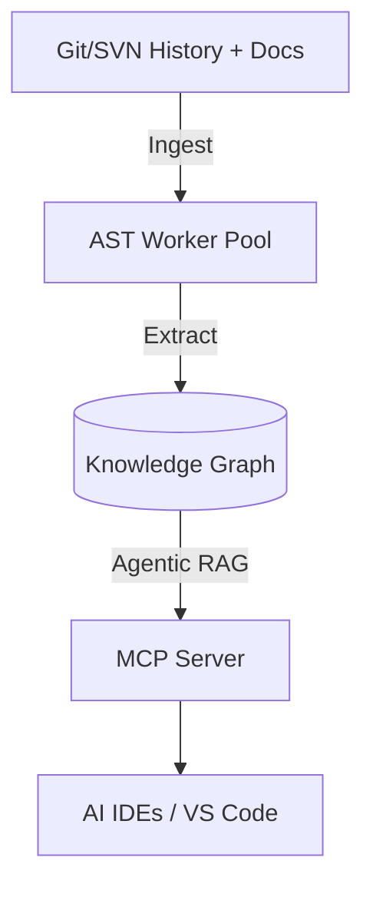

# Docuvia Docs

> Universal VCS Knowledge Graph Engine: ingest Git/SVN history, documents, and build artifacts, construct a queryable three-tier knowledge graph (L1 → L2 → L3), and expose it to AI agents via REST, MCP, and a VS Code extension.

Docuvia mines commit history, diffs, and spec documents alongside static code to surface the _why_ behind every decision — not just the _what_ — so AI agents and engineers stop re-deriving context that already exists in the repo's history.

## Sections

- **[Packages](packages/README.md)** — What each artifact package is (`cli`, `api-server`, `kg-engine`, `mockup-sandbox`, `vscode-client`): structure, entry points, and — for the CLI — full command reference and call chains.
- **[Detailed Development Materials](development/README.md)** — Capability matrix, refactoring notes, WASM AST internals, and the full VS Code extension design (17 pages).
- **[System Architecture](architecture/README.md)** — arc42-style architecture documentation: introduction, constraints, context, solution strategy, building blocks, runtime scenarios, deployment, crosscutting concepts, quality requirements, risks & debt, glossary.
- **[Architectural Decision Records (ADR)](adr/README.md)** — 26 ADRs covering the current architecture, plus a legacy decision log.
- **[Competitive Comparisons](comparisons/README.md)** — Vision and per-domain benchmarking against sibling knowledge-graph and AI-tooling projects.
- **[Roadmap](roadmap/README.md)** — Phased implementation roadmap, completion checklist, and sub-roadmaps for the AST parser and VS Code extension.
- **[Local-First Evaluation](evaluate/README.md)** — Atomized gap analysis of Docuvia's local-first capabilities against sibling tools, self-scored 3/10 with 12 actionable targets.
- **[Coding Guidelines](guidelines/README.md)** — The 7 mandatory engineering standards: TypeScript/React style, MVC architecture, POP/SRP, clean code, TDD, SRE/reliability, regression testing.

## About this space

This is the central, unified documentation hub for Docuvia. It serves as both the internal development and product documentation, and is simultaneously synced with GitBook for external reading. All architectural decisions, roadmaps, guidelines, and package overviews are authored and maintained directly in this folder (`docs/gitbook`).
