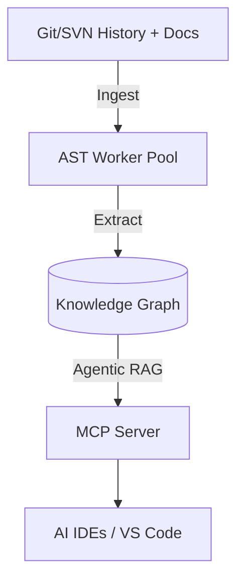

# Docuvia Docs

> Universal VCS Knowledge Graph Engine: ingest Git history, documents, and build artifacts, construct a queryable three-tier knowledge graph (L1 → L2 → L3), and expose it to AI agents via REST, MCP, and a VS Code extension.

Docuvia mines commit history, diffs, and spec documents alongside static code to surface the _why_ behind every decision — not just the _what_ — so AI agents and engineers stop re-deriving context that already exists in the repo's history.

## Welcome to Docuvia2

This space serves as the primary documentation for **Docuvia2** — the next-generation, refactored version of the knowledge graph engine. Our architecture focuses on an isomorphic AST microkernel, centralized schema, and robust composition.

*(This README serves as the prologue to the project's goals. We will expand the structural documentation, ADRs, and API guides progressively.)*
