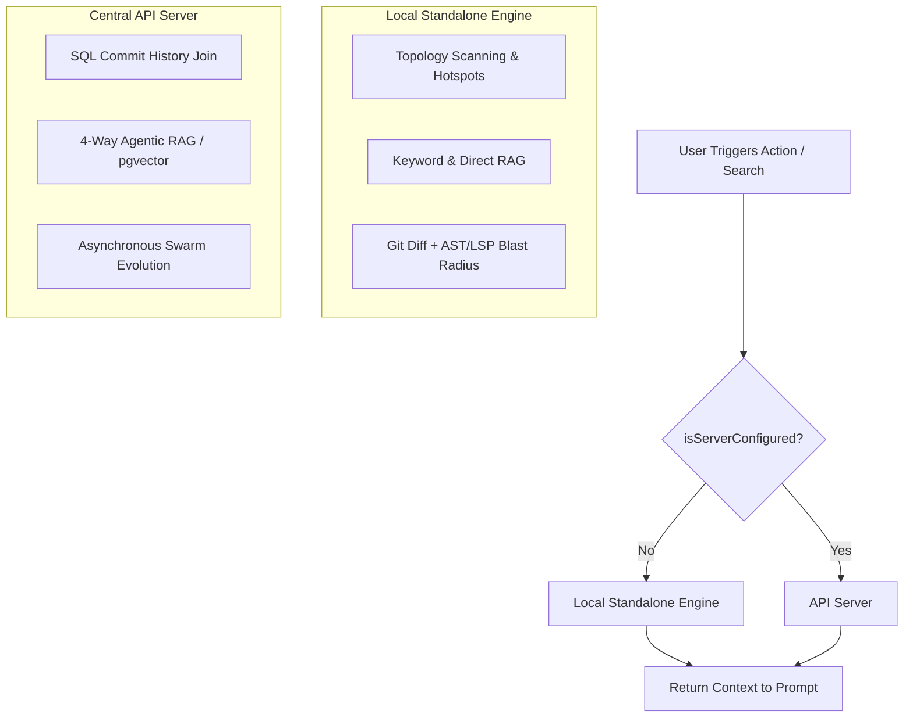

# Local-First Architecture & Graceful Server Degradation

> **Implementation status:** Tracked in the roadmap, not here — see [Standalone Engine (Graceful Degradation)](../roadmap/features/standalone-engine-graceful-degradation.md) and [Zero-Server Deep Traversal](../roadmap/features/zero-server-deep-traversal.md) in [Phase 5](../roadmap/phase-5-local-first-vs-code-client-web-ui.md) / [Phase 2](../roadmap/phase-2-ast-microkernel-semantic-diffing.md) for what is actually built today.

## Core Principle

Docuvia utilizes a **"Local-First, Server-Augmented"** architecture. It provides immediate, standalone value using the VS Code Extension as a **Local HEAD Index**, seamlessly unlocking team-scale semantic capabilities when connected to the API Server's **Global Projection**.

## Architecture Flow

## 1. Standalone Mode (Local-First Fallback)

- **Implementation**: Relies on `artifacts/vscode-client/src/central-server-client.ts#L36` returning false.
- **Architecture Recovery**: Falls back to the [AST Microkernel](./ADR-020-unified-isomorphic-ast-microkernel.md) for local topology scanning and [Git-Isomorphic Graph](./ADR-004-git-isomorphic-graph.md) resolution, bypassing naive `git log -n 100` bounds (implemented in `artifacts/vscode-client/src/knowledge-store.ts`).
- **Agentic RAG**: Gracefully degrades to Keyword RAG and Direct Anchoring using `target_refs` (e.g. in `artifacts/vscode-client/src/docuvia-code-lens-provider.ts`).
- **Evolution**: Local garbage collection based on `lastVerifiedAt` [temporal decay](./ADR-007-agentic-rag-routing.md), applied via the shared Core API's `vector-search.service.ts` (see [ADR-021](./ADR-021-shared-core-api-and-presentation-layers.md)). Pruning of decayed nodes also depends on [Asynchronous Metabolism](./ADR-008-asynchronous-metabolism.md) workers — see [Server-Side Metabolism](../roadmap/features/server-side-metabolism.md) for current build status.

## 2. Server-Augmented Mode (Team-Scale Ascension)

- **Heavy Computation Offloading**: API Server uses Drizzle `lib/db/src/schema/commits.ts` to calculate true co-occurrence frequencies without local Git processing.
- **Full RAG**: Unlocks `lib/core/src/services/intent-router.ts` for [4-Way Agentic RAG](./ADR-007-agentic-rag-routing.md), utilizing [pgvector](./ADR-019-pgvector-migration.md) and Graph Traversal.
- **Asynchronous Evolution**: [Background jobs](./ADR-008-asynchronous-metabolism.md) process [human-in-the-loop](./ADR-006-self-evolution-architecture.md) corrections to protect all team members.

## Git-Native Local Evolution & Projection (CQRS)

To strictly adhere to **Local-First** principles without corrupting the local read model, Docuvia treats the `docuvia-knowledge` branch as the writable knowledge store and treats `local.db` as a materialized projection of that branch for the current Git `HEAD`.

1. **Delta Detection**: Local changes are discovered from Git state, not from speculative database writes. The client uses `git diff` / `git diff-tree` to identify modified files and changed ranges.
2. **Blast Radius Calculation**: The changed ranges are mapped to symbols through the local AST layer, then enriched through LSP when type/reference precision or dirty-buffer semantics are needed. LLM reasoning is a last-resort enrichment layer, not the primary diff mechanism.
3. **Knowledge Branch Update**: The resulting structural and semantic deltas are written in the branch-native format defined by [ADR-023](./ADR-023-granular-markdown-storage.md) and committed to `docuvia-knowledge`.
4. **Local Projection Refresh**: Only after the knowledge branch is updated does Docuvia materialize the current `HEAD` view into `local.db`. The database is therefore a fast query/index cache, not the source of truth.
5. **Server Projection**: When the branch is pushed, the API server detects the updated `docuvia-knowledge` history and projects it into PostgreSQL for team-scale search and pgvector queries.

This topology guarantees offline availability while preventing split-brain state: uncommitted or unsynced knowledge never becomes canonical merely because it was written into `local.db`.
