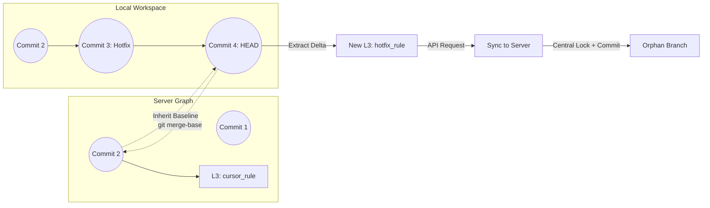
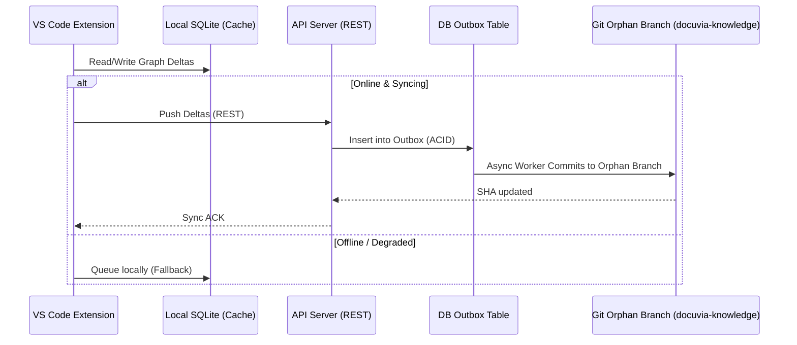

# Git-Isomorphic Knowledge Graph (Incremental Deltas)

> **Note**: Parts of the server-side async merge process outlined here have been superseded by **[ADR-023](./ADR-023-granular-markdown-storage.md)**, which shifts the SSOT update logic to local Git hooks writing granular Markdown/JSONL directly.

> **Implementation status:** Tracked in the roadmap, not here — see [Incremental Update (delta-only)](../roadmap/features/incremental-update-delta-only.md) ([Phase 1](../roadmap/phase-1-core-api-database-the-metabolism-engine.md)) and [`docuvia sync` Bidirectional CLI](../roadmap/features/docuvia-sync-bidirectional-cli.md) ([Phase 4](../roadmap/phase-4-git-isomorphic-sync-temporal-knowledge.md)).

## Core Philosophy

Knowledge is an immutable, distributed Directed Acyclic Graph (DAG) built upon Incremental Deltas (Knowledge Patches), perfectly isomorphic with the Git commit tree.

## The Temporal Alignment Architecture

## 1. The Baseline Inheritance (Nearest Ancestor)

- **Implementation**: When checking out an unknown branch, the system executes `git merge-base HEAD origin/main`.
- The client queries its [Local-First SQLite cache](./ADR-002-local-first-architecture.md) (falling back to the server if missing) for the knowledge snapshot of this ancestor commit, instantly inheriting historical guardrails without rescanning.

## 2. Local-Side Incremental Analysis (Knowledge Patch)

- **Source Code Extraction:** For programming language files modified in the delta, the client uses the [AST Microkernel](./ADR-020-unified-isomorphic-ast-microkernel.md) to locally extract new [L3 decisions](./ADR-005-knowledge-abstraction-strategy.md) (via [Progressive Enrichment](./ADR-015-progressive-enrichment-and-ast-lsp-dual-engine.md)).
- **Unstructured Document Extraction:** For non-code files (e.g., Markdown, PDF, PPTX, Build Logs), the AST cannot parse them. These are delegated to dedicated Server-Side LLM services (referencing [Document Misc Pool](./ADR-012-document-misc-pool.md)), as edge clients lack the capability to accurately process complex or multi-modal documents independently.
- These new L3s are explicitly anchored to the Git history via [Temporal Range Anchors](./ADR-018-temporal-and-conceptual-bidirectional-linking.md) (`introduced_in_commit` and `verified_until_commit` columns in Drizzle schema `l3NodesTable`). This eliminates JSONB array bloat.

## 3. Server-Side Incremental Merge

- When patches are submitted via API, the API Server synchronously writes the delta to the Outbox table using [Database-as-IPC](./ADR-014-sql-indexed-graph-and-database-as-ipc.md). A background worker ([Asynchronous Metabolism](./ADR-008-asynchronous-metabolism.md)) subsequently applies these patches to the [Orphan Branch](./ADR-017-tiered-storage-and-orphan-branch-graph-maintenance.md). (The legacy synchronous `409 Conflict` logic in `artifacts/api-server/src/routes/generate.ts` is superseded by this async outbox pattern).
- **Zero-Waste Validation**: Re-evaluating the entire codebase is avoided. Every token spent produces an immutable brick anchored to a specific point in space-time via [Git Blob Native Identity](./ADR-016-git-blob-native-identity-and-checkout-thrashing-defense.md) in `lib/db/src/schema/commits.ts`.

## System Flow & Boundaries

## Verifiability

The [local-first syncing mechanism](./ADR-002-local-first-architecture.md) and graph extraction MUST be testable without a live API server:

- **Extension Offline Resilience:** `@vscode/test-electron` test suites MUST launch the extension with the API server mocked as unreachable (503). The test MUST assert that local knowledge graph modifications successfully persist to the local SQLite cache without throwing unhandled exceptions to the user.
- **Outbox Sync Guarantee:** API server integration tests MUST use `withRollback(...)` to insert a pending Git synchronization event into the Outbox table to verify [Database-as-IPC](./ADR-014-sql-indexed-graph-and-database-as-ipc.md). A worker tick MUST assert the `git` command execution (via mocked `child_process` or equivalent) and the subsequent deletion/status-update of the Outbox row.
