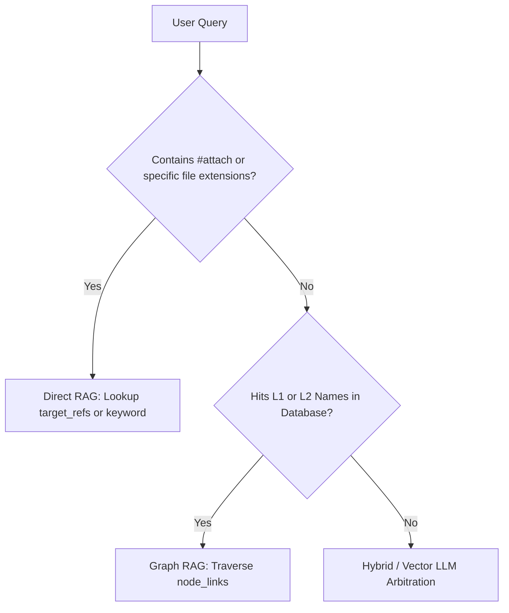
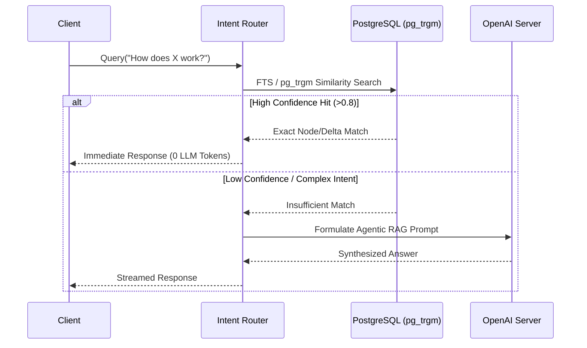

# Agentic RAG 4-Way Routing & Temporal Decay

> **Implementation status:** Tracked in the roadmap, not here — see [Agentic RAG (Intent Router)](../roadmap/features/agentic-rag-intent-router.md) ([Phase 3](../roadmap/phase-3-agentic-rag-mcp-interfaces.md)) and [Temporal Decay Scoring](../roadmap/features/temporal-decay-scoring.md) ([Phase 4](../roadmap/phase-4-git-isomorphic-sync-temporal-knowledge.md)).

## Core Architecture

Docuvia's `lib/core/src/services/intent-router.ts` dynamically selects the optimal retrieval strategy. Routing arbitration prioritizes $O(1)$ local caches over expensive LLM inference (facilitated by the [Local-First Architecture](./ADR-002-local-first-architecture.md) and [Database-as-IPC](./ADR-014-sql-indexed-graph-and-database-as-ipc.md) patterns).

## The Routing Funnel (O(1) Arbitration)

## 1. External Document Anchoring (The Floating Knowledge Catcher)

- **Implementation Schema**: `lib/db/src/schema/documents.ts` with `status: "unaffiliated"`.
- When a 50-page PDF is uploaded, it is initially `unaffiliated`. _(Note: While unstructured PDFs require LLM scanning, structured files now utilize the [AST Microkernel](./ADR-020-unified-isomorphic-ast-microkernel.md) and [Progressive Enrichment](./ADR-015-progressive-enrichment-and-ast-lsp-dual-engine.md) to extract semantic anchors deterministically without LLM tokens)._ The system scans the document to find semantic anchors in existing L2 nodes (see [Knowledge Abstraction Strategy](./ADR-005-knowledge-abstraction-strategy.md)) or recent commits. Once approved via `artifacts/api-server/src/routes/review-tasks.ts` (Drizzle schema: `lib/db/src/schema/review-tasks.ts`), it is firmly anchored in the space-time of the Git graph (see [Git-Isomorphic Graph](./ADR-004-git-isomorphic-graph.md)), preventing anachronistic hallucinations.

## 2. The 4-Way Strategies

- **Direct RAG**: $O(1)$ lookup via commit hashes (leveraging [Git Blob Identity](./ADR-016-git-blob-native-identity-and-checkout-thrashing-defense.md)) or full-text search against `l3_nodes.content` if no hash is provided.
- **Graph RAG**: Traverses `node_linksTable` to find structural dependencies (Neighbor Infection).
- **Vector RAG**: Standard embedding similarity via [PGVector](./ADR-019-pgvector-migration.md) (`embedding.ts`).
- **Hybrid RAG**: Intersection of graph constraints and vector similarities with cross-validation boosting (nodes found in both sets receive a compounding score boost). Implemented as `hybridSearch()` in `intent-router.ts`.

## 3. Temporal Decay & Garbage Collection

- Knowledge nodes contain `created_at` and `lastVerifiedAt`.
- **Implementation**: The router applies an Exponential Temporal Decay function to search scores (`Math.exp(-LAMBDA * daysSinceVerified)` in `intent-router.ts`). Knowledge untouched naturally sinks to the bottom. This decay process and eventual pruning are managed via [Asynchronous Metabolism](./ADR-008-asynchronous-metabolism.md) background jobs and synchronized securely on the [Orphan Branch](./ADR-017-tiered-storage-and-orphan-branch-graph-maintenance.md).
- When old knowledge correctly answers a query, its `lastVerifiedAt` is updated via the `POST /search/feedback` endpoint (passing the `nodeLayer`), "refreshing" its lifespan through the [Human-in-the-Loop Feedback Architecture](./ADR-006-self-evolution-architecture.md).

## System Flow & Boundaries

## Verifiability

To ensure the semantic routing fast-path functions under load and doesn't leak tokens, the CI pipeline MUST assert the following:

- **Fast-Path Assertion:** Integration tests in `../../artifacts/api-server/test/integration/` MUST seed the database using factories, trigger an exact-match query, and use `MSW` to strictly assert that `0` external HTTP requests are made to the AI server.
- **Fallback Assertion:** Queries below the similarity threshold MUST assert that exactly `1` request is intercepted by MSW, validating the payload shape and prompt template.
